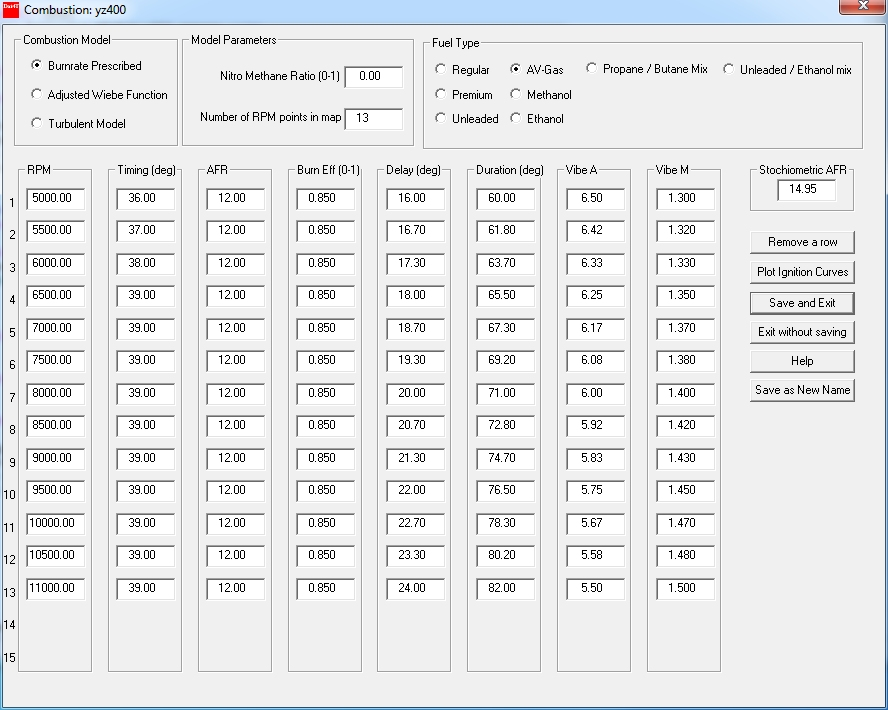

# Combustion Modeling

All combustion in the spark ignition internal combustion engine happens as turbulent combustion. If this was not the case the maximum rpm achieved would have been around 800rpm as the laminar burn rate is way too slow. The next paragraph gives a brief overview of turbulent combustion followed by a description of the combustion models used in simulations.

## Brief Description of Turbulent Combustion

Turbulent eddies are created from the bulk flow of the fluid. Kinetic energy is taken from the bulk flow and transformed into turbulent energy (the spinning of the turbulent eddy). The size of these eddies are in part determined by the size of the container or duct and in our engines are typically between 5 and 20mm diameter depending on the cylinder and transfer port sizes. (This size is known as the integral length scale) These eddies break down into progressively smaller eddies down to eddies of about 0.5 to 1mm. (The Taylor length scale) It is at this size that combustion takes place. (These eddies are damped out by the viscous forces in the fluid at an even smaller scale known as the Kolmogorov scale. This break down of bulk flow to large eddies to small eddies to viscous damping of the eddies is known as the \"Turbulent Cascade\" model.) These eddies are ignited on the surface by coming into contact with already burning eddies. They burn inward at the laminar burning rate over which we have no control other than mixture quality and purity. Only the initial ignited eddy burns from the inside out as it is ignited by the spark in the spark plug gap. The time taken from spark to the flame reaching the surface of this first eddy is the delay time from spark to combustion proper starting. 

To decrease the delay time we need to increase the strength and duration of the spark to ignite as much of this first eddy as good possible. The size of this spark also needs to be at least the size of a turbulent eddy. Bigger does not really help because one or two eddies burning at the laminar rate has no real effect on the delay time. Increasing the spark strength and duration past the point where the eddy has been fully ignited will also have no or a very small effect. This partially explains why some engines show a performance improvement with a bigger gap - they have larger turbulent eddies.

To increase combustion rate we have to spin these eddies faster to come into contact with non burning eddies at a faster rate. This is why faster spinning eddies (higher turbulent intensity) results in a faster combustion. It also implies that combustion happens at a specific rate. Uncontrolled combustion is where these eddies ignite because of a sharp temperature and pressure rise. This is an uncontrolled event and if enough eddies ignite we have detonation which is definitely uncontrolled!

The above process is chaotic and leads to big variations in burn rate and max pressure. In \"bad\" engines more than 600 measured pressure traces has to be averaged to obtain the average pressure trace. Having such a big spread means we have to set the operating point far from optimum as some of the cycles the pressure and temperature will exceed the value where detonation happen. The smaller we can make the cyclic variation the closer we can set the operating point to the detonation limit. This means that the more \"control\" we can impose on the turbulence formation the more repeatable we can make it, thus limiting cyclic variation and increasing the allowable compression ratio.

The only practical way we have is to control the bulk motion. Bulk flow distributes these eddies in a more controlled way and impose some control on the process. Spark ignition 4 strokes use mainly two methods: Swirl and Tumble. Swirl is created by having an offset inlet port so that the in cylinder flow is swirling around the cylinder axis. Uniflow 2strokes also use this principle. Tumble is created using 2 inlet valves and directing flow such that the gas in the cylinder starts rotating around an axis perpendicular to the cylinder axis. Most modern high performance 4stroke engines use this and it is the reason why backyard porters often destroy an engine\'s performance even if quoting huge flow numbers - they messed up the tumble flow!

So back to the 2stroke - we need a way to control bulk flow without messing up the scavenge process. We do our best with squish flow but as we all know, results will vary from model to model and even from engine to engine! We all agree (I think) that MSV is an indication and can be used with great success on similar engines (usually). We do not have sufficient and/or repeatable control over the turbulence creation process to use MSV as an exact indicator.

## Modeling of Combustion

To model combustion in a simulation package there are various approaches the developer can use and it depends on the time he is willing to spend on the model as well as on the typical user requirement and capabilities. The following is a list of most of the major types of models listed from the more simplistic to the more complex:

1.  Prescribed heat release. The developer programs a heat release rate curve into the software. The user has only control over the spark timing and the combustion duration. The chamber geometry is ignored.
2.  Prescribed burn rate. This model goes one step further in that the shape of the mass fraction burn rate is described by the user. Mass fraction burnt is usually a curve that is S-shaped. To describe this the model uses typically a Sine function or a Wiebe (Vibe) function to describe the S-shape. The user supplies the constants that describe the form of this function. The user also supplies the ignition timing, the delay period length and the duration of the combustion. The chamber geometry is ignored.
3.  Turbulent eddy entrainment. The turbulent intensity is calculated by the simulation and from this and the mixture purity and AFR, the laminar and turbulent burn rates are determined. This is then used to calculate the burn rate. The user supplies the ignition timing. The major characteristics of the chamber is included and squish action is calculated. Blending radiuses are ignored but dome shape and piston crown shape are used to calculate the flame front characteristics.
4.  LES (Large Eddy Simulation, a 3dimensional simulation) This is a CFD simulation (Computational Fluid Dynamics) that is fully 3dimensional and takes all the geometry into consideration. It uses cell sizes that capture the Taylor eddies but use a model to describe the turbulence further down the length scale. It has typical run times of hours to do one simulation.
5.  DNS (Direct Numerical Simulation, a 3dimensional simulation) This is also a CFD simulation but uses cell sizes small enough to calculate turbulence down to its smallest scales. It uses many millions of cells to model the engine geometry and has run times of days to weeks to do a simulation.

EngMod4T uses models of type 2 and 3. The user has the choice between the two types.

## [Prescribed Burn Rate Model]{.underline}

There are several Prescribed Burn Rate Models available of which the most popular one is the Vibe or Wiebe function model. The Vibe model is used as the prescribed burn rate model in EngMod4T. This model uses the following equation as its basis:

{border="0" width="240" height="60" align="left"}

 

 

 

 

{border="0" width="350" height="207"}

This equation results in an S-shaped function of which the shape is controlled by the Vibe parameters.

### The effect of VibeA

{border="0" width="375" height="413"}

Increasing the \"slope\" shape factor increases the burn rate slope as shown in the figure.

### The effect of VibeM {#the-effect-of-vibem align="left"}

{border="0" width="383" height="423"}

Increasing the \"distribution\" shape factor means more of the mass is burnt later.

### Using the Vibe Model {#using-the-vibe-model align="left"}

The user has to supply 5 values to prescribe the burn rate using this model:

1.  Ignition Timing - The timing of the spark in degrees before TDC

2.  Delay Period - The time from spark to turbulent combustion in crank angle degrees

3.  Burn Duration - The time from the end of the delay period to the end of turbulent combustion in crank angle degrees

4.  VibeA - The \"slope\" shape factor

5.  VibeM - The \"distribution\" shape factor

## [Calculated Burn Rate (Turbulent Eddy Entrainment Model)]{.underline}

EngMod4T uses the turbulent eddy entrainment model to calculate the burn rate and the \"Energy Cascade\" turbulent model to calculate the turbulent intensity and from that the eddy entrainment rate. It uses the transfer port flow as the main creator of turbulence with some help from the plugging pulse of the exhaust. After port closure some further turbulence is generated by the moving piston and the squish action while turbulence is damped out by the fluid viscosity.

As this is a fully 3dimensional situation modeled by zero and 1-dimensional equations it is not a fully robust method and can fail (give inaccurate predictions) under certain conditions. It is based on 3dimensional equations but with simplifying assumptions like homogeneity at small scales to remove direction from the equation at the small scale turbulence. Large scale movement are partially taken into consideration using the transfer port flow, the piston movement and squish action but finer detail is lost through the use of turbulence generation models based on average flow. Even so, the model works quite well under most conditions.

### Using the Turbulent Entrainment Model

Strictly speaking the user has to supply 1 value only to use this model:

1.  Ignition Timing - The timing of the spark in degrees before TDC

However, to enable the user to select between the two models the following values have to be supplied as well:

1.  Delay Period - The time from spark to turbulent combustion in crank angle degrees

2.  Burn Duration - The time from the end of the delay period to the end of turbulent combustion in crank angle degrees

3.  VibeA - The \"slope\" shape factor

4.  VibeM - The \"distribution\" shape factor

When using this model the user must verify that the model is calculating realistic results. To do this the model calculates the previous 4 values, (delay period, burn duration, vibeA and vibeM) after each rpm point and stores the results in the power output file. After a run the user can then plot them using Post4T and inspect them for realism. The following figures show a comparison between using the prescribed values as published, then using the turbulent entrainment model and then the calculated values as input for a simulation:

{border="0" width="813" height="597"}

{border="0" width="825" height="585"}

{border="0" width="824" height="587"}

 

The turbulent entrainment model increases run times quite a bit so a typical way to use it is to do a baseline simulation using it to predict the 4 values required by the Vibe model and then to use these values as input to the Vibe model and use it then for further simulations.

---

# Creating a new Spark Ignition Combustion Subsystem

There are three types of combustion models available:

- Prescribed Burn Rate - using a Vibe function
- Prescribed Burn Rate - using a Adjusting Vibe function
- Calculated Burn Rate - using a turbulent entrainment model

## Prescribed Burn Rate Model (Vibe Function)

It uses a Vibe curve fitted to the mass fraction burnt as a function of combustion duration in degrees. The values for the Vibe function have to be supplied by the user. There are three ways of obtaining the values for the Vibe function:

- Measured values. This is obtained from a measured pressure traces of the combustion period.
- Simulated results. pUsing full 3-dimensional Computational Fluid Dynamic software to model the combustion.
- Average values. In [Blair's](../Contents/References.htm) book is a range of tested values for typical engines. It is the best way to obtain reasonable values.

The user has to prescribe the Vibe coefficients, A and M, to describe the Vibe curve. Refer to Blair's book for a more detailed description. The user also has to prescribe the Delay period and the Duration period of the combustion process.

## Corrected Burn Rate Model (Vibe Function)

It uses a Vibe curve fitted to the mass fraction burnt as a function of combustion duration in degrees. The values for the starting Vibe function have to be supplied by the user. After three iteration cycles the model corrects the Vibe values after every cycle using special functions as described by Bonatesta, refer to [reference 4.](../Contents/References.htm)

## Calculated Burn Rate Model (Turbulent Entrainment)

This model is based on the classical turbulent entrainment model first proposed by Blizard and Keck, SAE730000. It uses the turbulent intensity in the cylinder to calculate the rate at which unburnt gas is entrained in the flame front. The turbulent intensity is calculated from the transfer flow, with losses through the exhaust port and is enhanced by the piston movement and squish flow. The current model does not yet take spark strength into consideration during the delay period calculations.

## Creating a New Combustion Model

The following dialog will appear when creating a new combustion subsystem:

{border="0"}

The user selects the type of combustion model by selecting one of the radio buttons in the group box labelled: **Combustion Model**. Selecting the **Burn Rate Prescribed** radio button selects the Vibe function based model. Selecting the **Turbulent Entrainment** radio button selects the turbulent combustion model. **Even though this model calculates its own delay and duration periods and combustion rates, the user must still prescribe them using realistic values to allow toggling between the two types of models.**

### [Fuel Type]{.underline}

The current version of the software allows a choice of 10 different type of fuels for spark ignition engines:

1.  Regular

2.  Premium

3.  Unleaded 95

4.  Unleaded 100

5.  Aviation Gasoline (AV-Gas)

6.  Methanol

7.  Ethanol

8.  Leaded Racing 110

9.  Propane and Butane mix. Selecting this fuel will open the following edit box:

    {border="0"}

10. Unleaded and Ethanol mix (E85 is 85% ethanol). Selecting this fuel will open the following edit box:

    {border="0"}

Depending on the chosen fuel the stochiometric AFR will appear in the edit box. Depending on the AFR, the mixture purity and the cylinder pressure and temperature the laminar burn rate for the chosen fuel will be calculated during turbulent combustion.

By choosing a fuel the software provides the latent heat of evaporation, lower calorific value and the carbon and hydrogen ratios.

### [Nitro-Methane Ratio]{.underline}

The effect of nitro-methane can be simulated by choosing a Nitro to Fuel ratio larger than 0.

### [Number of Rows in the Combustion Map]{.underline}

The combustion map consists of between 1 and 15 rows of data. The software interpolates between these rows during a simulation. If the simulated rpm value falls outside the map the closest map point data is used.

### [RPM]{.underline}

This is the points at which the combustion model values are supplied. If measured values are available there will be a range of rpm values used. If the values from Blair's book are used there will typically be only one point. The software interpolates between these values if a simulation is requested that does not correspond to one of the values. If the requested simulation is lower than the minimum value supplied, it will use this minimum value and not extrapolate. The same goes for the case where the requested simulation is at higher a higher value than supplied, it will then use the highest supplied value. In the case where only one value was supplied, that value will be used for all the simulations.

### [Timing]{.underline}

This is the ignition timing (the point where the engine sparks) in degrees before TDC.

### [AFR (Air/fuel ratio)]{.underline}

The ratio of the mass of air to the mass of fuel in the fresh charge. A smaller number means a richer mixture. A typical value is 12. (12kg air to 1kg fuel)

### [Combustion Efficiency (Beff)]{.underline}

This value takes care of all the little factors that could not be accounted for in sub models and range between 0.85 and 0.90 for most engines. Industrial type engines with simplistic carburettors can have a value as low as 0.8 while sophisticated high performance engines can have a value as high as 0.95.

**[Note:]{.underline} This value is also used as a calibration factor to match the engine dyno curve. A word of warning: When using this value to match the measured power output one must be very careful not to have values changing too rapidly close to one another as it is possible to obscure or create phenomena caused by other factors. As an example, if the dyno curve does not for some reason match the dips and peaks caused by the intake tuning and one uses Beff to force the curve to follow this, changing the intake length will now show a completely false picture. Use with caution!**

### [Delay (Combustion delay)]{.underline}

The period in degrees from the spark to the start of combustion. Typical values for the delay range from 4 degrees to 15 degrees. This delay period is where the small flame kernel that forms during the spark expands to a large enough flame to start turbulent combustion.

### [Duration (Combustion duration)]{.underline}

This is the period from the onset of combustion (the end of the delay period) to the point where the combustion has been completed for practical purposes. Values range from around 40 degrees for high performance GP engines to as long as 80 degrees for low performance larger engines. Most engines fall in the 45 to 55 degree range.

### [Vibe A]{.underline}

The first of the Vibe constants. A typical value is 6.0

### [Vibe M]{.underline}

The second Vibe constant. It has a typical value of 1.25.

---

# Creating a new Compression Ignition Combustion Subsystem

There are two types of combustion models available:

- Prescribed Burn Rate - using a Vibe function
- Calculated Burn Rate - using a turbulent entrainment model

## Prescribed Burn Rate Model (Vibe Function)

It uses a Vibe curve fitted to the mass fraction burnt as a function of combustion duration in degrees. The values for the Vibe function have to be supplied by the user. There are three ways of obtaining the values for the Vibe function:

- Measured values. This is obtained from a measured pressure traces of the combustion period.
- Simulated results. Using full 3-dimensional Computational Fluid Dynamic software to model the combustion.
- Published values. In [Blair's](../Contents/References.htm) book is a range of tested values for typical engines. It is the best way to obtain reasonable values.

The user has to prescribe the Vibe coefficients, A and M, to describe the Vibe curve. Refer to Blair's book for a more detailed description. The user also has to prescribe the Delay period and the Duration period of the combustion process.

## Calculated Burn Rate Model (Turbulent Entrainment)

This model is based on the classical turbulent entrainment model as proposed by [Blizard and Keck, SAE740191](../Contents/References.htm). It uses the turbulent intensity in the cylinder to calculate the rate at which unburnt gas is entrained in the flame front. The turbulent intensity is calculated from the transfer flow, with losses through the exhaust port and is enhanced by the piston movement and squish flow. The current model does not yet take the effect of the injection plumes on turbulence into account.

## Creating a New Combustion Model

The following dialog will appear when creating a new combustion subsystem:

{border="0"}

The user selects the type of combustion model by selecting one of the radio buttons in the group box labelled: **Combustion Model**. Selecting the **Burn Rate Prescribed** radio button selects the Vibe function based model. Selecting the **Turbulent Entrainment** radio button selects the turbulent combustion model.

**Even though this model calculates its own delay and duration periods and combustion rates, the user must still prescribe them using realistic values to allow toggling between the two types of models and to supply the calculation start values.**

### [Combustion Efficiency]{.underline}

This value takes care of all the little factors that could not be accounted for in sub models and range between 0.85 and 0.95 for most engines.

### [Fuel Temperature (°C)]{.underline}

The software has to use the fuel density when calculating the mass of fuel injected and the density is a function of temperature.

### [Number of Rows in the Combustion Map]{.underline}

The combustion map consists of between 1 and 20 rows of data. The software interpolates between these rows during a simulation. If the simulated rpm value falls outside the map the closest map point data is used.

### [Fuel Type]{.underline}

The current version of the software allows a choice of 5 different type of fuels for compression ignition engines:

1.  Methanol
2.  Ethanol
3.  JP-5 (Kerosene derivitive jet fuel)
4.  JP-8 (Kerosene derivitive jet fuel)
5.  Automotive Summer Diesel

Depending on the chosen fuel the stochiometric AFR will appear in the edit box. Depending on the AFR, the mixture purity and the cylinder pressure and temperature the laminar burn rate for the chosen fuel will be calculated during turbulent combustion.

By choosing a fuel the software provides the latent heat of evaporation, lower calorific value, the density and the carbon and hydrogen ratios.

### [RPM]{.underline}

This is the points at which the combustion model values are supplied. If measured values are available there will be a range of rpm values used. If the values from Blair's book are used there will typically be only one point. The software interpolates between these values if a simulation is requested that does not correspond to one of the values. If the requested simulation is lower than the minimum value supplied, it will use this minimum value and not extrapolate. The same goes for the case where the requested simulation is at higher a higher value than supplied, it will then use the highest supplied value. In the case where only one value was supplied, that value will be used for all the simulations.

### [Timing]{.underline}

This is the start of injection timing (SOI) in degrees before TDC.

### [AFR / Vol]{.underline}

This field prescribes the mixture strength. The user have to choose between prescribing the air/fuel ratio or prescribing the volume of fuel injected in the **Mixture Model** field:

{border="0"}

### Air / Fuel Ratio (AFR)

The ratio of the mass of air to the mass of fuel in the fresh charge. A smaller number means a richer mixture. A typical value is 22.(22kg air to 1kg fuel). Using this option assumes the effect of charge loss is not taken into consideration.

### Injected Volume

This is the volume of fuel injected by an injector per injection event. During the simulation the software will calculate the AFR for that cylinder based on the prescribed fuel volume injected, the density of the fuel and the mass of air trapped at exhaust port closure.

### [Delay (Combustion delay)]{.underline}

The period in degrees from the start of injection (SOI) to the start of combustion. Typical values for the delay range from 4 degrees to 15 degrees. This delay period is where the small flame kernel that forms during the start of injection expands to a large enough flame to start turbulent combustion.

### [Duration (Combustion duration)]{.underline}

This is the period from the onset of combustion (the end of the delay period) to the point where the combustion has been completed for practical purposes. Most engines fall in the 35 to 55 degree range.

### [Vibe A]{.underline}

The first of the Vibe constants. A typical value is 6.0

### [Vibe M]{.underline}

The second Vibe constant. It has a typical value of 1.25.

---

# Editing existing data

When editing an existing combustion subsystem the following dialog will appear :

{border="0" width="888" height="710"}

To add a row to the combustion map simply increment the value in the \"Number of RPM points in the map\" edit box by the required number of rows to be added. The maximum number of rows is 15 and the minimum number 1. The rpm values does not have to be in sequence, the software will automatically re-arrange them in the correct sequence. To remove a row click on the \"**Remove a Row**\" button and the following dialog will appear:

{border="0" width="285" height="95"}

After the required changes have been made the user can see the effect of the changes by selecting the \"Plot Timing Curves\" button. For the example shown here the following curves will be displayed:

{border="0" width="837" height="559"}

{border="0" width="837" height="559"}

{border="0" width="837" height="559"}

Clicking the \"**OK**\" button will return the user to the combustion dialog box where more changes can be made, the changes can be discarded by selecting the \"**Exit without saving**\" button or the changes can be saved by selecting the \"**Save and Exit**\" button.
