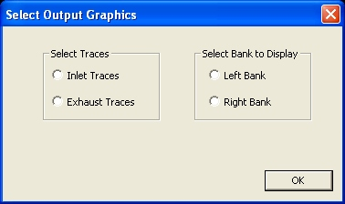

## [5 to 8 Cylinder Engine Graphics]{.underline}

[When choosing to display the graphics of a 5 to 8 cylinder engine on the screen ]{lang="EN-UK" style="font-size:12.0pt"} [these]{style="font-size:12.0pt"}[ options exist: ]{lang="EN-UK" style="font-size:12.0pt"}

1.  [ ]{lang="EN-UK" style="font-size:12.0pt"}
2.  The first option is to display the intake [side ]{style="font-size:12.0pt"} pressure ratio traces for all the cylinders.
3.  The second option is to display the exhaust [side ]{style="font-size:12.0pt"} pressure ratio traces for all the cylinders.

[ ]{style="font-size:12.0pt"}

Because it is impractical to display more than 4 cylinders on screen at simultaneously there exists a further option for these engines:

1.  Select the left hand bank of cylinders; or
2.  Select the right hand bank of cylinders.

[ ]{lang="EN-UK" style="font-size:12.0pt"}

The following figure shows the choices:

{border="0" width="378" height="224"}

[ ]{lang="EN-UK" style="font-size:12.0pt"}

Selecting the intake side the pressure traces for the cylinder inlet port at the crankcase interface, the transfer port at the cylinder interface and crankcase are displayed. If the engine has a reedvalve a further graph showing the reed petal tip lift (divided by 10) is also displayed.

Selecting the exhaust side the pressure traces for the exhaust port at the cylinder interface, the transfer port at the cylinder interface and the cylinder pressure is shown. Because the cylinder pressure is much higher and will dominate the display the graph is limited to a pressure ratio of 3.

[After choosing the graphics options a summary of the port timing and the effective [port]{style="font-size:12.0pt"} areas are displayed. The next figure shows this output.]{lang="EN-UK" style="font-size:12.0pt"}

{border="0" width="714" height="363"}

 A typical output after the required number of iterations is shown in the next figure:

{border="0" width="1024" height="768"}

A list of some performance values are displayed at the top of the screen. To continue to the final screen press \"Enter\". The final screen shows a more complete summary of the performance values as shown in the next figure:

{border="0" width="842" height="670"}

[ ]{style="font-size:12.0pt"}

The meaning of the variables are explained in [TextOutput.htm](TextOutput.htm)

Clicking on \"**OK**\" will exit the program.
