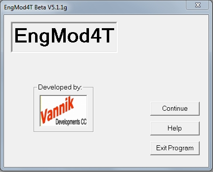

## [Authorization]{.underline}

If you are a first time user,  moved to a new computer or changed your C-drive, you will need to obtain or update your authorization file: EngMod4T.fig. To obtain the authorization file you need to apply for one a from **Vannik Developments** at <vannik@mweb.co.za>. You have to supply your name and the serial number for your C-drive, even if the software is not installed on the C-drive. If you do not know the serial number or how to obtain it, run EngMod4T by double clicking on the icon:

{width="34" height="32"}

which will then display the front page:

{border="0" width="431" height="348"}

Clicking on the \"**Continue**\" button will then display the following screen. Click the \"**Register Yes**\" radio button which after filling in your name and clicking on \"**Register**\" button will look as follows:

{border="0" width="612" height="389"}

Now click on \"**Continue**\" button to terminate the execution of the program. Now email the created file for authorization.
