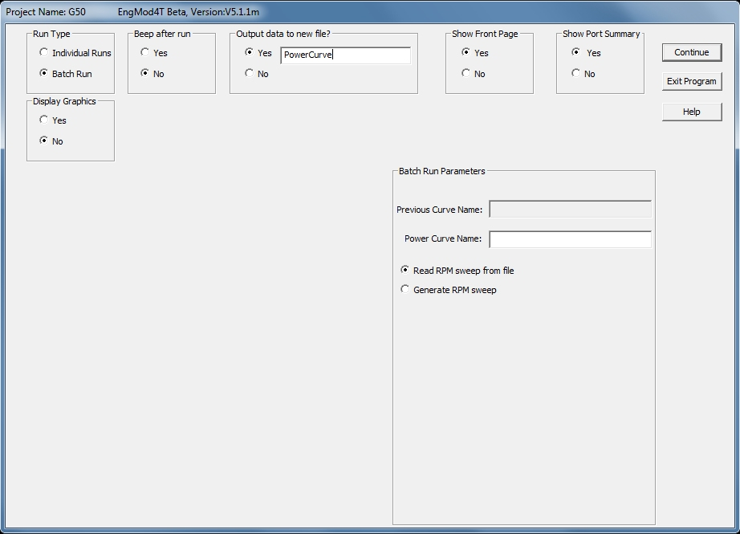
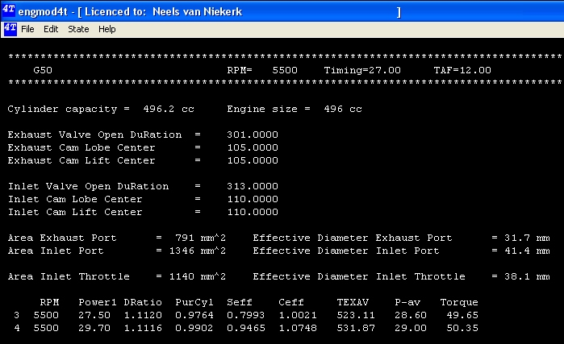
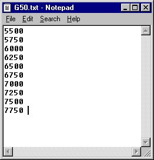

## [Batch Mode]{.underline}

One of the ways the program can be used is to calculate a power curve in the \'batch\' mode. In this mode the program is started and continues through all the prescribed rpm points until they are all processed. This mode is selected by choosing to run the program in the batch mode on the main dialog. This mode is used to create power curves, torque curves etc. for the engine and individual cylinders. The performance values are stored in the \*.pou file. To select the batch mode the user selects the \"**Batch Run**\" radio button.

By default the choice is made to not display the graphics and to not \"beep\" after each rpm run. The rpm output overwrites the previous batch run files by default unless the \"**Output data to a new File? - Yes**\" radio button is selected after which a text input box opens for the user to give the new name. The name \"PowerCurve\" was used here.

{border="0" width="922" height="665"}

To distinguish a batch run from the others the user has to enter a descriptive name next. In the example shown the descriptor **LongExhaust** was used. 

### Batch Run from RPM Text file

{border="0" width="922" height="664"}

Next the user has to specify whether the rpm values are to be generated or read from a file. Generating results in a constant RPM increment while in the file varying increments can be used. This example shows the choice of reading it from a file. After pressing \"**Continue**\" the batch run starts and displays a screen similar to the following:

{border="0" width="699" height="427"}

Before this mode can be selected it is necessary to create a text file with the same name as the project, the extension **\*.txt** and with a list of the rpm points in it. The following is an example of such a file:

{border="0" width="262" height="272"}

This file is created using a text file utility like Notepad. It can be separately created or from within the software by clicking on the \"**Edit RPM File**\"-button. It is also possible to create this file when running a generated rpm sweep by saving the sweep RPM values as shown in the next dialog. When this mode is selected only text is displayed in the program window.

### Batch Run from a Generated RPM Sweep {#batch-run-from-a-generated-rpm-sweep align="left"}

The user chooses to generate the RPM sweep from the main dialog. Next the starting and finishing RPM values are specified followed by the RPM increment. This is shown in the following picture:

{border="0" width="925" height="666"}

After pressing \"**Continue**\" the batch run starts and displays a screen similar to the following:

{border="0" width="699" height="427"}
