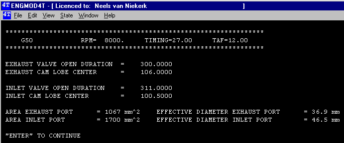

## [Graphics Introduction]{.underline}

[If the choice from the main menu is made to display the graphics the following three possibilities exist: ]{lang="EN-UK" style="font-size:12.0pt"}

1.  Single cylinder engine graphics
2.  2 to 4 cylinder engine graphics
3.  5 to 8 cylinder engine graphics.

The difference between these are the display options. A maximum of four individual plots per screen is practical so for more than 4 cylinders it is necessary to have a choice of which group to display. Each is discussed under its own heading.

[After choosing the graphics options a summary of the cam timing and the effective valve areas are displayed. The next figure shows this output.]{lang="EN-UK" style="font-size:12.0pt"}

{width="691" height="288"}

[After pressing \"**Enter**\" the screen will change to the graphics screen. The details of which are discussed for each option.]{lang="EN-UK" style="font-size:12.0pt"}
