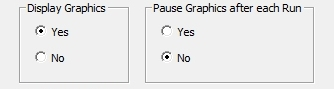
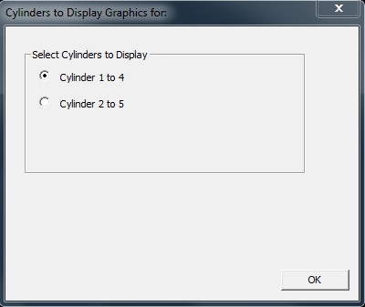
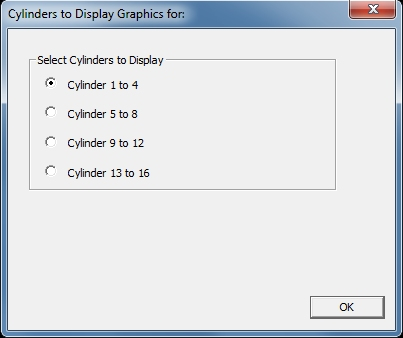
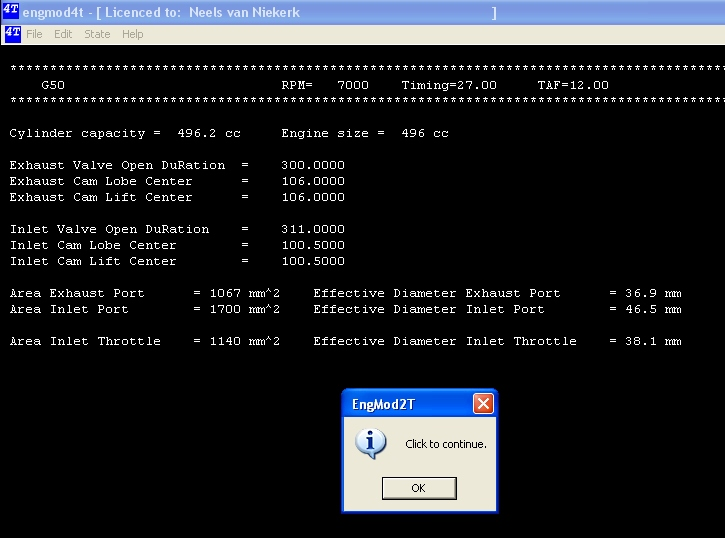
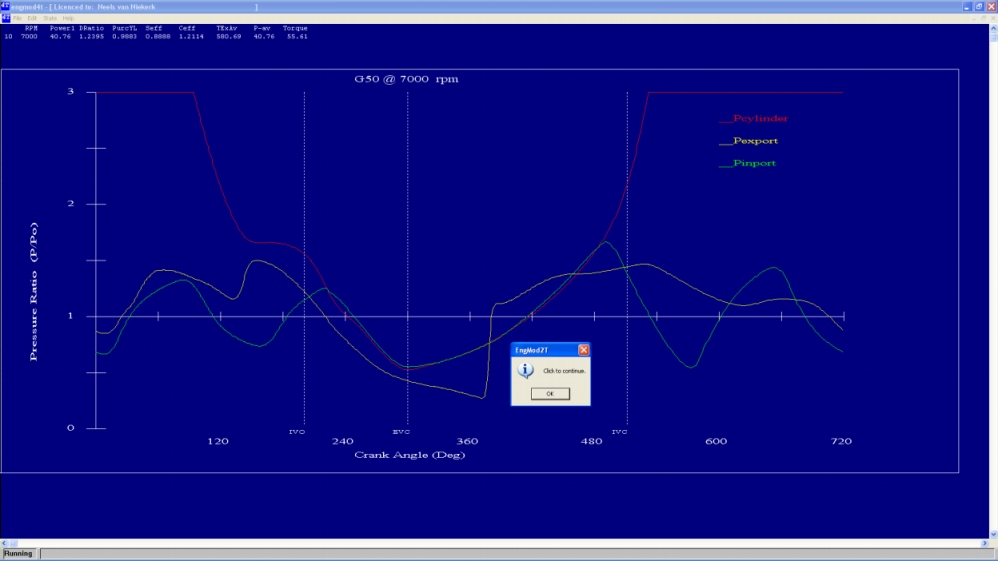

## [Graphics Output to Screen]{.underline}

When choosing to display the graphics the following selections opens:

{border="0" width="334" height="89"}

The user chooses to halt the software execution between each stage and wait for a user action or to continue non stop.

When choosing to display the graphics one of the following dialog boxes will be displayed, depending on the number of cylinders and if the number of cylinders are more than four (the maximum number of cylinder graphics results that can be shown on the screen is four, and the user has to select which ones are displayed):

{border="0" width="400" height="337"}  {border="0" width="402" height="339"}

{border="0" width="401" height="338"}  {border="0" width="404" height="340"}

{border="0" width="402" height="336"}  {border="0" width="403" height="338"}

After choosing the graphics options a summary of the port timing and the effective port areas are displayed. If a throttle is specified its effective area and diameter is also displayed. The next figure shows this output.

{border="0" width="725" height="538"}

A typical output of the pressure traces for a single cylinder is shown in the next figure:

{border="0" width="998" height="561"}

A typical output of the pressure traces for a sixteen cylinder engine where the last four cylinders were selected is shown in the next figure:

{border="0" width="1075" height="604"}

A list of some performance values are displayed at the top of the screen. To continue to the final screen press \"Enter\". The final screen shows a more complete summary of the performance values as shown in the next figure:

{border="0" width="613" height="668"}

The meaning of the variables are explained in [TextOutput.htm](TextOutput.htm)

Clicking on \"**OK**\" will exit the program.
