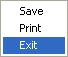

## [Run Time Control]{.underline}

During the execution of a job there are a range of options available from the menu bar:

{border="0" width="426" height="43"}

### [**File**]{.underline} {#file align="left"}

{border="0" width="68" height="57"}

- **Print**  - This option prints the current screen
- **Save** - This saves the current screen
- **Exit**  - Terminates the execution and exits the program

### [Edit]{.underline} {#edit align="left"}

{border="0" width="87" height="40"}

- **Select All** - Selects the current screen displayed
- **Copy** - Copies the selected screen to the clip board to allow pasting into another document

### [**State**]{.underline} {#state align="left"}

{border="0" width="73" height="23"}     {border="0" width="121" height="23"}

- **State** - State allows the temporary halting of the program execution. If the computer is needed for another function the program execution can be temporary halted and the resumed when it is convenient.

### [**Help**]{.underline} {#help align="left"}

{border="0" width="118" height="40"}

- **EngMod4T Help** - Opens this help file from inside the program
- **About** - Displays some information about the software.
