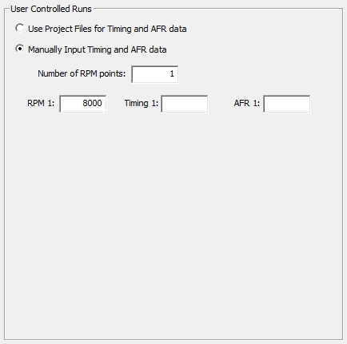
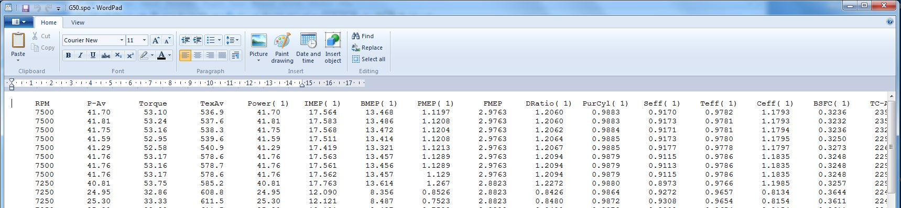

## [Screen Mode]{.underline}

It is also possible to select running the program from the screen. More than one rpm point can be selected. Typically the following choices are made for screen runs:

{border="0"}

{border="0"} {border="0"}

The next selection is whether to input data from the screen or to use the project files for timing and air/fuel ratio:

{border="0"}

Selecting the \"Manually Input Timing and AFR data\" radio button opens the following edit boxes:

{border="0"}

It is also possible to select more than 1 but no more than 10 rpm values:

{border="0"}

The rpm values for all points can be the same but with different ignition timing and/or air fuel ratios to determine for instance the optimum timing at a point. The results are in the following file: \"ProjectName.spo\" and it is in the project folder (Usually: \"C:\\4Stroke\\ProjectName\\\") and can be opened with any text editor. It is in ASCII format. Set the editor to \"No Wrap\" to keep all the data for a rpm point in a single line.

The following picture shows an example using \"Wordpad\" which is a free text editor that is supplied with MS/Windows.

{border="0"}

Note that the runs are just appended as they complete and there is no indication of what they were. The file is used developing the simulation model before full rpm range simulations in \"Batch-mode\" are run. It is up to the operator to keep track of what each run is.
