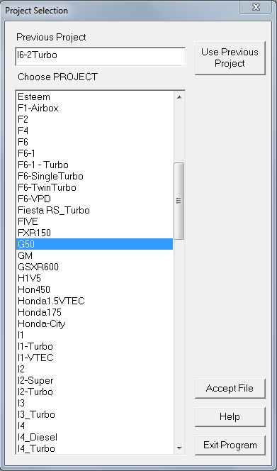
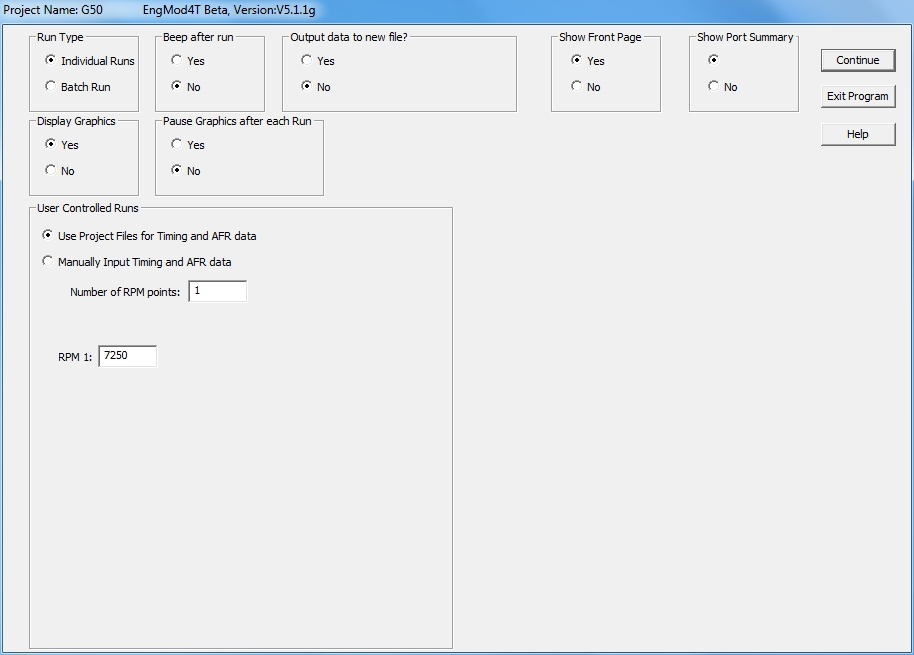
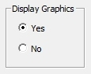
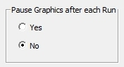

## **[Starting EngMod4T]{.underline}**

Start **EngMod4T**by double clicking on the **EngMod4T** icon.

{width="34" height="32"}

This will bring up a dialog box that will display the program version and with two command buttons.

{border="0" width="431" height="348"}

Click on the **\"Continue\"**-button to start the main program or the **\"Exit Program\"**-button to exit. If you click the \"**Continue**\"-button a dialog box will appear with a list of the available projects:

{border="0" width="391" height="664"}

Select the project you want to simulate by clicking on its name and then clicking the \"**Accept File**\"-button or by double clicking on the name. You can also click on the \"**Use Previous Project**\"-button to rerun the previous simulation. This will open the simulation parameter dialog:

{border="0" width="914" height="655"}

The top row on this dialog box contains the control parameters for the simulation:

### Run Type Selection

{border="0" width="115" height="91"}

Individual runs are normally used when an investigation is done and only one or a small amount of runs are executed and the results are stored in a file with the .spo extension. Typically a batch run is an unattended run that is an rpm sweep and has as output a power curve with all its attached data, in a file with the .pou extension.

### Beep Selection

{border="0" width="115" height="93"}

This selection switches a beep sound on or off after each rpm run.

### Output File Name Selection

{border="0" width="239" height="92"}

This selection outputs the data to the default files with the project name.

{border="0" width="236" height="92"}

This outputs the data to files with the specified file name.

### Display Front Page Selection

{border="0" width="112" height="90"}

This selection makes it possible to skip the front page when starting the program and open the projecr selection dialog box immediately.

### Display Port Summary Selection

{border="0" width="113" height="94"}

The port summary at the top of each run page can be switched on or off with this selection.

### Display Graphics Selection

{border="0" width="115" height="94"}

This chooses whether to display the graphics on the screen or not.

### Pause graphics Selection

{border="0" width="176" height="95"}

The port summary at the top of each run page can be switched on or off with this selection.
