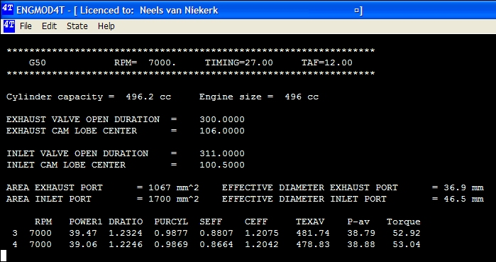
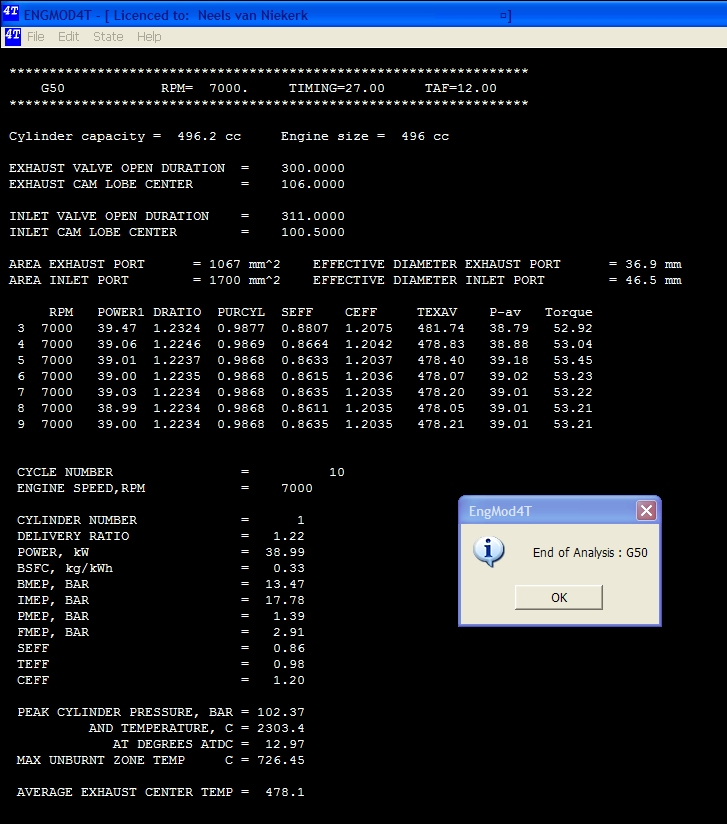

## [Text Only Display]{.underline}

By choosing not to display the graphics the program displays text only. This is done by selecting the \"**Display Graphics - No**\" radio button:

{border="0" width="527" height="207"}

The following is an example of the output in text mode for a single cylinder engine:

{border="0" width="699" height="369"}

As can be seen from the figure 4 iteration cycles have been completed and the 5th one is in process.

At the top the project name, the rpm for this run as well as the ignition timing and trapped air/fuel ratio (TAF) is displayed. This is followed by the cylinder and engine capacity. A summary of the cam timing and the effective valve areas are displayed. The following values are displayed for each cycle:

- **RPM**        Revolutions per minute
- **Power1**     Power for cylinder 1
- **DRatio**     Delivery ratio for last cylinder
- **PurCyl**      Purity of cylinder content at inlet valve closure for last cylinder
- **Seff**           Scavenging efficiency - purity of cylinder content at exhaust valve closure for last cylinder
- **Ceff**          Charging efficiency for last cylinder
- **TexAv**      Average temperature at exhaust center section
- **P-av**          The sum of the average power for each cylinder over the last 3 cycles
- **Torque**      The torque calculated from P-av and RPM

 The next figure shows the output for the completed run.

{border="0" width="727" height="824"}

The results for the final cycle is displayed in more detail:

- **Cycle Number**\...\...\...\...\...Number of simulation cycles
- **Engine Speed, RPM**\.....Revolutions per minute

<!-- -->

- **Cylinder Number**\...\...\....The cylinder number for which the following results are listed
- **Delivery Ratio**\...\...\...\.....The delivery ratio for each cylinder
- **Power, kW**\...\...\...\...\...\...\...The predicted power output for each cylinder
- **BSFC, kg/kWh**\...\...\...\.....Brake specific fuel consumption in kg per kilowatt hour for each cylinder
- **BMEP, Bar**\...\...\...\...\...\.....Brake mean effective pressure in bar for each cylinder
- **IMEP, Bar**\...\...\...\...\...\...\...Indicated mean effective pressure in bar for each cylinder
- **PMEP, Bar**\...\...\...\...\...\.....Pumping mean effective pressure in bar for each cylinder
- **FMEP, Bar**\...\...\...\...\...\.....Friction mean effective pressure in bar
- **Seff**\...\...\...\...\...\...\...\...\...\...\...Scavenging efficiency - purity of cylinder content at exhaust valve closure for last cylinder
- **Teff**\...\...\...\...\...\...\...\...\...\.....Trapping efficiency
- **Ceff**\...\...\...\...\...\...\...\...\...\.....Charging efficiency

<!-- -->

- **Peak Cylinder Pressure, Bar**\...\...\....Maximum cylinder pressure for this cycle
- **Peak Cylinder Temperature, C**\...\...Maximum cylinder temperature for this cycle
- **At degrees ATDC**\...\...\...\...\...\...\...\...\....Position in crankshaft rotation where maximum pressure occurred
- **Max Unburnt Zone Temp, C**\...\...\....Same as TUMax, Maximum unburnt mixture temperature before being taken up by the flame front

<!-- -->

- **Average Exhaust Center Temp, C**\...\.....Average exhaust center section or center temperature

By clicking on the \"**OK**\"-button the program is exited.

 
