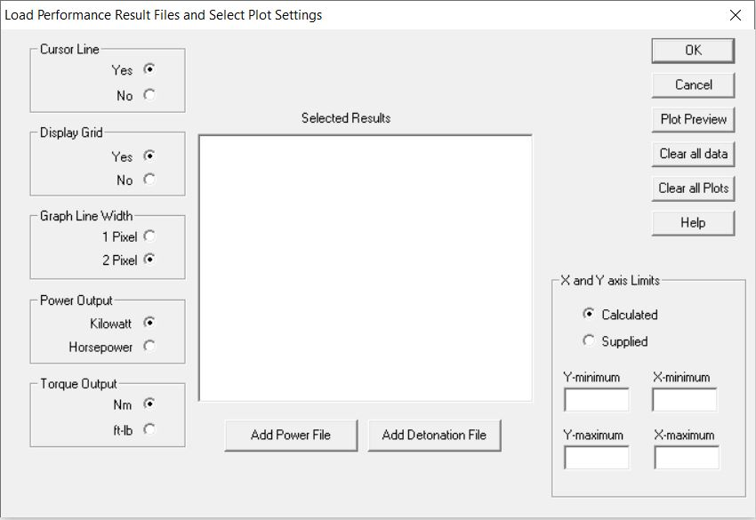
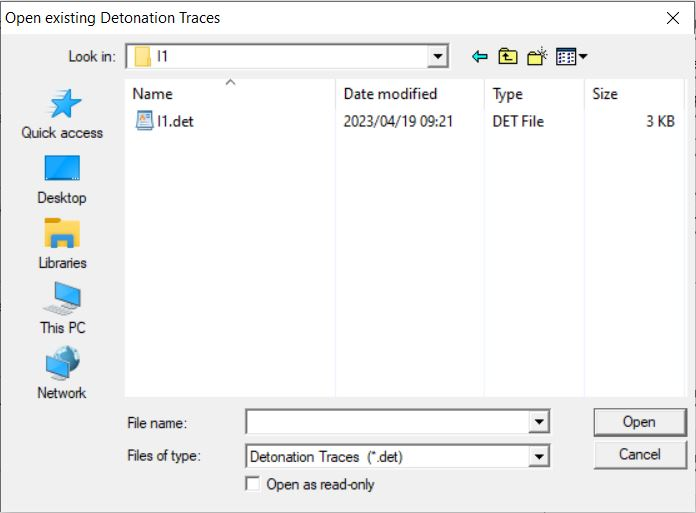
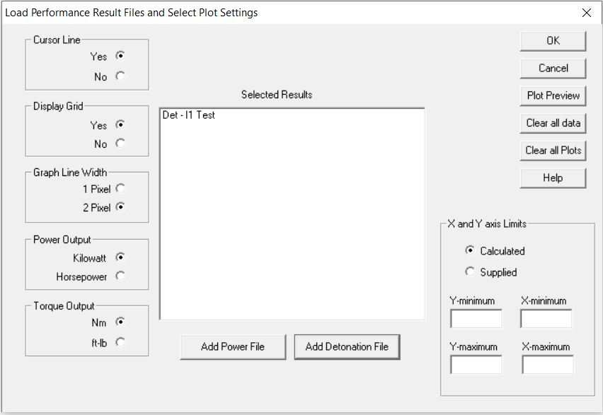
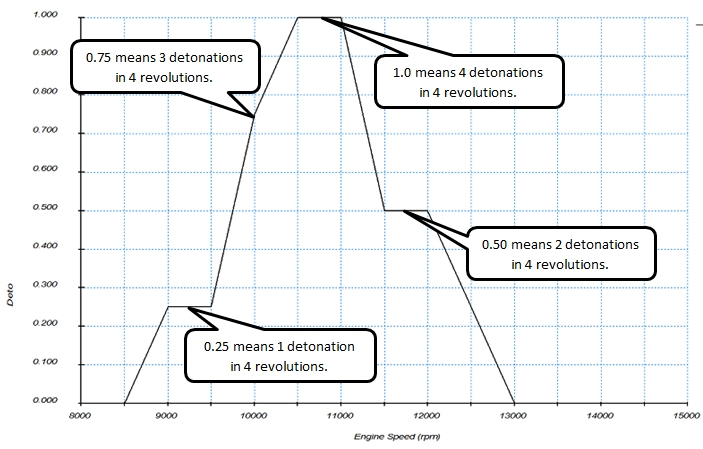
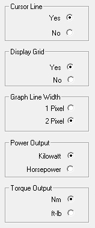
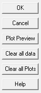

## [**Detonation Traces**]{.underline}

Selecting \"**Plot Options**\" will drop down the following menu:

{border="0"}

Selecting the **Performance and Efficiency** option on the **Plot
Options** menu will open the following dialog box:

{border="0"}

To select a detonation file click the **Add Detonation File** button.
This will open the file open dialog box with \*.det files listed:

{border="0"}

After selecting and opening a file the main dialog box is updated to
show all the detonation traces contained in this file. Each detonation
trace is given the file name followed by the specific performance curve
name. More detonation files can be added:

{border="0"}

Specific traces can now be selected by clicking on the required name
which then opens the following dialog box:

{border="0"}

After selecting the required traces by clicking on them the **OK**
button is selected and the user is returned to the main dialog box.
After all the required traces are selected the **OK** button on the main
dialog box is selected and the main plot is displayed:

{border="0"}

The detonation severity is based on the number of detonation events that
occured during the final four simulation cycles. It lists the severity
in the following way:

- **0.00** - no detonation event
- **0.25** - 1 detonation event in 4 cycles - low detonation
- **0.50** - 2 detonation event in 4 cycles - medium detonation
- **0.75** - 3 detonation event in 4 cycles - high detonation, probable
  catastrophic failure
- **1.00** - 4 detonation event in 4 cycles - severe detonation, almost
  definite catastrophic failure

## Content Description

The detonation data is written in an appending file. It has the project
name with the **.det** or **.des** extension. As an example the name for
the detonation file of project Honda will be: **Honda.det** for batch
jobs and **Honda.des** for screen runs. The data in the detonation file
is per column (where there is more than one cylinder the columns per
cylinder are repeated for each cylinder):

- **RPM**         Simulated engine rpm
- **P-av**
  - Average engine total power over the last six cycles (kW) for a
    naturally aspirated engine.
  - The same for a Supercharged engine but with the power absorbed by
    the Compressor and its drive subtracted.
  - Average engine total power over the last forty cycles (kW) for a
    Turbocharged engine.
- **Torque**      The engine torque calculated from the P-av value in
  the previous bullet point.(Nm)
- **PurCyl **    Purity of the mixture in the cylinder at inlet valve
  closure
- **TUBmax**   Maximum unburned mixture temperature per cylinder (C)
- **TCylMax**  Maximum temperature per cylinder (C)
- **PCylMax**  Maximum pressure per cylinder (bar)
- **Detto**        The count of the number of detonations per cylinder
  over the last 4 cycles. 0 to 4.

## Graph Appearance Display Options

On the left of the dialog box there are a number of display options as
shown in the next picture with the default options selected:

{border="0"}

## Graphing and Data Options

On the right of the dialog box there are a number of display and data
manipulation options as shown in the next picture:

{border="0"}

- **OK -** This button clears away the dialog box and displays the
  selected results.
- **Cancel -** This button clears away the dialog box and clears the
  display area.
- **Plot Preview -** This button displays the selected results but keeps
  the dialog box open.
- **Clear all Data -** This button clears all loaded data.
- **Clear all Plots -** This button unselects all the selected plots but
  keeps the loaded data.
- **Help -** This button opens the help files.

## Zooming into a selected area

{border="0"}

To zoom in on specific areas of the plot traces select the **Supplied**
radio button in the **X and Y  axis limit** group box and specify the
required values in the edit boxes either by editing the value displayed
or by using the spin buttons next to each edit box.
