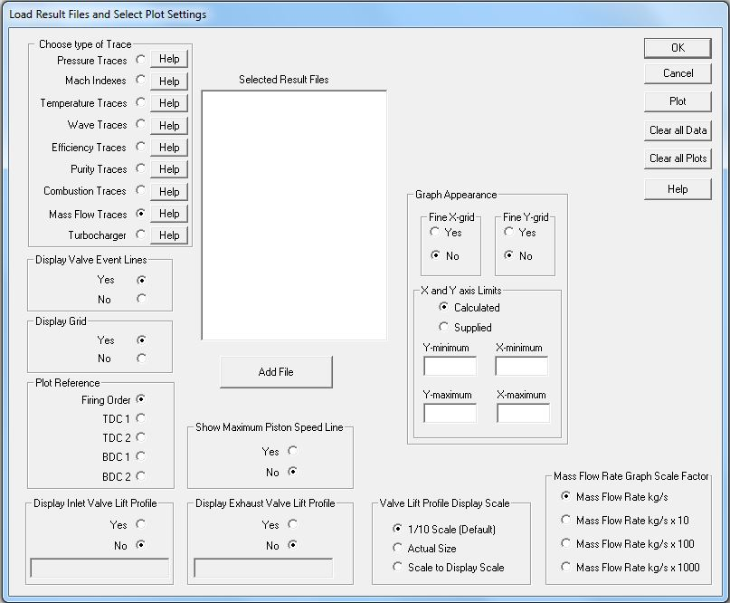

## [Mass Flow Trace (\*.dme)]{.underline}

The mass flow trace files are part of the new or over written files.
They have the project name appended with the rpm value and the extension
**.dme**. The mass flow traces for project Honda at 8000 rpm will be in
the file: **Honda8000.dme**. This file will be in the project directory
and over written each time a simulation at its specific rpm is
conducted.

The mass flow units are: **kg/s**

To plot it with other variables on the same graph a scale factor can be
selected as shown at the bottom center of this picture:

{border="0"}

It has the following traces as output:

- **Deg**\...\...\...\.....Engine degrees using the last cylinder as
  reference.
- **MITrace**\...\...The mass flow at the inlet trace point.
- **ComprDM**..The mass flow through the compressor if a turbocharger is
  fitted.
- **Min**\...\...\...\.....The mass flow at the inlet port.
- **Mex**\...\...\...\....The mass flow at each exhaust port.
- **TurbDM**\...\...The mass flow through the turbine if a turbocharger
  is fitted.
- **WasteDM**\....The mass flow through the wastegate if one is fitted.
- **MXTrace**\.....The mass flow at each exhaust trace point.
- **MexOut**\...\....The mass flow at each exhaust outlet to atmosphere.

To load mass flow rate traces the following radio button is selected:

{border="0"}
