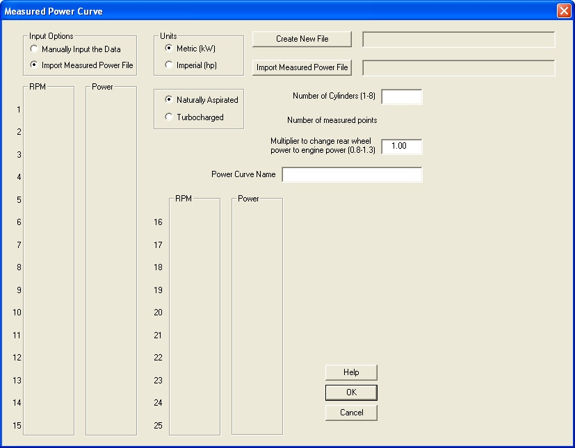

# [Importing Measured Power Curves]{.underline} {#importing-measured-power-curves align="left"}

## Manual Data Input {#manual-data-input align="left"}

By selecting the \"Create Measured Power Curve File\" option on the main
menu the following dialog opens:

{border="0" width="827"
height="645"}

This dialog allows you to manually input from 2 to 25 points on a power
curve into a file.

## Importing Measured Data from File {#importing-measured-data-from-file align="left"}

It is also possible to import an ASCII file which has rpm as its first
column and Power as its second column by selecting \"Import Measured
Power File\" radio button after which the dialog will change to the
following:

{border="0" width="827"
height="645"}

The imported file can have any extension but must be an ASCII file and
the data must start in the first row.

## General Information {#general-information align="left"}

Both options require the number of cylinders, the power curve name and
the output file name to be specified by the user. In the manual input
version the user has to specify the number of points to be entered while
in the automatic import version the user must select and open the file
to be read. In both cases can the user specify whether the input data is
in kW or hp.

The multiplier used to convert rear wheel power to engine power should
be used with caution to prevent over optimistic results. Typically a
high performance race engine with straight cut gears have a loss of
about 12% so the recommended multiplier is 1.12.

The power file created by this utility is in the same format as the
power output file created by EngMod4T which allows direct comparison
between the simulated and measured power and torque.

It uses the number of cylinders to create the power output for each
cylinder by dividing the measured power by the number of cylinders.
