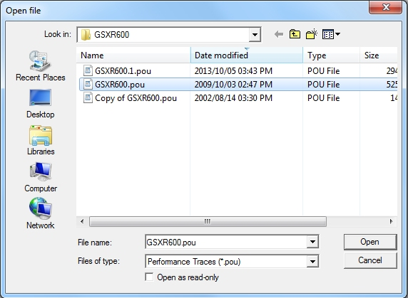
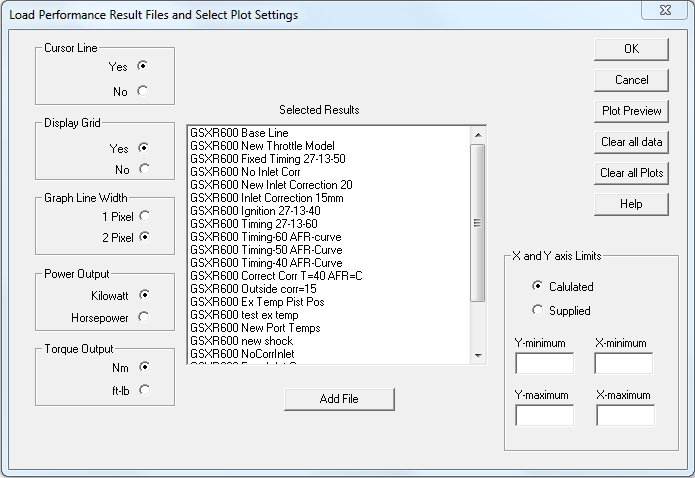
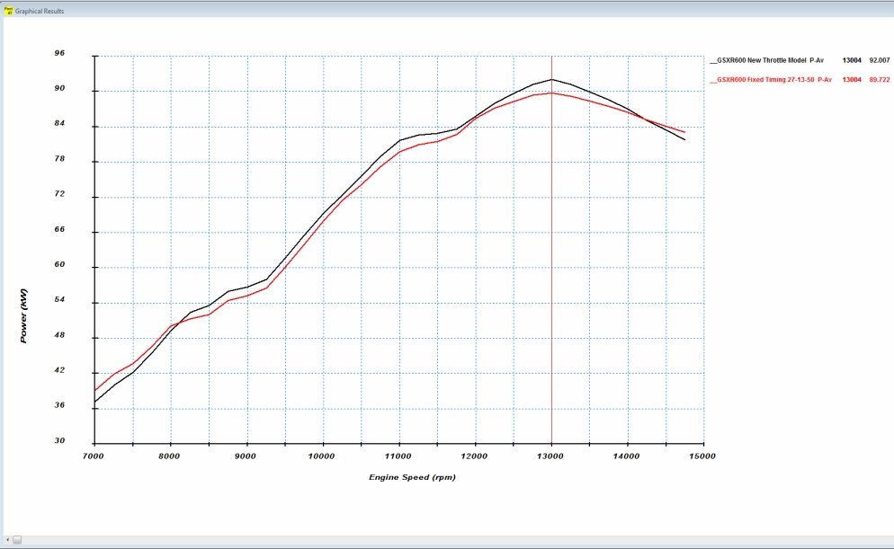
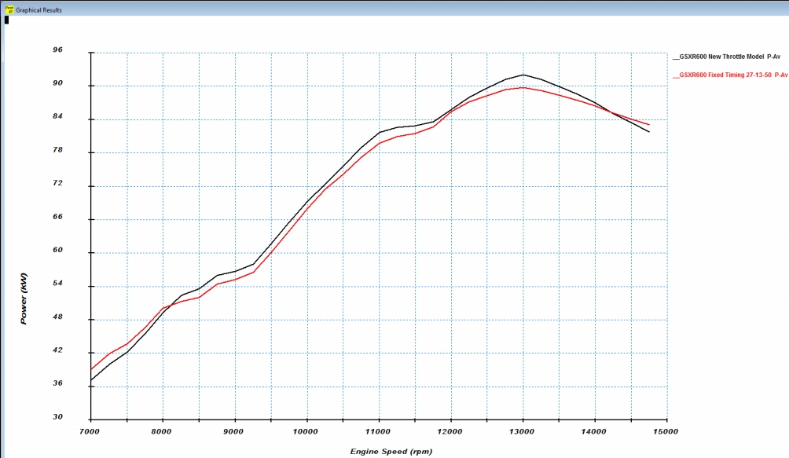
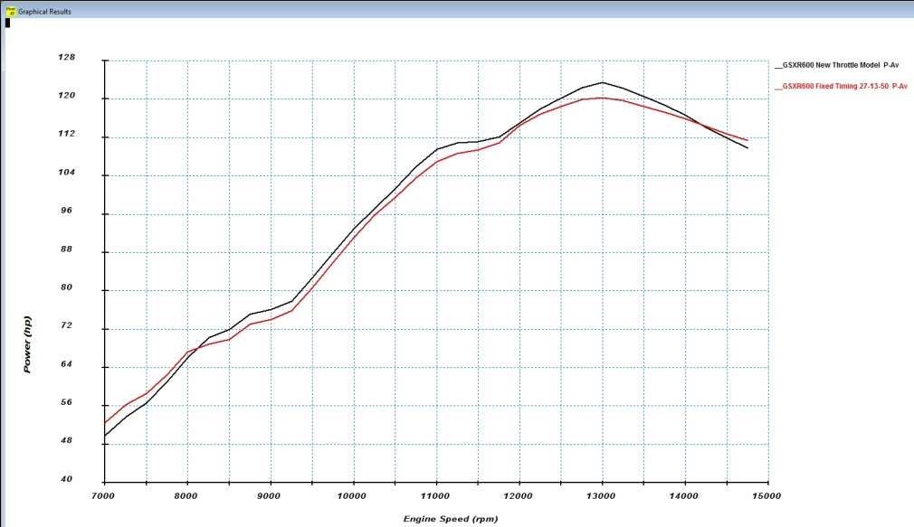

## [**Performance and Efficiency traces**]{.underline}

Selecting \"**Plot Options**\" will drop down the following menu:

{border="0"}

Selecting the **Performance and Efficiency** option on the **Plot
Options** menu will open the following dialog box:

{border="0"}

To select a performance file click the **Add Performance File** button.
This will open the file open dialog box with \*.pou files listed:

{border="0"}

After selecting and opening a file the main dialog box is updated to
show all the performance traces contained in this file. Each performance
trace is given the file name followed by the specific performance curve
name. More performance files can be added:

{border="0"}

Specific traces can now be selected by clicking on the required name
which then opens the following dialog box:

{border="0"}

After selecting the required traces by clicking on them the **OK**
button is selected and the user is returned to the main dialog box.
After all the required traces are selected the **OK** button on the main
dialog box is selected and the main plot is displayed (**Note -** After
the graph legends the rpm value and the graph value at the cursor line
is displayed):

{border="0"}

## Graph Appearance Display Options

On the left of the dialog box there are a number of display options as
shown in the next picture with the default options selected:

{border="0"}

**Display Cursor Line - No:** Selecting this option displays the graph
without a cursor line:

{border="0"}

**Display Grid - No:** Selecting this option displays the graph without
a grid:

{border="0"}

**Display Line Width - 1 Pixel:** If the option for trace lines of 1
pixel width was selected the plot will look as follows:

{border="0"}

The power output and torque (kW and Nm) can be displayed in imperial
units (hp and ft-lb) by selecting the \"**Horsepower**\" and
\"**ft-lb**\" radio buttons:

**Power Output - Horsepower:**In this figure the horsepower dispaly is
selected. The same can be done for the torque curve:

{border="0"}

## Graphing and Data Options

On the right of the dialog box there are a number of display and data
manipulation options as shown in the next picture:

{border="0"}

- **OK -** This button clears away the dialog box and displays the
  selected results.
- **Cancel -** This button clears away the dialog box and clears the
  display area.
- **Plot Preview -** This button displays the selected results but keeps
  the dialog box open.
- **Clear all Data -** This button clears all loaded data.
- **Clear all Plots -** This button unselects all the selected plots but
  keeps the loaded data.
- **Help -** This button opens the help files.

## Zooming into a selected area

{border="0"}

To zoom in on specific areas of the plot traces select the **Supplied**
radio button in the **X and Y  axis limit** group box and specify the
required values in the edit boxes either by editing the value displayed
or by using the spin buttons next to each edit box.
