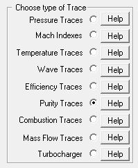

## [Purity Trace Output (\*.pur)]{.underline}

The purity trace files are part of the new or over written files. They
have the project name appended with the rpm value and the extension
**.pur**. The purity traces for project Honda at 8000 rpm will be in the
file: **Honda8000.pur**. This file will be in the project directory and
over written each time a simulation at its specific rpm is conducted.

It has the following traces as output:

- **Deg **           Engine degrees using the last cylinder as
  reference.
- **PurIn **         Purity trace at the inlet valve per cylinder.
- **PurCyl**        Purity trace in the cylinder per cylinder.
- **PurEx**         Purity trace at the exhaust valve per cylinder.

The purity traces has a value of 1 for pure air and a value of 0 for
pure exhaust gas. Any mixture of the two will have a value between 0 and
1.

To load purity traces the following radio button is selected:

{border="0"}
