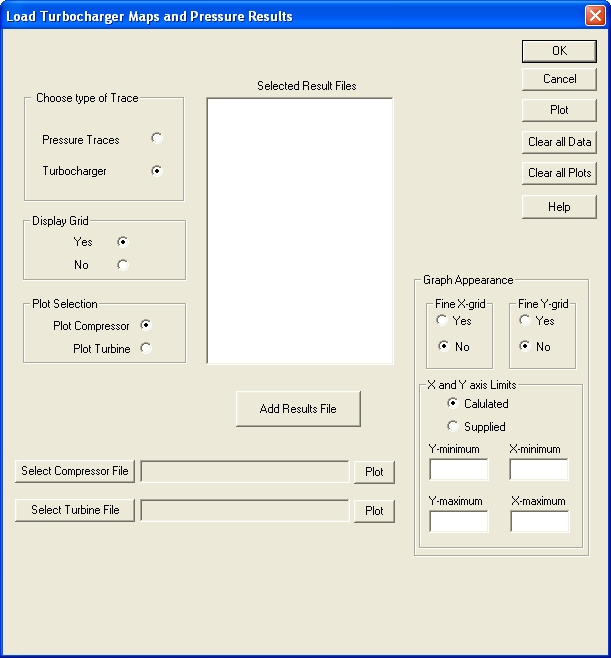
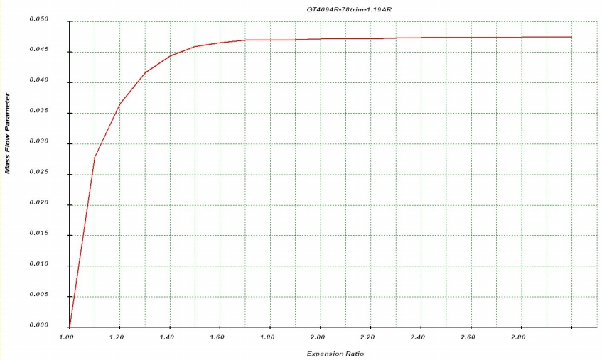
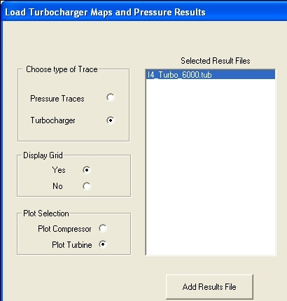
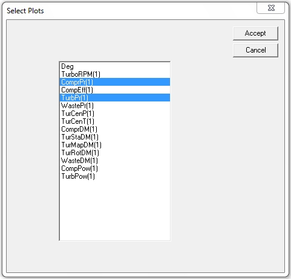
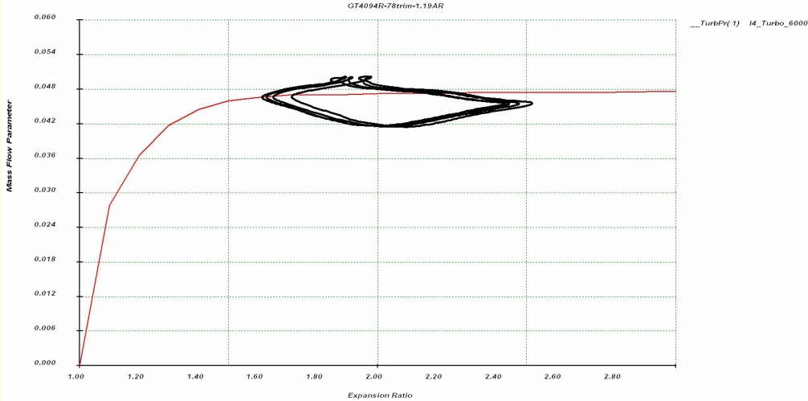

# Turbocharger Post Processing

To post processes a turbocharger run we select the \"**Turbocharger Map
Plot**\" option from the \"**Plot Options**\" drop down menu:

{border="0"}

This opens the following dialog box:

{border="0"}

The first step is to import the compressor and turbine files. We start
by clicking on the \"**Select Compressor File**\" button which opens the
Compressor file selection dialog where we select the required file:

{border="0"}

After repeating the process to import the turbine file the turbocharger
map names are now displayed:

{border="0"}

To investigate these maps we can plot them individually by clicking on
the \"**Plot**\" button next to each. The compressor map looks as
follows:

{border="0"}

And the turbine map:

{border="0"}

Next we import a results file from a simulation by first making sure the
\"**Turbocharger**\" radio button in the \"**Choose type of Trace**\"
group is selected, and then by clicking the \"**Add Results File**\"
button and select the required file:

{border="0"}

By now clicking on the \"**Selected Results File**\" the following drop
down menu is displayed where we select the two highlighted results:

{border="0"}

Next we make sure the \"**Plot Compressor**\" radio button in the
\"**Plot Selection**\" group is selected and the click on the \"**OK**\"
button:

{border="0"}

The thick black line shows the instantaneous working point of the
compressor during a complete engine cycle (720deg). Next we select the
\"**Plot Turbine**\" radio button and the \"**OK**\" button:

{border="0"}

Once again the thick black line shows the instantaneous working point of
the turbine relative to the swallowing curve for a complete cycle
(720deg).
