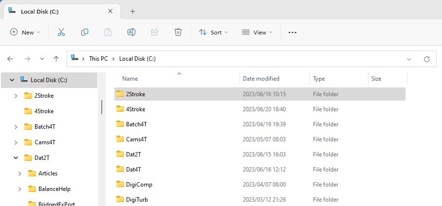

**[ ]{lang="EN-US" style="font-size:16.0pt;mso-bidi-font-size:10.0pt"}**

**[ ]{lang="EN-US" style="font-size:16.0pt;mso-bidi-font-size:10.0pt"}**

# [Dat4T -- The pre-processor for EngMod4T]{lang="EN-US" style="font-size:20.0pt;mso-bidi-font-size:10.0pt"} {#dat4t-the-pre-processor-for-engmod4t align="center"}

[ ]{lang="EN-US"}

## [Dat4T]{lang="EN-US" style="font-size:16.0pt;mso-bidi-font-size:10.0pt"}[ was developed by ]{lang="EN-US"} {#dat4t-was-developed-by align="center"}

[ ]{lang="EN-US"}

### [Neels van Niekerk]{lang="EN-US"} {#neels-van-niekerk align="center"}

**[of]{lang="EN-US" style="font-size:14.0pt;mso-bidi-font-size:10.0pt"}**

### [Vannik Racing Developments]{lang="EN-US"} {#vannik-racing-developments align="center"}

[ ]{lang="EN-US" style="font-size:12.0pt;mso-bidi-font-size:10.0pt"}

[ ]{lang="EN-US" style="font-size:12.0pt;mso-bidi-font-size:10.0pt"}

[Dat4T is the preprocessor for the 1-dimensional gasdynamic multi cylinder four stroke engine simulation software, EngMod4T. This Help-system describes the required input variables and options available. It also describes the pipe numbering system and gives a brief overview of some of the models used.]{lang="EN-US"}

[ ]{lang="EN-US"}

[The simulation models and simulation methods used in EngMod4T are mostly based on the work of [Professor Emeritus Gordon P Blair](References.htm) of The Queen\'s University of Belfast.]{lang="EN-US"}

---

# License Agreement {#license-agreement align="center"}

This software is licensed to run on a single computer.

Engine designs that you independently generate using the EngMod4T software suit (Dat4T, EngMod4T and Post4T) may be used, given away, or sold without additional license or fees. You are not required to say that your designs were developed using EngMod4T. 

The sample engine designs distributed with the EngMod4T software suit provide a demonstration of the various features of EngMod4T. They are intended for educational purposes only. C G J van Niekerk grants you (the registered owner of this copy of EngMod4T) the right to edit or modify these sample designs for your own use, but you may not give them away or sell them.

This manual and software are protected by both South African copyright law and International treaty provisions, with the following single exception. C G J van Niekerk authorizes you to make archival copies of the software for the sole purpose of backing-up this software and protecting this software from loss.

---

# Disclaimer {#disclaimer align="center"}

Although great care has been taken to ensure accurate and representative models of all the thermodynamic and gasdynamic processes are used, at the end of the day they are just that: Models of reality. The modeler should therefore keep the following in mind:

C G J van Niekerk specifically disclaims all other warranties, expressed or implied, including but not limited to implied warranties of merchantability and fitness for a particular purpose with respect to defects in the diskette or documentation, and the software license granted herein in particular, and without limiting operation of the software license with respect to any particular application, use, or purpose.

Modifying road car or motorcycle engines may result in the vehicle failing the requirements of the relevant state Road Traffic Authority and therefore being declared unroadworthy and unregistered.

The price of man in motion is the occasional accident and/or collision. Testing vehicle performance may be dangerous. Motor racing is dangerous. This software package is about improving the performance of the motor vehicle, motor cycle, motor boat or any other vehicle, boat or aircraft. It deals with developing and changing engine characteristics. Anyone who uses this program and/or manual as a guide for vehicle modification does so entirely at their own risk.

In no event shall C G J van Niekerk be liable for any loss of profit or any other commercial damage, including but not limited to special, consequential or other damages arising from the application of any information, dimensional changes or data because of using this package.

---

# The Folder Structure used by the EngMod4T Suite of Programs

During the installation process the installer software creates the program folders and the working folder as well as shortcut Icons on the desktop. Unless you know how to change a target folder for a program it is strongly recommended that you use the default file structure.

1.  Folders Created:
2.  **C:\\4Stroke** - This is the working folder where all the Project files is stored.
3.  **C:\\Program Files (x86)\\Dat4T** - The Dat4T executable, license file and Help files are installed to this folder.
4.  **C:\\Program Files (x86)\\EngMod4T** - The EngMod4T executable, license file and Help file are installed to this folder.
5.  **C:\\Program Files (x86)\\Post4T** - The Post4T executable and Help file are installed to this folder.
6.  **C:\\Program Files (x86)\\Waveviewer4T** - The WaveViewer4T executable and Help files are installed to this folder.

Only the first folder is of any interest if everything is normal. The other folders are only accessed if there are issues with the software, most often when Windows decides to install the license file somewhere else. A typical executable folder looks as follows:

{border="0"}

## Working Folder - \"C:\\4Stroke\"

The working folder is the one we are interested in. It is created when the software is installed and populated with some examples to supply a starting point for the new user to get up to speed.

{border="0"}

Double clicking on the \"C:\\4Stroke\" icon opens the working folder. Normally there would be a large number of files in this folder but to make it easier to explain there is only one Project loaded: Blast. The folder shown below is after running a single simulation:

{border="0"}

There are a number of files in this folder other than directly Project related files and they are as follows with the following functions:

1.  **Dat4TErrorLog.dat** - Every time Dat4T is started a new file is over written over the old one and It stores all the errors and commands used. Send this file with an error report when Dat4T gives a funny error or crashes, before opening Dat4T again as that will just over write the file.
2.  **Dat4TLicenseCheck.dat** - Certain parts in Dat4T is only available if you have a valid license and this logs the checks.
3.  **EngMod4TLicenseCheck.dat** - Every time EngMod4T is started the validity of the license is first verified. If you have any license issues please send this file.
4.  **OldEngMod4TFile.fle** - This stores the choices made during the previous EngMod4T run to save time selecting them if the next run will use the same parameters.
5.  **OldProjectFile.fle** - This stores the previous Project opened by Dat4T and loads it when Dat4T is opened again.
6.  **Post4TErrorLog.dat** - Every time Post4T is started a new file is over written over the old one and It stores all the errors and commands used. Send this file with an error report when Post4T gives a funny error or crashes, before opening Post4T again as that will just over write the file.
7.  **Post4TWorkDir.dat** - Stores the Post4T working folder of the previous run, not yet used for anything.

## Project Folder - \"C:\\4Stroke\\Blast\"

### Single Run Results

Once a simulation of a Project is run a folder is created with the name of the Project and all the result files are stored in this folder. We double click on the \"Blast\" folder icon in the Project folder to open it:

{border="0"}

In this folder is a list of all the simulation results at 8000rpm, they are the files with the \"8000\" appended to the name but before the extention. These are the files used by Post4T to display the \"Trace\" values. There are also three new files without the \"8000\" in the name. They are the following and is used for specific outputs:

1.  **Blast.dat** - This file (.dat) lists the running of the main simulator, EngMod4T, and captures errors. Any time a simulation crashes this is the file you send to report the error and ask for assistance.
2.  **Blast.des** - The detonation results for a single run is stored in this file (.des). To see the values inside it, open it with a normal text editor, something like \"Wordpad\" or \"Notepad++\".
3.  **Blast.spo** - The performance results for a single run is stored in this file (.spo). To see the values inside it, open it with a normal text editor, something like \"Wordpad\" or \"Notepad++\".

Note that both the last two files are appended during each batch run so the performance and detonation results are just added during each run.

### Batch Run Results

After a \"Batch\" run there are a lot more files with the results for each rpm point in the batch run. There are now two new files which we are interested in.

{border="0"}

The following two files are of interest:

1.  **Blast.det** - The detonation results for a batch run is stored in this file (.det). To see the values inside it, open it with Post4T.
2.  **Blast.pou** - The performance results for a batch run is stored in this file (.pou). To see the values inside it, open it with Post4T.

Note that both these files are appended during each batch run so the performance and detonation results are just added during each run.

### Advanced Users

There are three files created with each RPM point that lists the instantaneous port open area against crank angle. These files are not opened by Post4T but requires Microsoft Excel to open and plot.

1.  **Blast8000.epa** - This file (.epa) lists the exhaust port open area against crank angle.
2.  **Blast8000.ipa** - This file (.ipa) lists the inlet port open area against crank angle.

---

# Project Layout

Dat4T creates or edits projects for use by EngMod4T. A project consists of a collection of subsystems that are stored in individual files. A main project file contains the list of subsystem files. The name of this project file is the name of the engine to be simulated. A project consists of the following:

## Project File (ProjectName.pjt)

This file contains a list of all the subsystem file names. When a new project is created Dat4T automatically creates subsystem files with the project name. The user can then use these names or change them to existing subsystem names. If the new names are used they will be empty subsystems that has to be populated by the user.

### Engine Subsystem (EngineName.eng)

The engine subsystem describes the basic engine layout and geometry. It also contains some starting values and control values for the main simulation.

### Exhaust Cam, Port and Valve Subsystem (ExhaustPortName.exp)

This contains all the data for the exhaust cam, the port dimensions, the flow conditions and the number and dimensions of the valves.

### Inlet Cam, Port and Valve Subsystem (InletPortName.ipo)

This contains all the data for the inlet cam, the port dimensions, the flow conditions and the number and dimensions of the valves.

### Exhaust Subsystem (ExhaustName.exl, ExhaustName.exd)

These files contain all the relevant information to describe the type and layout of the exhaust system. The first file describes the type of system, sets up the atmospheric and plenum connectivity, specifies the collector angles and plenum volumes and gives the length dimensions of all the pipes.

The second file contains all the pipe diameters.

### Intake Subsystem (IntakeName.inl, IntakeName.ind)

These files contain all the relevant information to describe the type and layout of the intake system. The first file describes the type of system, sets up the atmospheric and plenum connectivity, specifies the collector angles, plenum volumes and throttle type and dimensions and gives the length dimensions of all the pipes.

The second file contains all the pipe diameters.

### Combustion and Ignition Subsystem (CombustionName.cbd)

This subsystem describes the combustion model and parameters, specifies the type of fuel and the combustion efficiency and contains generic combustion chamber details.

### Temperature and Atmospheric Subsystem (TemperatureName.tmp)

This subsystem prescribes the wall surface temperatures of the combustion chamber and all the ducts as well as the atmospheric temperature and pressure.

### Turbocharger and Boost Control Subsystem (TurbochargerName.trb)

This subsystem defines the turbocharger installation layout, the type of boost control and gives the names of the compressor and turbine maps.

## Additional Files

A project contains additional files, some are currently being used and others are meant for use with future upgrades of the software.

**ExhaustName.sil** Currently used to contain the exhaust silencer data. The silencer subsystem is still undergoing development and is only partially active.

**ExhaustPortName.exc** This file is being used to contain the exhaust valve lift profile in the format as used by EngMod4T

**IntakePortName.inc** This file is being used to contain the intake valve lift profile in the format as used by EngMod4T

**ProjectName.prt** This file gives a printable summary all the subsystems as contained in the project file.

---

# Windows User Interface Nomenclature

The software uses a Windows Dialog Box based user interface. To understand the descriptions in the help files it is helpful to know the Windows names of the controls. The following is an example of a dialog box with some of the major controls shown:

{border="0" width="679" height="496"}

## Radio Buttons

Radio buttons are grouped together and allows a choice of only one of the many options. Therefore only one radio button can be active in a group.

## List Box

A list box displays a list of items. Usually the user can click on one of these names and the software will then perform some funtion like for example open another dialog box that allows editing or selecting of the properties of that item.

## Edit Box

1.  **Greyed Out** - A greyed out edit box is where the software displays a value.
2.  **Active** - An active edit box is where the user enters data required by the software.

## Buttons

Buttons perform functions relating to the dialog box, for example to quit it without saving the data or to accept the data and save it, etc.

---

## **[Error Handling in Dat4T]{.underline}**

Sometimes there will be an error during the runtime of **Dat4T**. This error can be one of three different cases:

1.  An error with a message to inform the user what is wrong with an explanation on what to fix,
2.  An error with a message that the program will stop requesting the user to pack the project and to email it to the developer,
3.  The program just halts and either freezes or exits with no message.

It is important and very much appreciated if you report these errors as it helps to make the software more robust and user friendly.

### Error with Explanation

This is usually some incompatibility with the geometry and the user is directed to use Dat4T to repair the issue. If you are unable to repair the issue you are still free to create a pack file and email it to the developer with a brief explanation or a screen shot of the error message.

### Error with Request

This type of error will usually have a message stating that \"a numerical error has occured\" and the user is requested to send a pack file to the developer. The creation of a pack file is described in the Help files of Dat4T.

### Dat4T freezes or exits with no explanation

This is the most rare of the errors and requires special treatment. Please follow the following three steps:

1.  If the program does not automatically closes, stop the program using \"Task Manager\" which can be accessed by right clicking on the task bar,
2.  Send an error log file of the run to the developer. If you are using the default folders it will be in the ProjectName folder: **\"C:\\4Stroke\\Dat4TErrorLog.dat\"**
3.  Finally also create a pack file of the project and email it to the developer.

**Note:** The error log file gets overwritten every time Dat4T is run so do these actions immediately after the error occured.

### Developer email addresses

vannik@mweb.co.za

vannik07@gmail.com

------------------------------------------------------------------------

© Neels van Niekerk 2024
