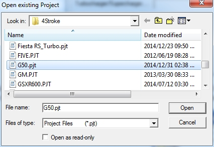
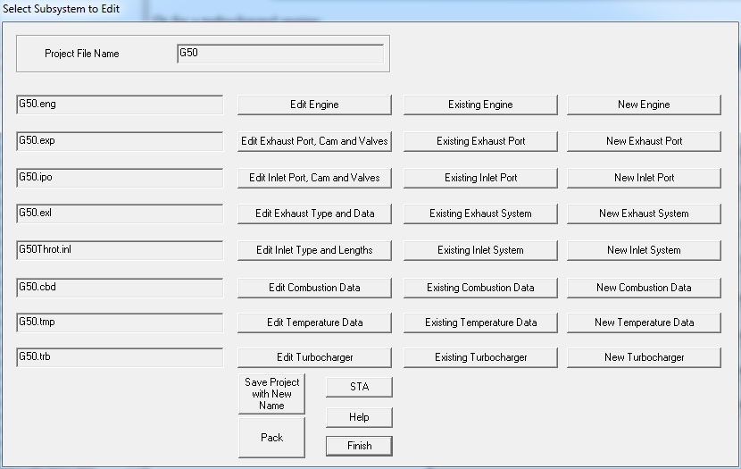
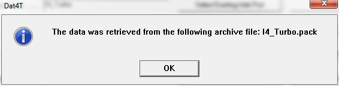
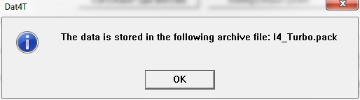

# [Starting Dat4T]{.underline}

[ ]{lang="EN-US"}Start Dat4T by double clicking on the Dat4T icon.

{border="0" width="33" height="34"}

[This will bring up a dialog box that will display the program version and with three command buttons.]{lang="EN-US" style="mso-ansi-language:EN-US"}

[ {border="0" width="470" height="447"}]{lang="EN-US" style="mso-ansi-language:EN-US"}

[Click on the **OK-button** to start the main program, the **Help-button** to open the help files or the **Exit Program-button** to quit the program.]{lang="EN-US" style="mso-ansi-language:EN-US"}

---

# [Creating a New Project]{.underline}

Start Dat4T by double clicking on the program icon.

{border="0" width="33" height="34"}

This will display the Start-Up page. After clicking on the **OK- button** on the start up page the following dialog box will appear:[ ]{lang="EN-US" style="mso-ansi-language:EN-US"}

{border="0" width="774" height="559"}

Now click the top right hand button **\"Create New Project**\" and the following dialog will appear:

 {border="0" width="426" height="267"}

The dialog box will list all the available projects in the start up folder. Type the name for the new project in the edit box and click on the **Save-button**. In this example we use NewProject as the project name. This will then create the new project subsystem files using the project name as the default names for the subsystem names:

{border="0" width="774" height="559"}

Click the **Accept-button** on the project dialog if you are satisfied with the subsystem names.

It is possible to select alternative existing subsystems at this stage by clicking on the \"**Select Existing Subsystem**\" button of the subsystem to be changed. This is described in more detail in [Changing or Creating New Subsystems.](../Contents/NewSubSystem.htm) Clicking the **Accept-button** will start the main data input.

---

# [Modifying an Existing Project]{.underline}

After clicking on the OK- button on the startup page the following dialog box will appear: [  ]{lang="EN-US" style="mso-ansi-language:EN-US"}

{border="0" width="774" height="559"}

Click the \"**Select Existing Project**\" **button.** The dialog box will list all the available projects in the startup folder. To select an existing project click on the project name and click the \"**Open**\"- button or double click on the project name. In this case we select the G50 project.

{border="0" width="426" height="293"}

The subsystems of project G50 is now displayed in the project dialog:

{border="0" width="774" height="563"}

It is possible to select alternative existing subsystems at this stage by clicking on the name of the subsystem to be changed. This is described in more detail in [Changing or Creating New Subsystems.](../Contents/NewSubSystem.htm) Click on the \"**Accept**\" - button. This will bring up the main editing menu, if the engine is a non-turbocharged engine:

{border="0" width="830" height="525"}

Or for a turbocharged engine:

{border="0" width="830" height="525"}

Choose the subsystem to be modified by clicking on the button next to the relevant subsystem.

---

# [[Selecting a New Sub-System]{.underline}]{lang="EN-US"}

[When the filled project dialog is displayed (After opening a new or existing project) it lists the subsystems in the project file]{lang="EN-US" style="font-size:12.0pt;mso-bidi-font-size:10.0pt"}

{border="0" width="774" height="559"}

The subsystem is changed by clicking on one of the two buttons next to it. You can either create a new subsystem or select one from another project. In this example we will select an existing subsystem and particularly an exhaust system. By clicking on the **\"Select Existing Exhaust System\"** button a new dialog box with a list of the existing subsystem files in that folder is displayed:

{border="0" width="426" height="293"}

An existing subsystem can be chosen by double clicking on it or by clicking on it and clicking the "**Open**"- button. In this case we select \'YZ_Diffuser.exl\' as the exhaust system:

{border="0" width="426" height="293"}

This will return you to the project dialog box where the new subsystem name will now be displayed.

{border="0" width="774" height="559"}

[Another subsystem can now be changed. Once you are satisfied with the selected subsystems click the "**Accept**"- button on the project dialog box. If a new subsystem was created for an existing project, the main menu will be bypassed and the program will go directly to the new subsystem input menu. For a subsystem that already exists the program will continue to the main editing menu.]{lang="EN-US"}

 

 

---

# Editing a Subsystem

After accepting an existing Project the following dialog will open:

{border="0" width="830" height="525"}

This dialog allows you to choose between editing the current subsystem, swopping it for an existing subsystem or creating a new subsystem. This will also update the project file to replace the previous subsystem name with the new name.

---

# [Archiving or Extracting an Existing Project]{.underline}

## Archived Projects

This facility allows project files to be archived or \"packed\" to either keep backup files of the current state of the project or to send the project to another user of the software to allow project and file sharing. When creating such an archive the file will be stored in the working folder which normally is \"C:\\4Stroke\" and it will have the project name as its name with the \".pack\" extension. This file contains all the info of the project that is part of the project at that moment, this includes the optional files (Batch Run RPM file, flow bench files and imported lift profile files) if they exist, and including the turbo compressor and turbine maps.

## Extracting an existing archive

After clicking on the OK- button on the start-up page the following dialog box will appear:

{border="0"}

Click the \"**Unpack Archive**\" **button.** The dialog box will list all the available archived files in the working folder. To select an existing archive click on the archive name and click the \"**Open**\"- button or double click on the archive name. In this case we select the I4-Turbo archive.

**Warning: During the unpack process any file that has the same name as a file in the archive will be over-written by the unpack process.**

{border="0"}

If the unpack or extraction process was successful, the following message box is displayed:

{border="0"}

The subsystems of project I4-Turbo are now displayed in the project dialog:

{border="0"}

The unpacked project is now available and can be used as a normal project.

## Packing or Creating an Archive File {#packing-or-creating-an-archive-file align="center"}

The project edit dialog box is used to create or pack an archive file:

{border="0" width="830" height="525"}

Click the \"**Pack Archive**\" **button.** This will create an archive file with the same name as the project file but with the \".pack\" file extension and will save it in the working folder if successful. On successful completion of the archiving process the following message box will be displayed:

{border="0" width="514" height="144"}

**Warning: During the pack process any pack file that has the same name as the project file will be over-written by the pack process.**

This file can now be saved or sent to another user.

## Save the Project with New Name

This button creates a new project name and saves all the files with this name.

**Warning1: If files with the new name already exists they will be over written without warning.**

**Warning2: During this renaming only the subsystem files will be saved under a new name. Imported files like turbocharger maps, camshaft lift profiles and flowbench files will not be copied to new files.**

\-

---

# [General Dialog Box Error]{style="font-weight: 400"}

The software is written using modal dialog boxes. This means that you can open more than one dialog box but cannot proceed without closing all of them. Some typical examples are:

- Sometimes a warning message is not canceled by the user but obscured by clicking in another dialog box, an action that brings the other dialog box to the front and sends the warning message to the back.
- The same can happen to a file save or file open dialog box. The user wants to save the file but with a new name and opens the file save dialog box. If the main dialog box is now inadvertently clicked, the file save dialog is send to the back. The user now clicks again on the save button and a new file save dialog box opens.

Both the above examples will let the user continue until he wants to close the main dialog box when the software will not allow the completion. The solution is to drag the main dialog box out of the way to see if there are unclosed dialog boxes or message boxes behind it.

The following dialog box is always there and not an error:

{border="0"}

## Example

In this example we open the file selection dialog in the cam data dialog by clicking on the \"Select Cam Lift File 1 to Import\" button:

{border="0"}

Before selecting a file we click on the main dialog and the file dialog disappears:

{border="0"}

If we now click on the \"Select Cam Lift File 1 to Import\" button again the following message is displayed:

{border="0"}

After cancelling this message neither the \"Accept and Save\" button or the \"Exit without saving\" button works. If we now drags the main dialog to one side the following is visible underneath it:

{border="0"}

There are two dialogs visible behind the main dialog, the startup dialog that is always there and the file selection dialog that we opened but never closed. Clicking on its edge will bring it to the front and we can now either complete the file selection operation or cancel it. Once that is done we can now close the main dialog.

Another way to find the errand dialog is to click on its icon in the task bar. There will be second icon behind the main icon in the task bar if a second dialog is open. Clicking on the edge of the rear icon will bring the hidden dialog to the front where it can be completed.

{border="0"}

## When an unsolved error occurs:

Make screen shots and exit Dat4T. Then send the screen shots and the file \"C:\\4Stroke\\Dat4TErrorLog.dat\" to Vannik Developments at: <vannik@mweb.co.za>

------------------------------------------------------------------------

© Neels van Niekerk 2024

---

# Run Time Duration

One of the major factors controlling the time a simulation takes (on any simulator) is the number of meshes or control volumes the ducts are divided into. Now we also have to take into consideration that for accuracy sake we want the wave to travel about one mesh length or slightly less per revolution. If it is more we have a numerically unstable situation and the software crashes (we are trying to extrapolate). If it travels a lot less than the mesh length we loose resolution and start getting smearing. So what the software does at each rpm point is it uses an assumed pipe temperature, calculate the wave speed and then calculate a mesh length that will give an increment about every one degree. We now have to verify that this increment length will result in a minimum of three meshes in the shortest pipe - for the numerical method to work you need a minimum of three meshes. So now the software checks all the pipes/ducts and if one is found with less than 3 meshes the mesh length is decreased until three meshes fits. At the end of this we have the final mesh length and if this is much shorter than what we started with we will end up with lots more meshes and the degree increment will be smaller as well. So we end up getting penalised twice for very short pipes, more meshes to calculate for and more increments per revolution.

To minimize the run time the solution is to increase the length of the shortest duct/pipe to minimize this effect. The aim is to have no duct shorter than the minimum length for the lowest rpm point to be simulated as listed in the following table but this requires us find a trade off between run time and accuracy. The best solution is to lengthen the shortest duct/pipe to this minimum length for an exhaust pipe/duct and for an inlet pipe/duct and to subtract this correction from a mating duct/pipe to maintain the correct overall length.

The following table gives an indication what the minimum inlet and exhaust lengths should be for the minimum simulation rpm to not effect the run time negatively. Shorter lengths can be used but it will increase the run time.

  ------- -- --------- -------
  RPM        Exhaust   Inlet
  6000       72mm      43mm
  8000       54mm      32mm
  10000      43mm      26mm
  12000      36mm      22mm
  14000      31mm      19mm
  16000      27mm      16mm
  18000      24mm      14mm
  ------- -- --------- -------

Please note the following:

- In an effort to ensure accuracy below 4500 rpm the minimum length stays as specified for 4500 rpm. This will lead to longer run times below 4500rpm.
- If a silencer is used the way it is modeled internally will result in very short ducts which will dramatically increase the run times.
- A turbocharger simulation requires over a 100 iterations for the turbocharger model to stabilize.
- The pipe joint subroutine (collector) is not an efficient piece of software and more collectors lead to slower run times.

The following example illustrates what we are trying to achieve:

{border="0"}

In this example, for a total length of 120mm the unmodified version would be divided into 12 meshes while the modified one will be 8 meshes, leading to approximately a 30% reduction reduction in run time.

To facilitate this the pipe, duct or passage length tool has been added in Dat2T. It is accessed by clicking on the \"**Pipe, Duct & Passage Check**\" button on the main editing screen:

{border="0"}

This brings up the following dialog with the duct and length value that is an issue plus the recommended length:

{border="0"}

After changing the pipe length rerun the check until no more pipes are shown with a recommended length. This means that the pipe length is no longer influencing run times.
