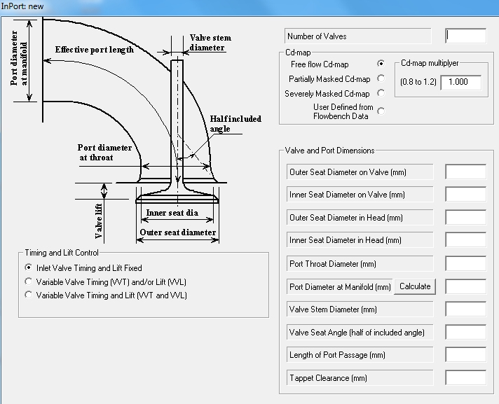
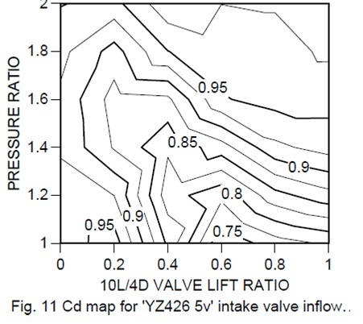
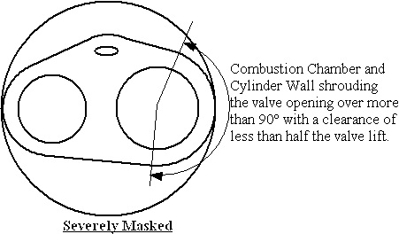
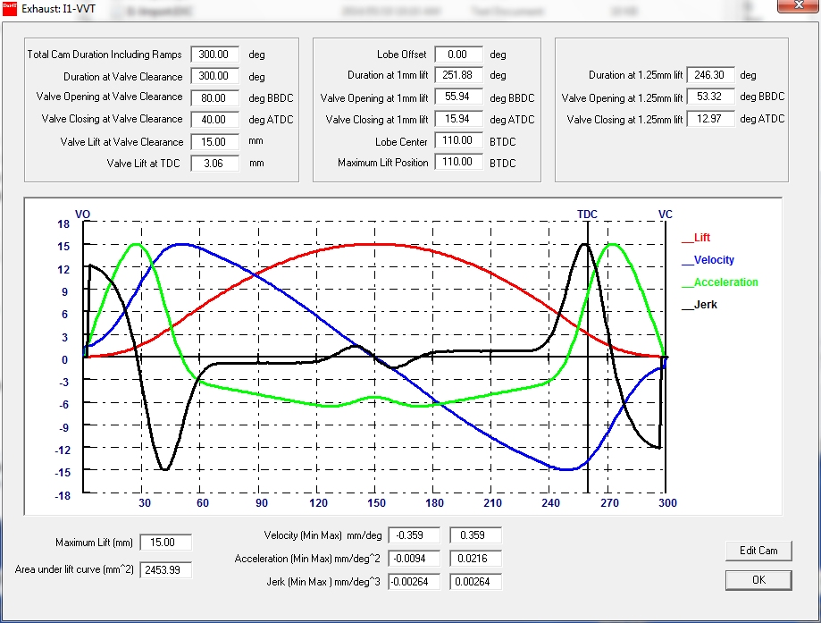
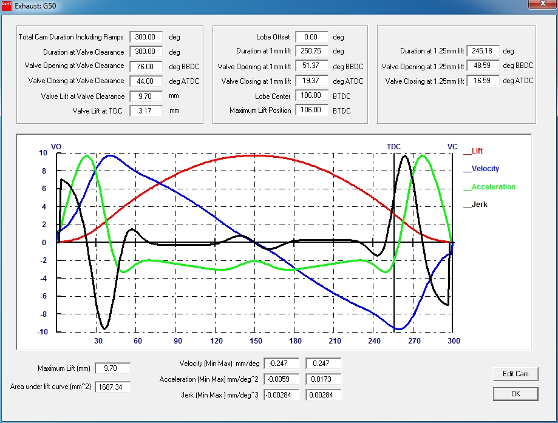
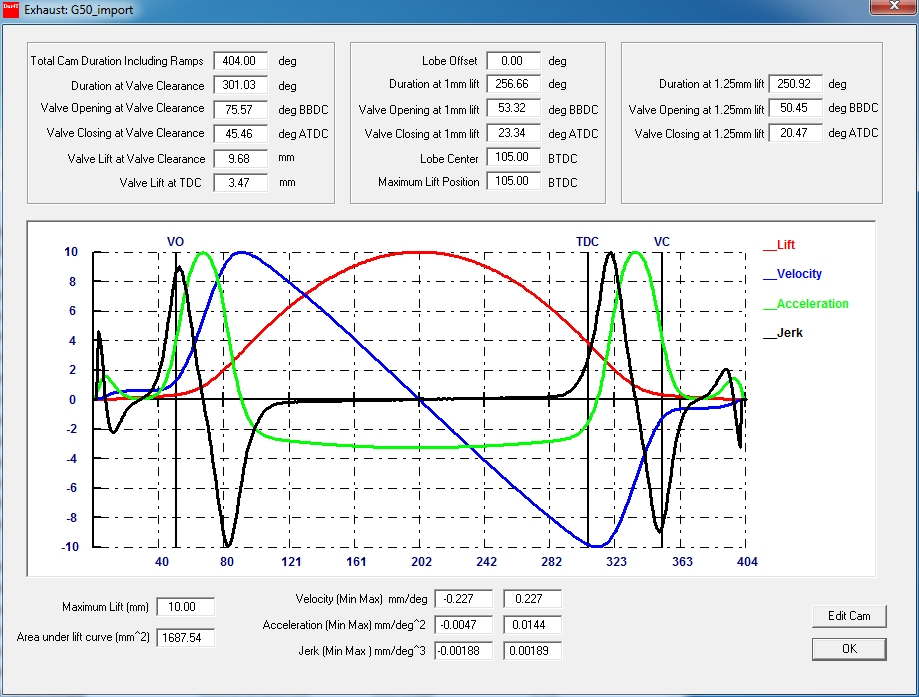
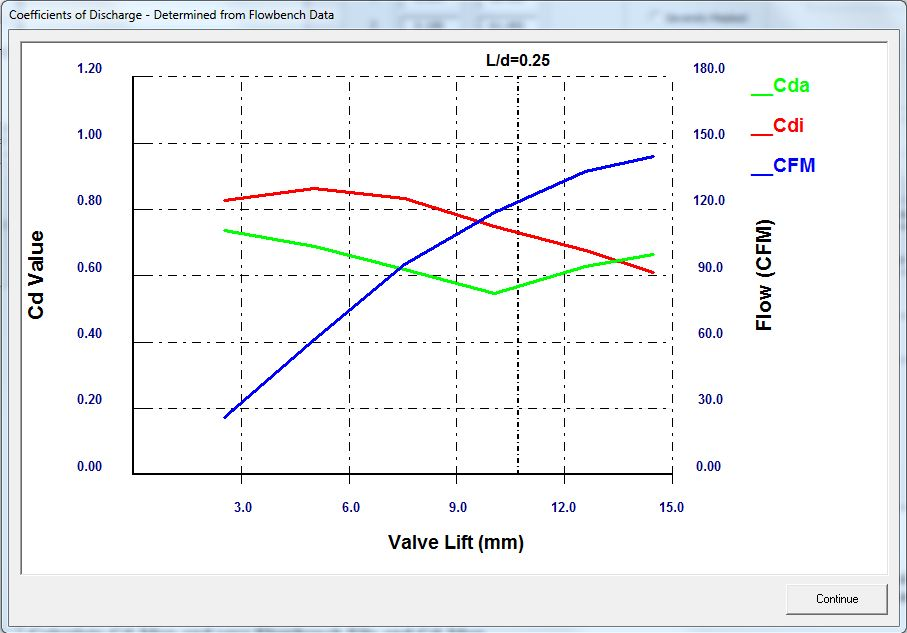
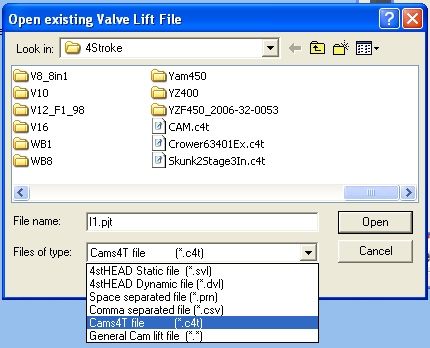
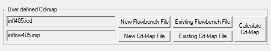

# [Modeling Flow Through Ports and Valves]{lang="EN-US" style="font-size:20.0pt;mso-bidi-font-size:10.0pt"} {#modeling-flow-through-ports-and-valves align="left"}

[The flow through the valves and ports are modeled using gasdynamics and discharge coefficients. It is based on the work of the late [Professor Emeritus Gordon P Blair](References.htm) of The Queen\'s University of Belfast.]{lang="EN-US"}

[In modeling a port in 1-dimensional gasdynamic simulation software certain assumptions and simplifications must be made. The following discusses these for the EngMod4T program. Other vendors might make different trade-offs but they all will have to make some.]{lang="EN-US"}

## Description of dimensional port and valve input data

The following figure shows the input required to model an inlet port:

{border="0" width="712" height="577"}

[**Number of Valves:** This is the number of valves per cylinder and can vary from 1 to 3 for inlet valves and 1 or 2 for exhaust valves.]{lang="EN-US"}

[**Valve and Port Dimensions:** These values are straight forward. It is important to note that the software will automatically adjust the port diameters from the manifold diameter up to the effective throat diameter. The effective throat diameter is the throat diameter adjusted for the effect of the valve stem diameter. They will be discussed in detail in the inlet port and exhaust port topics.]{lang="EN-US"}

## Effect of Seat Dimensions on the Valve and in the Head on Effective Flow Area

The software uses the smallest available flow area through the valve open apperture times the Cd-value as the area through which the gas flows. This area is dependent on the seat dimensions on the valve and in the head. The two major controlling dimensions are the seat inside diameter on the valve and the seat outside diameter in the head. The next figure shows the possible combinations of these \"major\" dimensions:

{border="0" width="500" height="526"}

The next graph shows the effect on flow area by having first only the inner seat diameter on the valve decreased by 3mm, then the effect of increasing only the outer diameter of the seat in the head by 3mm and finally doing both. The graph goes from the valve opening point to the fully open point:

{border="0" width="779" height="541"}

## Description of the Cd maps

[During the flow through a valve the flow is less than what the flow theoretical flow through the open area would have been. The ratio of the measured flow to the theoretical flow is known as the "coefficient of discharge" and is usually abbreviated as Cd. This Cd value is a function of how far the valve is open and the pressure ratio across the valve. If we create a map of the Cd as a function of both the valve open ratio and the pressure ratio we end up with a typical Cd map as shown in the next figure (the often used 28" of water pressure used on a flow bench gives a pressure ratio of 1.07 which is very slightly above the x axis). (from SAE2001-01-1798): ]{lang="EN-US"}

{border="0" width="451" height="402"}

The Cd value is actually of the complete port and takes the losses through the "venturi", the flow around the short side radius and around the valve guide and valve stem into consideration as well as the valve seat and valve masking effects. This map is one of the inputs into EngMod4T and that is why it is stated EngMod4T takes the flow loss into of the smallest cross sectional area into consideration irrespective of where it is.

The following figure shows how the flow through the valve opening migrates as a function of pressure ratio, lift and engine rpm. It is clear that the flow on an engine spends very little time at the 28" line (1.07).

{border="0" width="451" height="418"}

[Very few people have the facilities to measure a port to construct a Cd map. Getting just the Cd value at a specific pressure ratio (i.e. at 28" of water on a flow bench) is a lot more common. Because of this there are three ways in EngMod4T to describe the flow through a port and valve combination:]{lang="EN-US"}

1.  1\) If no flow data is available the user selects the most appropriate type of flow
2.  2\) If flow bench data is available this data is used to construct a Cd-map
3.  3\) Import a full Cd map

### No Flow Data Available

[For case 1 a number of Cd maps for 1, 2 and 3 valve inlet ports and 1 and 2 valve exhaust ports ranging from severely masked to fully free flow has been included in the software to allow the user a choice of what he thinks approximates his engine best.]{lang="EN-US"}

[**Severely Masked** is defined where the combustion chamber and/or cylinder wall restricts the flow through the valve open aperture over more than 90 degrees of its circumference and with a clearance of less than half the valve lift. The following figure shows it schematically:]{lang="EN-US"}

{border="0" width="451" height="264"}

[**Partially Masked** is defined where the combustion chamber and/or cylinder wall restricts the flow through the valve open aperture over less than 90 degrees of its circumference with a clearance bigger than half the valve lift but smaller than the full valve lift. Almost all 4 and 5 valve heads fall in this category. The following figure shows it schematically:]{lang="EN-US"}

{border="0" width="470" height="264"}

[**Free Flowing** is where the combustion chamber and cylinder walls have almost no detrimental effect on the flow through the valve aperture. The following figure shows it schematically:]{lang="EN-US"}

{border="0" width="450" height="264"}

[To allow further fine tuning of the Cd-map there are multipliers. A severely masked Cd map multiplied with a factor of 1.2 is roughly the same as a partially masked Cd map multiplied by 0.8, and the same way a partially masked Cd map multiplied by 1.2 flows roughly the same as a free flowing Cd map multiplied by 0.8. Using this together with good judgement and experience the effect of flow improvements in the chamber can be modeled.]{lang="EN-US"}

### Flow Bench Data Available

[When a port is measured on a flow bench and the Cd value for each valve lift at a specific pressure ratio is known this Cd curve is used to modify an existing Cd map to closely approximate the map for that port. This is described in [\"User Defined Cd-Map\"](InCd-map.htm)]{lang="EN-US"}

### Cd-Map Available

[If the user has access to fully prepared Cd maps they can import those directly.]{lang="EN-US"}

---

## Modeling Variable Valve Timing (VVT) and Variable Valve Lift (VVL)

The software can model variable valve lift combined with variable valve timing. This can be achieved using two methods where one allows the movement from one lift curve and timing to a second lift curve and timing, and the other allows one curve with variable timing and then at a specific rpm value changes over to a second curve also with variable timing.

- The first is achieved by specifying two valve lift profiles, each with its own lift, duration and timing and the rpm value up to which profile 1 is used and the rpm value from which profile 2 is used. The simulation will use linear interpolation for timing and lift between the two rpm values.
- The second is achieved by specifying two valve lift profiles, each with its own lift, duration and timing as a function of the rpm value. The change over rpm is also specified. The simulation will use linear interpolation for the timing of each cam between the two rpm values.

Both methods of lift profile specification, generated and imported can be used for specifying the start and end lift profile but only one method at a time per port. This means that as an example the generated profiles can be used for the exhaust port and an imported profile for the inlet. It is also possible to have only one port with VVT/L. In the rest of the discussion the one method will be used for the exhaust port an the other method for the inlet port.

## Using a Generated Lift Profile

### Selecting VVT&L and specifying RPM range

By selecting the **Variable Valve Timing (VVT) and/or Lift (VVL)** radio button additional input boxes opens. The first set requires the control rpm values. The first value is the rpm value up to which the lift profile 1 is used. The second value is the rpm value from where the second lift profile is used.

{border="0" width="360" height="323"}

If a step change is required specify the second value as 1 rpm more for example rpm1 = 6000 and rpm2 = 6001.

The next figure shows the data required for the two lift profiles to be generated:

{border="0" width="637" height="454"}

After the data has been entered and the **Accept and Save** button was clicked the graphics plus timing data for Lift Profile 1 is diaplayed:

{border="0" width="919" height="697"}

Clicking the **OK** button displays the graphics and timing data for Lift Profile 2:

{border="0" width="919" height="697"}

## Using an Imported Lift Profile

### Selecting VVT&L and specifying RPM range

By selecting the **Variable Valve Timing (VVT) and/or Lift (VVL)** radio button additional input boxes opens. The first set requires the control rpm values. The first value is the rpm value up to which the lift profile 1 is used. The second value is the rpm value from where the second lift profile is used.

{border="0" width="392" height="324"}

If a step change is required specify the second value as 1 rpm more for example rpm1 = 6000 and rpm2 = 6001.

### Selecting Variable Valve Timing and Lift

By selecting the **Variable Valve Timing and Lift (VVT and VVL)** radio button additional input boxes opens.

- The first set requires the control rpm and timing values for lift profile 1. The first value is the rpm value up to which the lift profile 1 first timing value is used and the timing value. The second value is the rpm value from where the second timing value is used.
- The second set requires the control rpm and timing values for lift profile 2. The first value is the rpm value up to which the lift profile 2 first timing value is used and the timing value. The second value is the rpm value from where the second timing value is used.
- The rpm value where the lift changes from profile 1 to profile 2 is also supplied

{border="0" width="390" height="319"}

### Importing the two Lift Profiles

The next figure shows the data required for the two lift profiles to be imported. Note that only one method of specifying the timing for both profiles can be used.

{border="0" width="332" height="497"}

After the data has been entered and the **Accept and Save** button was clicked the graphics plus timing data for Lift Profile 1 is diaplayed:

{border="0" width="919" height="697"}

Clicking the **OK** button displays the graphics and timing data for Lift Profile 2:

{border="0" width="919" height="697"}

After saving the inlet and exhaust port, valve and lift profile data the combination can be seen by clicking on the [\"**STA**\"](STA.htm) button:

{border="0" width="954" height="325"}

---

# Creating a new Exhaust port with a User Generated Cam Lift Profile

This section of the help pages describes how to create a generic cam profile using the internal cam profile generator. The user will be prompted to supply the following information:

Port and Valve Data

This section of the input data is identical for all the valves and cams.

{border="0" width="315" height="244"}

### Number of valves

The maximum number of exhaust valves allowed is 2 and the minimum is 1.

### Number of Port Passages

Some heads with two valves do not have siamesed ports with one outlet but two separate ports. The maximum number of exhaust passages allowed is 2 and the minimum is 1.

### Masking of valves

By choosing the amount of valve masking (interference to the flow by the proximity of the cylinder liner), together with the number of valves, the program will choose the relevant coefficient of discharge maps. Currently the choices are:

1.  fully free flow
2.  partially masked
3.  severely masked
4.  user generated Cd-map

### Cd-Map Multiplier

Sometimes the engine starts off unmodified with a specific map and because it is modified the flow improves but not so much as to use the next map, the user can adjust the map to the new better flow conditions by multiplying the map by a factor. The maximum a map can be improved is 10% (factor = 1.1) before the next map should be used. The user can also start by using a better map and adjust it downward by up to 10% (factor = 0.9) to simulate the unmodified engine and the progressively adjust the map upward as the flow is improved. See also the help topic on [Cd-maps](PortFlowModeling.htm).

{border="0" width="466" height="466"}

The next shows the required input data on the valve and port.

{border="0" width="323" height="328"}

### Outer Seat Diameter on Valve

The outer diameter of the valve seat area on the valve in millimetres.

### Inner Seat Diameter on Valve

The inner diameter of the valve seat area on the valve in millimetres.

### Outer Seat Diameter on Head

The outer diameter of the valve seat area in the head in millimetres.

### Inner Seat Diameter on Head

The inner diameter of the valve seat area in the head in millimetres.

### Port Throat Diameter

The diameter of the narrowest part of the port at the valve end of the port between the valve guide and the valve seat in millimetres. This dimension is usually slightly smaller than the **valve seat inner diameter** but will not be bigger than it.

### Port Diameter at Manifold

The port diameter in the head at the exhaust manifold face.

### Valve Stem Diameter

Diameter of valve stem in millimetres. This is the diameter of the portion of the valve stem in the port.

### Valve Seat Angle

The valve seat angle is half the included angle of the valve seat contact area relative to the valve stem center line.

### Length of Port Passage

This is the effective or mean length of the port from the valve seat surface to the manifold or spigot face in millimetres.

### Tappet Clearance

This is the tappet clearance or valve train lash in millimetres. The typical value for a generated lift profile is zero.

## Select Cam Control (VVT and/or VVL)

The software can model variable valve lift combined with variable valve timing. This is achieved by specifying two valve lift profiles, each with its own lift, duration and timing and the rpm value up to which profile 1 is used and the rpm value from which profile 2 is used. The simulation will use linear interpolation for timing and lift between the two rpm values. If a step change is required specify the second value as 1 rpm more for example rpm1 = 6000 and rpm2 = 6001. For more information see [Modeling of VVT and VVL](VVT_VVL.htm)

## Created Cam Data

[**Note: This lift profile generated here is not sophisticated enough to manufacture a cam from. Its purpose is to generate an approximation to use in the simulation if a measured profile is not available**]{style=" color=red"}

The generated lift profile is based on the method described by [**Blair (p35-p45)**](References.htm). The lift profile is divided into 5 phases and a 3^rd^ order polynomial is fitted to the first two and the last two. It is important to note that this is the valve lift profile, which is the same as the cam lift profile for a direct acting camshaft but can be substantially different for a system with rockers and/or roller followers.

The first phase is known as the opening ramp. This is the phase from valve opening until the end of positive acceleration and **should not be confused with the ramp that takes up the lash adjustment.** The duration of this phase is usually 40 degrees. The height of the valve lift during this phase is typically 0.2 times the main lift for high performance engines and up to 0.5 times for low revving diesel engines. This value determines the amplitude of maximum positive acceleration on the opening side.

The third phase is the dwell period at maximum lift and can vary from zero to typically 10 degrees. High performance engines tend to have zero degrees dwell. **The centre of the dwell period or the point of maximum lift is defined as the lobe centre**.

The second phase, the main opening lift phase, is the period from the end of the up ramp until the start of the dwell phase or in the case of zero dwell, until maximum lift is reached. The acceleration is negative.

The fourth phase, the main closing lift phase, is the period from the end of the dwell phase or in the case of zero dwell, from maximum lift until the start of the closing ramp. The acceleration is negative.

The fifth phase is the closing ramp and has the same typical values as the closing ramp. It starts at the end of the main closing lift and continues to the point of valve closing. This value determines the amplitude of maximum positive acceleration on the closing side.

This method of cam profile generation starts at valve opening and ends at valve closing, thus the effect of lash or tappet clearance has already been taken into consideration and should be set to 0. The final output screen should show the inputted opening and closing values at tappet clearance. To achieve special effects the engine modeller might experiment with this to achieve special lift profiles.

By specifying a non-central lobe centre and/or different opening and closing ramp and main lift values a non-symmetrical lift profile can be generated.

The generated cam profile is stored in a file with the same name as this subsystem but with the .eco extension. It is a normal ASCI file and can be view with a standard spreadsheet program.

{border="0" width="571" height="774"}

### Valve Opening before BDC

The actual point of valve opening in degrees before bottom dead centre (BBDC). This is the point in a real engine where all the lash in the valve train has been taken up.

### Valve Closing after TDC

The actual point of valve closing in degrees after top dead centre (ATDC). This is the point in a real engine where all the lash in the valve train has been taken up.

### Lift of Valve

The lift of the valve from the opening point to the centre of the lobe in millimetres.

### Opening Ramp Ratio

The fraction of the valve lift during the opening positive acceleration phase. (typically 0.2 for a high performance high revving engine and up to 0.5 for a low revving diesel engine)

### Closing Ramp Ratio

The fraction of the valve lift during the closing positive acceleration phase. (typically 0.2 for a high performance high revving engine and up to 0.5 for a low revving diesel engine) On a symmetrical lift profile it has the same value as the opening ramp.

### Opening Ramp Duration

The duration of the valve lift during the opening positive acceleration phase. The polynomial was derived for a period of 40 degrees and it is advisable to use this value.

### Closing Ramp Duration

The duration of the valve lift during the closing positive acceleration phase. The polynomial was derived for a period of 40 degrees and it is advisable to use this value.

### Dwell Duration

The period in degrees that the valve spends at maximum lift. Values range from zero to 10 degrees.

### Cam Lobe Centre Position

The cam lobe centre is defined as the centre point of the dwell period or as the point at maximum lift for a cam with zero dwell. It can be defined in the following two ways:

- Central uses the centrepoint of the lift curve on a symmetrical profile
- Degrees after valve opening used for a non-symmetrical profile.

At the end of this the screen will display typically the following data:

{border="0" width="1347" height="708"}

Clicking on \"Accept and Save\" a summary and graphics will follow that looks as follows:

{border="0" width="919" height="697"}

At this point in time it is possible to edit the data if you are not satisfied with the results. Clicking on \"OK\" will accept the results while clicking on \"Edit Cam\" will take you back to the previous dialog.

---

# Creating a new Exhaust port with an Imported Cam Lift Profile

This section of the help pages describes how to import an existing valve lift file. The user will be prompted to supply the following information:

## Port and Valve Data

This section of the input data is identical for all the valves and cams.

{border="0" width="315" height="244"}

### Number of valves

The maximum number of exhaust valves allowed is 2 and the minimum is 1.

### Number of Port Passages

Some heads with two valves do not have siamesed ports with one outlet but two separate ports. The maximum number of exhaust passages allowed is 2 and the minimum is 1.

### Valve Masking

By choosing the amount of valve masking (interference to the flow by the proximity of the cylinder liner), together with the number of valves, the program will choose the relevant coefficient of discharge maps. Currently the choices are:

1.  fully free flow
2.  partially masked
3.  severely masked
4.  user generated Cd-map

### Cd-Map Multiplier

Sometimes the engine starts off unmodified with a specific map and because it is modified the flow improves but not so much as to use the next map, the user can adjust the map to the new better flow conditions by multiplying the map by a factor. The maximum a map can be improved is 10% (factor = 1.1) before the next map should be used. The user can also start by using a better map and adjust it downward by up to 10% (factor = 0.9) to simulate the unmodified engine and the progressively adjust the map upward as the flow is improved. See also the help topic on [Cd-maps](PortFlowModeling.htm).

  {border="0" width="466" height="466"}

The next shows the required input data on the valve and port.

{border="0" width="323" height="328"}

### Outer Seat Diameter on Valve

The outer diameter of the valve seat area on the valve in millimetres.

### Inner Seat Diameter on Valve

The inner diameter of the valve seat area on the valve in millimetres.

### Outer Seat Diameter on Head

The outer diameter of the valve seat area in the head in millimetres.

### Inner Seat Diameter on Head

The inner diameter of the valve seat area in the head in millimetres.

### Port Throat Diameter

The diameter of the narrowest part of the port at the valve end of the port between the valve guide and the valve seat in millimetres. This dimension is usually slightly smaller than the **valve seat inner diameter** but will not be bigger than it.

### Port Diameter at Manifold

The port diameter in the head at the exhaust manifold face.

### Valve Stem Diameter

Diameter of valve stem in millimetres. This is the diameter of the portion of the valve stem in the port.

### Valve Seat Angle

The valve seat angle is half the included angle of the valve seat contact area relative to the valve stem center line.

### Length of Port Passage

This is the effective or mean length of the port from the valve seat surface to the manifold or spigot face in millimetres.

### Tappet Clearance

This is the tappet clearance or valve train lash in millimetres. If the imported cam file is measured to include the lash take-up ramp, this clearance is the actual clearance as used in the engine. If the start of the lift file is partially or fully up this ramp, the user will have to experiment with this setting to achieve the correct valve opening and closing points.

## Select Cam Control (VVT and/or VVL)

The software can model variable valve lift combined with variable valve timing. This is achieved by specifying two valve lift profiles, each with its own lift, duration and timing and the rpm value up to which profile 1 is used and the rpm value from which profile 2 is used. The simulation will use linear interpolation for timing and lift between the two rpm values. If a step change is required specify the second value as 1 rpm more for example rpm1 = 6000 and rpm2 = 6001. For more information see [Modeling of VVT and VVL](VVT_VVL.htm)

## Cam Data

{border="0" width="327" height="543"}

The cam, or more accurately, the valve lift data is imported as a file. This data can be generated by another application all together. This file must have the following format:

An optional user specified number of header rows that describes the file content.  (min=0)

Following this, two columns that are space or tab delimited that lists the degree values in column one and the lift values in column two.

The degree values can be either crankshaft or camshaft degrees. The program will make the adjustment internally.

The degrees must increase in steps of one degree per lift value and must start at zero lift and end again at zero lift.

The following picture shows a typical 4stHEAD static valve lift file, column one is the degrees, column two the lift, three the velocity and four the acceleration.

{border="0" width="640" height="533"}

### Imported File Name

The name of the imported file with its extension. The maximum total length including the extension is 80 characters. For this version of the program this file must be in the same directory as Project. As shown, the file type can be one of the following:

1.  4stHEAD Static file (\*.svl)
2.  4stHEAD Dynamic file (\*.dvl)
3.  A Space separated file (\*.prn)
4.  Comma separated file (\*.csv)
5.  A general lift file (\*.\*)

{border="0" width="429" height="350"}

### Line Number Where Lift Data Starts

The imported file can have lines at the start of the file containing headers and other descriptors and values. The software requires the number of the line where the actual degree and lift data starts.

### Crankshaft or Camshaft Degrees

As it is possible to have a lift profile in either crankshaft or camshaft degrees the user has to specify which format is used in the imported file.

### Cam Timing Indexing Option

To index the imported data to have the correct valve timing is not always simple. Four methods are provided:

1.  The first method is to specify the valve opening point. Depending on how the cam was measured and on the tappet clearance specified, this could lead to errors in the valve timing as small measurement errors and small tappet clearance errors can have a large influence on indexing the cam.
2.  The second method is to specify the cam (or lobe) centre position BTDC. The cam centre is defined as the centre of the period from the start of the opening ramp to the end of the closing ramp, that is the centre of the total cam profile including ramps. On a symmetrical lobe this is halfway between the opening and closing points, but on a non-symmetrical profile this is not necessary the case. When importing a file that describes dynamic lift with valve bounce the final closing value can change and so will the cam centre. In this case it is recommended that one of the other methods be used.
3.  The third method is to specify the dwell centre position BTDC. The dwell centre is defined as the centre of the dwell period or in the case of no dwell, the point of the highest lift. On a symmetrical lobe this is halfway between the opening and closing points, but on a non-symmetrical profile this is not necessary the case.
4.  The fourth method is to prescribe the valve lift at TDC. This will be the lift as measured on an engine with the valve clearance set to the specified value.

The following picture demonstrates the difference between **lobe centre** and **lift or dwell centre** (for illustrative purposes a large offset is used):

{border="0" width="905" height="424"}

Whatever the method the user might have to make adjustments to the indexing degrees and tappet clearance to obtain the correct timing and duration.

At the end of this the screen will display typically the following data:

{border="0" width="1062" height="726"}

Clicking on \"Accept and Save\" a summary and graphics will follow that looks as follows:

{border="0" width="919" height="697"}

At this point in time it is possible to edit the data if you are not satisfied with the results. Clicking on \"OK\" will accept the results while clicking on \"Edit Cam\" will take you back to the previous dialog.

 

---

## [Creation of a user defined exhaust port Cd-map based on Flowbench Data]{.underline}

The software uses [Cd-maps](../Cd-Maps/Cd-Map.htm) for the port flows based on measured data for typical head and valve configurations. Sometimes it is necessary for the user to modify these maps based on data obtained on a flowbench. To do this, the user selects the \"**User Defined from Flowbench Data**\" radio button on the cam and inlet port dialog:

{border="0"}

Which then changes to show the following dialog:

{border="0"}

The next step is to either select or create new flow bench and Cd-map files by clicking first the \"**New Flow Bench File**\" button and selecting a file name and then the \"**New Cd-map File**\" button to create or select the Cd-map file:

{border="0"}

Next we click on the \"**Calculate Cd-Map**\" button and the following dialog opens if it is a new file that already exists:

{border="0"}

Click on the \"**OK**\" button to open the following dialog:

{border="0"}

The user has to complete the form before continuing:

### **[Lift Units]{.underline}**

The user has to select the units in which the valve lift on the flowbench was measured.

- **m** - meter (Typical values: 0.006 to 0.025).
- **cm** - centimeter (Typical values: 0.6 to 2.5).
- **mm** - millimeter (Typical values: 6.0 to 25.0).
- **inch** - inch (Typical values: 0.25 to 1.0).

### **[Ambient Temperature Units]{.underline}**

The user has to select the units in which the ambient (atmospheric) temperature was recorded.

- **Kelvin** - Kelvin (Typical values: 273.0 to 313.0).
- **deg C** - Celsius (Typical values: 0.0 to 40.0).
- **deg F** - farhenheit (Typical values: 32.0 to 104.0).
- **deg R** - Rankine (Typical values: 491.0 to 564.0).

### **[Ambient Pressure Units]{.underline}**

The user has to select the units in which the ambient (atmospheric) pressure was recorded.

- **bar** - bar (Typical values: 0.86 to 1.05, nominal: 1.01).
- **psi** - pound per square inch (Typical values: 14.5 to 15.4, nominal: 14.7).
- **mmH2O** - millimeter water (Typical values: 8779 to 10844, nominal: 10328).
- **inH20** - inch water (Typical values: 345.18 to 426.73, nominal: 406.34).
- **mmHg** - millimeter mercury (Typical values: 646 to 798, nominal: 760).
- **inHg** - inch mercury (Typical values: 25.4 to 31.4, nominal: 29.9).
- **atm** - standard atmosperic pressure (101.325kPa)(Typical values: 0.85 to 1.05, nominal: 1.0).

### **[Flowbench Test Pressure Units]{.underline}**

This is the delta pressure measured over the flowbench orifice. It usually is between 10\" and 28\" of H2O (Water) on most commercial flowbenches.

The user has to select the units in which the flowbench pressure was recorded.

- **bar** - bar (Typical values: 0.020 to 0.162, nominal: 0.075).
- **psi** - pound per square inch (Typical values: 0.289 to 2.349, nominal: 1.08).
- **mmH2O** - millimeter water (Typical values: 203 to 1651, nominal: 711).
- **inH20** - inch water (Typical values: 8.0 to 65, nominal: 28).
- **mmHg** - millimeter mercury (Typical values: 0.589 to 798, nominal: 760).
- **inHg** - inch mercury (Typical values: 0.589 to 4.783, nominal: 2.2).
- **atm** - atmosperic pressure (Typical values: 0.020 to 0.160, nominal: 0.074).

### **[Flow Units]{.underline}**

The user has to select the units in which the volume flow on the flowbench was recorded.

- **m\^3/s** - Cubic meter per second (Typical values: 0 to 0.472).
- **m\^3/min** - Cubic meter per minute (Typical values: 0 to 28.31).
- **m\^3/h** - Cubic meter per hour (Typical values: 0 to 1699).
- **cfs** - Cubic feet per second (Typical values: 0 to 16.67).
- **cfm** - Cubic feet per minute (Typical values: 0 to 1000).
- **cfh** - Cubic feet per hour (Typical values: 0 to 60000).
- **l/s** - Liter per second (Typical values: 0 to 472).
- **l/min** - Liter per minute (Typical values: 0 to 28316).
- **l/h** - Liter per hour (Typical values: 0 to 1699011).
- **g/s** - Gram per second (Typical values: 0 to 566).

### **[Ambient Temperature Value]{.underline}**

The ambient temperature value as recorded during the flow testing must be entered in the units as selected.

### **[Ambient Pressure Value]{.underline}**

The ambient pressure value as recorded during the flow testing must be entered in the units as selected.

### **[Flowbench Test Pressure Value]{.underline}**

The flowbench pressure setting value as recorded during the flow testing must be entered in the units as selected.

### **[Starting Map]{.underline}**

As a flowbench records data only at one pressure ratio and a Cd-map covers a range of pressure ratios the Cd-map creation methodology is to use an existing map as starting point and then use the flowbench data at one of these pressure ratios to calculate correction factors which is then applied to the selected base map. The user has to select this base map based on his experience with the engine.

### **[Flowbench Data]{.underline}**

The flowbench data is now filled in:

{border="0"}

### **[Display Flow Curve]{.underline}**

Selecting the \"**Display Flow Curve**\" button calculates the corrected [Cd-values](../Cd-Maps/Cd-Map.htm) for the flow bench pressure ratio and displays it (Cda) and the theoretical Cd-values (Cdi) on a graph. This is used to verify that the input data is correct and does not result in Cd values greater than 1.0. Selecting the \"**Continue**\" button returns to the Flowbench dialog.

### **[Calculate Cd-Map and save Flowbench File and Cd-Map]{.underline}**

Select the \"**Calculate Cd-Map and save Flowbench File and Cd-Map**\" button which also calculates the corrected Cd value and displays it but then on \"**Continue**\" it updates and saves the Cd-map and the flowbench input file, then it returns to the inlet port dialog.

{border="0"}

The software will automatically calculate the corrections from the chosen Cd-map to be used as the base map and when running the simulation the new Cd-map will be used.

### **[Exit without saving]{.underline}**

Quits the Cd-Map dialog box without calculating a Cd-map or saving the flowbench input file.

### **[Error Message]{.underline}**

Sometimes the following error message will be displayed:

{border="0"}

This error message means that for the specified values of the port and the test conditions the calculated mass flow is more than what is physically possible. The following is an indication of the possible error:

- Test bench test pressure was higher than the recorded pressure.
- The ambient pressure was lower than the recorded pressure.
- The ambient temperature was higher than the recorded temperature.
- The recorded flow was higher than the actual flow.
- The recorded valve lift was lower than the actual valve lift.
- The recorded port or valve size is smaller than the actual size.
- The included valve seat angle is smaller than the actual one.

---

# Creating a new Inlet port with a User Generated Valve Lift Profile

This section of the help pages describes how to create a generic valve lift profile using the internal lift profile generator. The user will be prompted to supply the following information:

## Port and Valve Data

This section of the input data is identical for all the valves and cams.

{border="0" width="321" height="162"}

### Number of valves

The maximum number of inlet valves allowed is 3 and the minimum is 1.

### Masking of valves

By choosing the amount of valve masking (interference to the flow by the proximity of the cylinder liner), together with the number of valves, the program will choose the relevant coefficient of discharge maps. Currently the choices are:

1.  fully free flow
2.  partially masked
3.  severely masked
4.  user generated Cd-map

### Cd-Map Multiplier

Sometimes the engine starts off unmodified with a specific map and because it is modified the flow improves but not so much as to use the next map, the user can adjust the map to the new better flow conditions by multiplying the map by a factor. The maximum a map can be improved is 20% (factor = 1.2) before the next map should be used. The user can also start by using a better map and adjust it downward by up to 20% (factor = 0.8) to simulate the unmodified engine and the progressively adjust the map upward as the flow is improved. See also the help topic on [Cd-maps](PortFlowModeling.htm).

{border="0" width="515" height="458"}

The next shows the required input data on the valve and port.

{border="0" width="324" height="369"}

### Outer Seat Diameter on Valve

The outer diameter of the valve seat area on the valve in millimetres.

### Inner Seat Diameter on Valve

The inner diameter of the valve seat area on the valve in millimetres.

### Outer Seat Diameter on Head

The outer diameter of the valve seat area in the head in millimetres.

### Inner Seat Diameter on Head

The inner diameter of the valve seat area in the head in millimetres.

### Port Throat Diameter

The diameter of the narrowest part of the port at the valve end of the port between the valve guide and the valve seat in millimetres. This dimension is usually slightly smaller than the **valve seat inner diameter** but will not be bigger than it.

### Port Diameter at Manifold

The port diameter at the intake manifold face or start of the intake spigot, depending on the carburettor, throttle body or trumpet fixing method.

### Valve Stem Diameter

Diameter of valve stem in millimetres. This is the diameter of the portion of the valve stem in the port.

### Valve Seat Angle

The valve seat angle is half the included angle of the valve seat contact area relative to the valve stem center line.

### Length of Port Passage

This is the effective or mean length of the port from the valve seat surface to the manifold or spigot face in millimetres.

### Tappet Clearance

This is the tappet clearance or valve train lash in millimetres. The typical value for a generated lift profile is zero.

## Select Cam Control (VVT and/or VVL)

The software can model variable valve lift combined with variable valve timing. This is achieved by specifying two valve lift profiles, each with its own lift, duration and timing and the rpm value up to which profile 1 is used and the rpm value from which profile 2 is used. The simulation will use linear interpolation for timing and lift between the two rpm values. If a step change is required specify the second value as 1 rpm more for example rpm1 = 6000 and rpm2 = 6001. For more information see [Modeling of VVT and VVL](VVT_VVL.htm)

## Cam Data

[**Note: This lift profile generated here is not sophisticated enough to manufacture a cam from. Its purpose is to generate an approximation to use in the simulation if a measured profile is not available**]{style=" color=red"}

The generated lift profile is based on the method described by [**Blair (p35-p45)**](References.htm). The lift profile is divided into 5 phases and a 3^rd^ order polynomial is fitted to the first two and the last two. It is important to note that this is the valve lift profile, which is the same as the cam lift profile for a direct acting camshaft but can be substantially different for a system with rockers and/or roller followers.

The first phase is known as the opening ramp. This is the phase from valve opening until the end of positive acceleration and **should not be confused with the ramp that takes up the lash adjustment.** The duration of this phase is usually 40 degrees. The height of the valve lift during this phase is typically 0.2 times the main lift for high performance engines and up to 0.5 times for low revving diesel engines. This value determines the amplitude of maximum positive acceleration on the opening side.

The third phase is the dwell period at maximum lift and can vary from zero to typically 10 degrees. High performance engines tend to have zero degrees dwell. **The centre of the dwell period or the point of maximum lift is defined as the lobe centre**.

The second phase, the main opening lift phase, is the period from the end of the up ramp until the start of the dwell phase or in the case of zero dwell, until maximum lift is reached. The acceleration is negative.

The fourth phase, the main closing lift phase, is the period from the end of the dwell phase or in the case of zero dwell, from maximum lift until the start of the closing ramp. The acceleration is negative.

The fifth phase is the closing ramp and has the same typical values as the closing ramp. It starts at the end of the main closing lift and continues to the point of valve closing. This value determines the amplitude of maximum positive acceleration on the closing side.

This method of cam profile generation starts at valve opening and ends at valve closing, thus the effect of lash or tappet clearance has already been taken into consideration and should be set to 0. The final output screen should show the inputted opening and closing values at tappet clearance. To achieve special effects the engine modeller might experiment with this to achieve special lift profiles.

By specifying a non-central lobe centre and/or different opening and closing ramp and main lift values a non-symmetrical lift profile can be generated.

The generated cam profile is stored in a file with the same name as this subsystem but with the .ipo extension. It is a normal ASCI file and can be view with a standard spreadsheet program.

{border="0" width="571" height="774"}

### Valve Opening before TDC

The actual point of valve opening in degrees before top dead centre (BTDC). This is the point in a real engine where all the lash in the valve train has been taken up.

### Valve Closing after TDC

The actual point of valve closing in degrees after bottom dead centre (ABDC). This is the point in a real engine where all the lash in the valve train has been taken up.

### Lift of Valve

The lift of the valve from the opening point to the centre of the lobe in millimetres.

### Opening Ramp Ratio

The fraction of the valve lift during the opening positive acceleration phase. (typically 0.2 for a high performance high revving engine and up to 0.5 for a low revving diesel engine)

### Closing Ramp Ratio

The fraction of the valve lift during the closing positive acceleration phase. (typically 0.2 for a high performance high revving engine and up to 0.5 for a low revving diesel engine) On a symmetrical lift profile it has the same value as the opening ramp.

### Opening Ramp Duration

The duration of the valve lift during the opening positive acceleration phase. The polynomial was derived for a period of 40 degrees and it is advisable to use this value.

### Closing Ramp Duration

The duration of the valve lift during the closing positive acceleration phase. The polynomial was derived for a period of 40 degrees and it is advisable to use this value.

### Dwell Duration

The period in degrees that the valve spends at maximum lift. Values range from zero to 10 degrees.

### Cam Lobe Centre Position

The cam lobe centre is defined as the centre point of the dwell period or as the point at maximum lift for a cam with zero dwell. It can be defined in the following two ways:

- Central uses the centre point of the lift curve on a symmetrical profile
- Degrees after valve opening used for a non-symmetrical profile.

At the end of this the screen will display typically the following data:

{border="0" width="1344" height="694"}

Clicking on \"Accept and Save\" a summary and graphics will follow that looks as follows:

{border="0" width="919" height="697"}

At this point in time it is possible to edit the data if you are not satisfied with the results. Clicking on \"OK\" will accept the results while clicking on \"Edit Cam\" will take you back to the previous dialog.

---

# Creating a new Inlet port with an Imported Cam Lift Profile

This section of the help pages describes how to import an existing valve lift file. The user will be prompted to supply the following information:

## Port and Valve Data

This section of the input data is identical for all the valves and cams.\<

{border="0" width="321" height="162"}

### Number of valves

The maximum number of inlet valves allowed is 3 and the minimum is 1.

### Valve Masking

By choosing the amount of valve masking (interference to the flow by the proximity of the cylinder liner), together with the number of valves, the program will choose the relevant coefficient of discharge maps. Currently the choices are:

1.  fully free flow
2.  partially masked
3.  severely masked
4.  user generated Cd-map

### Cd-Map Multiplier

Sometimes the engine starts off unmodified with a specific map and because it is modified the flow improves but not so much as to use the next map, the user can adjust the map to the new better flow conditions by multiplying the map by a factor. The maximum a map can be improved is 20% (factor = 1.2) before the next map should be used. The user can also start by using a better map and adjust it downward by up to 20% (factor = 0.8) to simulate the unmodified engine and the progressively adjust the map upward as the flow is improved. See also the help topic on [Cd-maps](PortFlowModeling.htm).

  {border="0" width="515" height="458"}

The next shows the required input data on the valve and port.

{border="0" width="324" height="369"}

### Outer Seat Diameter on Valve

The outer diameter of the valve seat area on the valve in millimetres.

### Inner Seat Diameter on Valve

The inner diameter of the valve seat area on the valve in millimetres.

### Outer Seat Diameter on Head

The outer diameter of the valve seat area in the head in millimetres.

### Inner Seat Diameter on Head

The inner diameter of the valve seat area in the head in millimetres.

### Port Throat Diameter

The diameter of the narrowest part of the port at the valve end of the port between the valve guide and the valve seat in millimetres. This dimension is usually slightly smaller than the **valve seat inner diameter** but will not be bigger than it.

### Port Diameter at Manifold

The port diameter at the intake manifold face or start of the intake spigot, depending on the carburettor, throttle body or trumpet fixing method.

### Valve Stem Diameter

Diameter of valve stem in millimetres. This is the diameter of the portion of the valve stem in the port.

### Valve Seat Angle

The valve seat angle is half the included angle of the valve seat contact area relative to the valve stem center line.

### Length of Port Passage

This is the effective or mean length of the port from the valve seat surface to the manifold or spigot face in millimetres.

### Tappet Clearance

This is the tappet clearance or valve train lash in millimetres. If the imported cam file is measured to include the lash take-up ramp, this clearance is the actual clearance as used in the engine. If the start of the lift file is partially or fully up this ramp, the user will have to experiment with this setting to achieve the correct valve opening and closing points.

## Select Cam Control (VVT and/or VVL)

The software can model variable valve lift combined with variable valve timing. This is achieved by specifying two valve lift profiles, each with its own lift, duration and timing and the rpm value up to which profile 1 is used and the rpm value from which profile 2 is used. The simulation will use linear interpolation for timing and lift between the two rpm values. If a step change is required specify the second value as 1 rpm more for example rpm1 = 6000 and rpm2 = 6001. For more information see [Modeling of VVT and VVL](VVT_VVL.htm)

## Cam Data

{border="0" width="328" height="501"}

The cam, or more accurately, the valve lift data is imported as a file. This data can be generated by another application all together. This file must have the following format:

An optional user specified number of header rows that describes the file content.  (min=0)

Following this, two columns that are space or tab delimited that lists the degree values in column one and the lift values in column two.

The degree values can be either crankshaft or camshaft degrees. The program will make the adjustment internally.

The degrees must increase in steps of one degree per lift value and must start at zero lift and end again at zero lift.

The following picture shows a typical Cams4T static valve lift file, column one is the degrees and column two the lift.

{border="0" width="592" height="499"}

### Imported File Name

The name of the imported file with its extension. The maximum total length including the extension is 80 characters. For this version of the program this file must be in the same directory as Project. As shown, the file type can be one of the following:

1.  4stHEAD Static file (\*.svl)
2.  4stHEAD Dynamic file (\*.dvl)
3.  A Space separated file (\*.prn)
4.  Comma separated file (\*.csv)
5.  A general lift file (\*.\*)

{border="0" width="430" height="348"}

### Line Number Where Lift Data Starts

The imported file can have lines at the start of the file containing headers and other descriptors and values. The software requires the number of the line where the actual degree and lift data starts.\<

### Crankshaft or Camshaft Degrees

As it is possible to have a lift profile in either crankshaft or camshaft degrees the user has to specify which format is used in the imported file.

### Cam Timing Indexing Option

To index the imported data to have the correct valve timing is not always simple. Four methods are provided:

1.  The first method is to specify the valve opening point. Depending on how the cam was measured and on the tappet clearance specified, this could lead to errors in the valve timing as small measurement errors and small tappet clearance errors can have a large influence on indexing the cam.
2.  The second method is to specify the cam (or lobe) centre position ATDC. The cam centre is defined as the centre of the period from the start of the opening ramp to the end of the closing ramp, that is the centre of the total cam profile including ramps. On a symmetrical lobe this is halfway between the opening and closing points, but on a non-symmetrical profile this is not necessary the case. When importing a file that describes dynamic lift with valve bounce the final closing value can change and so will the cam centre. In this case it is recommended that one of the other methods be used.
3.  The third method is to specify the dwell centre position ATDC. The dwell centre is defined as the centre of the dwell period or in the case of no dwell, the point of the highest lift. On a symmetrical lobe this is halfway between the opening and closing points, but on a non-symmetrical profile this is not necessary the case.
4.  The fourth method is to prescribe the valve lift at TDC. This will be the lift as measured on an engine with the valve clearance set to the specified value.

The following picture demonstrates the difference between **lobe centre** and **lift or dwell centre** (for illustrative purposes a large offset is used):

{border="0" width="905" height="424"}

Whatever the method the user might have to make adjustments to the indexing degrees and tappet clearance to obtain the correct timing and duration.

At the end of this the screen will display typically the following data:

{border="0" width="1071" height="702"}

Clicking on \"Accept and Save\" a summary and graphics will follow that looks as follows:

{border="0" width="919" height="697"}

At this point in time it is possible to edit the data if you are not satisfied with the results. Clicking on \"OK\" will accept the results while clicking on \"Edit Cam\" will take you back to the previous dialog.

 

---

## [Creation of a user defined inlet port Cd-map based on Flowbench Data]{.underline}

The software uses [Cd-maps](../Cd-Maps/Cd-Map.htm) for the port flows based on measured data for typical head and valve configurations. Sometimes it is necessary for the user to modify these maps based on data obtained on a flowbench. To do this, the user selects the \"**User Defined from Flowbench Data**\" radio button on the cam and inlet port dialog:

{border="0"}

Which then changes to show the following dialog:

{border="0"}

The next step is to either select or create new flow bench and Cd-map files by clicking first the \"**New Flow Bench File**\" button and selecting a file name and then the \"**New Cd-map File**\" button to create or select the Cd-map file:

{border="0"}

Next we click on the \"**Calculate Cd-Map**\" button and the following dialog opens if it is a new file and the name already exists:

{border="0"}

Click on the \"**OK**\" button to open the following dialog:

{border="0"}

The user has to complete the form before continuing:

### **[Lift Units]{.underline}**

The user has to select the units in which the valve lift on the flowbench was measured.

- **m** - meter (Typical values: 0.006 to 0.025).
- **cm** - centimeter (Typical values: 0.6 to 2.5).
- **mm** - millimeter (Typical values: 6.0 to 25.0).
- **inch** - inch (Typical values: 0.25 to 1.0).

### **[Ambient Temperature Units]{.underline}**

The user has to select the units in which the ambient (atmospheric) temperature was recorded.

- **Kelvin** - Kelvin (Typical values: 273.0 to 313.0).
- **deg C** - Celsius (Typical values: 0.0 to 40.0).
- **deg F** - farhenheit (Typical values: 32.0 to 104.0).
- **deg R** - Rankine (Typical values: 491.0 to 564.0).

### **[Ambient Pressure Units]{.underline}**

The user has to select the units in which the ambient (atmospheric) pressure was recorded.

- **bar** - bar (Typical values: 0.86 to 1.05, nominal: 1.01).
- **psi** - pound per square inch (Typical values: 14.5 to 15.4, nominal: 14.7).
- **mmH2O** - millimeter water (Typical values: 8779 to 10844, nominal: 10328).
- **inH20** - inch water (Typical values: 345.18 to 426.73, nominal: 406.34).
- **mmHg** - millimeter mercury (Typical values: 646 to 798, nominal: 760).
- **inHg** - inch mercury (Typical values: 25.4 to 31.4, nominal: 29.9).
- **atm** - standard atmosperic pressure (101.325kPa)(Typical values: 0.85 to 1.05, nominal: 1.0).

### **[Flowbench Test Pressure Units]{.underline}**

This is the delta pressure measured over the flowbench orifice. It usually is between 10\" and 28\" of H2O (Water) on most commercial flowbenches.

The user has to select the units in which the flowbench pressure was recorded.

- **bar** - bar (Typical values: 0.020 to 0.162, nominal: 0.075).
- **psi** - pound per square inch (Typical values: 0.289 to 2.349, nominal: 1.08).
- **mmH2O** - millimeter water (Typical values: 203 to 1651, nominal: 711).
- **inH20** - inch water (Typical values: 8.0 to 65, nominal: 28).
- **mmHg** - millimeter mercury (Typical values: 0.589 to 798, nominal: 760).
- **inHg** - inch mercury (Typical values: 0.589 to 4.783, nominal: 2.2).
- **atm** - atmosperic pressure (Typical values: 0.020 to 0.160, nominal: 0.074).

### **[Flow Units]{.underline}**

The user has to select the units in which the volume flow on the flowbench was recorded.

- **m\^3/s** - Cubic meter per second (Typical values: 0 to 0.472).
- **m\^3/min** - Cubic meter per minute (Typical values: 0 to 28.31).
- **m\^3/h** - Cubic meter per hour (Typical values: 0 to 1699).
- **cfs** - Cubic feet per second (Typical values: 0 to 16.67).
- **cfm** - Cubic feet per minute (Typical values: 0 to 1000).
- **cfh** - Cubic feet per hour (Typical values: 0 to 60000).
- **l/s** - Liter per second (Typical values: 0 to 472).
- **l/min** - Liter per minute (Typical values: 0 to 28316).
- **l/h** - Liter per hour (Typical values: 0 to 1699011).
- **g/s** - Gram per second (Typical values: 0 to 566).

### **[Ambient Temperature Value]{.underline}**

The ambient temperature value as recorded during the flow testing must be entered in the units as selected.

### **[Ambient Pressure Value]{.underline}**

The ambient pressure value as recorded during the flow testing must be entered in the units as selected.

### **[Flowbench Test Pressure Value]{.underline}**

The flowbench pressure setting value as recorded during the flow testing must be entered in the units as selected.

### **[Starting Map]{.underline}**

As a flowbench records data only at one pressure ratio and a Cd-map covers a range of pressure ratios the Cd-map creation methodology is to use an existing map as starting point and then use the flowbench data at one of these pressure ratios to calculate correction factors which is then applied to the selected base map. The user has to select this base map based on his experience with the engine.

### **[Flowbench Data]{.underline}**

The flowbench data is now filled in:

{border="0"}

### **[Display Flow Curve]{.underline}**

Selecting the \"**Display Flow Curve**\" button calculates the corrected [Cd-values](../Cd-Maps/Cd-Map.htm) for the flow bench pressure ratio and displays it (Cda) and the theoretical Cd-values (Cdi) on a graph. This is used to verify that the input data is correct and does not result in Cd values greater than 1.0. Selecting the \"**Continue**\" button returns to the Flowbench dialog.

### **[Calculate Cd-Map and save Flowbench File and Cd-Map]{.underline}**

Select the \"**Calculate Cd-Map and save Flowbench File and Cd-Map**\" button which also calculates the corrected Cd value and displays it but then on \"**Continue**\" it updates and saves the Cd-map and the flowbench input file, then it returns to the inlet port dialog.

{border="0"}

The software will automatically calculate the corrections from the chosen Cd-map to be used as the base map and when running the simulation the new Cd-map will be used.

### **[Exit without saving]{.underline}**

Quits the Cd-Map dialog box without calculating a Cd-map or saving the flowbench input file.

### **[Error Message]{.underline}**

Sometimes the following error message will be displayed:

{border="0"}

This error message means that for the specified values of the port and the test conditions the calculated mass flow is more than what is physically possible. The following is an indication of the possible error:

- Test bench test pressure was higher than the recorded pressure.
- The ambient pressure was lower than the recorded pressure.
- The ambient temperature was higher than the recorded temperature.
- The recorded flow was higher than the actual flow.
- The recorded valve lift was lower than the actual valve lift.
- The recorded port or valve size is smaller than the actual size.
- The included valve seat angle is smaller than the actual one.
