# Exhaust Pipe Nomenclature and Boundaries

## Naming Convention: {#naming-convention align="left"}

To model complex exhaust systems it was necessary to adopt a naming convention. This naming convention is described using the following figure:

{border="0" width="652" height="632"}

**Header Pipe** - A header pipe is a pipe that is connected to the cylinder head. Because a header can have an abrupt area change (step) as in the top pipe, or a pipe junction for pipes connecting the header pipes as in the second pipe, it is necessary to have \"**Primary Headers**\" and \"**Secondary Headers**\". As there can be more steps, the next row of headers, if required, is known as the \"**Tertiary Headers**\" and so on as up to 4 steps per header pipe is allowed. In both figures the Primary Headers number from 1 to 4 and the Secondary Headers from 5 to 8.

**Connector Pipe** - A \"**Connector Pipe**\" is any pipe that has multi-pipe junctions (Collectors) on both ends. There are no Connector Pipes in the top pipe but in the second pipe the Connector Pipes number from 9 to 15.

**Collector Pipe** - The \"**Collector Pipe**\" is any pipe that is connected to only one multi-pipe junction while the other end is open to atmosphere, connected to a box/plenum or a silencer. It can also be divided by steps as in the top pipe.

**Box Pipe** - A \"**Box Pipe**\" is any pipe that leaves a box, it has a box connected to its inlet end.

**Note:** Make sure the difference between a **Connector Pipe** and a **Collector Pipe** is clear.

## Boundary Description: {#boundary-description align="left"}

In the exhaust system there are boundaries that are modelled by the software. Often these boundaries are 3-dimensional but as the software is based on 1-dimensional gasdynamics the boundaries are modelled in a plane with special input values to simulate the 3-dimensional nature of the boundary. The following figure shows a typical exhaust system with most of the boundaries shown:

{border="0" width="762" height="342"}

**Exhaust Valve Boundary** - This is the start of the exhaust system and modelled by prescribing the valve and port dimensions, selecting a Cd-map by selecting the amount of masking and prescribing its open and closed duration and area by selecting a cam profile.

**Exhaust Port/Manifold Boundary** - This is typically where the exhaust manifold bolts to the head and can be a perfect match or there can be a step. A step is created by using a different diameter for the exhaust port manifold diameter and the diameter at the start of the header pipe. The Cd-map for this is automatically selected by the software depending on the area change.

**[Exhaust Header Steps](ExStepMod.htm)** - This is where there is a discontinuity in the header diameter that forms a step. It is formed where one pipe ends at a certain diameter and then continues as a pipe with a different diameter.  The Cd-map for this is automatically selected by the software depending on the area change.

**[Exhaust Collector Boundary](ExCollector.htm)** - This is a boundary where the number of pipes change. In the example shown four pipes becomes one pipe. This is clearly a full 3-dimensional boundary. The software models the effect of the abrupt area changes and calculates the flow losses as a function of the angles between the pipes. It is important to note that it has no physical length. Any taper parts must be modelled as part of the collector pipe, and in rare cases, also as part of the header pipes.

**[Exhaust Collector Steps](ExStepMod.htm)** - This is where there is a discontinuity in the collector pipe diameter that forms a step. It is formed where one pipe ends at a certain diameter and then continues as a pipe with a different diameter.  The Cd-map for this is automatically selected by the software depending on the area change. (It is the same as a header pipe step, it is just in the collector pipe)

**[Box In/Outlet Boundaries](ExBoxMod.htm)** - This is where a pipe starts or terminates in an exhaust box or plenum. During the modelling the user selects whether the edge is sharp or radiused and from this the software selects a Cd-map.

**Atmospheric Outlet Boundary** - This is where the exhaust pipe connects to the atmosphere. During the modelling the user selects whether the edge is sharp or radiused and from this the software selects a Cd-map.

**Note:** Make sure the difference between a **Collector** and a **Collector Pipe** is clear.

---

## Exhaust Pipe Numbering Convention

Before the numbering convention is discussed it is necessary to first define what is meant by a pipe:

A Pipe is a piece of tube that runs from one boundary to the next with no discontinuities in between.

**[Boundaries](ExPipeBoundaries.htm):**

- Start of a pipe at the cylinder manifold face
- End of a pipe open to the atmosphere
- A collector (multi-pipe joint)
- The entry to or exit from a box or plenum
- The entry to a silencer
- A step up or down
- The entry to or exit from a turbine
- The entry to or exit from a wastegate

Note: A straight pipe connected to a gradual area change (diffuser) is not a boundary but just one pipe with 2 sections.

## [Pipe Numbering]{.underline}

Pipes are numbered in the direction of major flow starting at the cylinders and in cylinder sequence. Using this sequence the pipes connecting to the cylinder pipes are numbered next and this process is continued until the last pipe open to the atmosphere is numbered. This is demonstrated in the following example:

## Example 1 : Demonstration of Pipe numbering process

This example shows the layout and pipe numbering for a four-cylinder engine fitted with a 4into2into1 pipe system fitted with a box. Each header pipe has one step in it, the collector pipe also has a step and the box has 3 outlet pipes. The numbering is shown in the following figure (also take note of what each pipe is called):

## Example 2 : Demonstration of Pipe numbering process if there are steps in a pipe system with 2 collectors

This example shows the layout and pipe numbering for a eight-cylinder engine fitted with two 4into1 pipe systems. Each collector pipe also has two steps in it. The numbering is shown in the following figure:

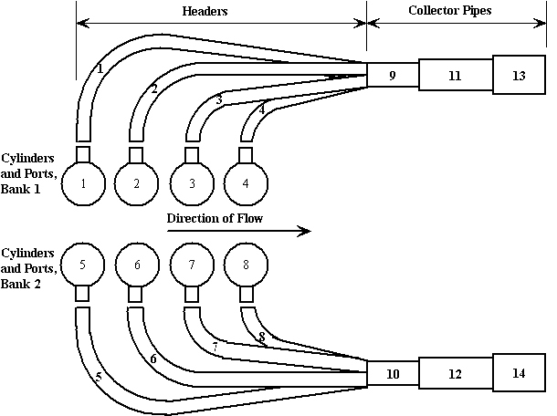

## Pipe Section Numbering

Pipes with gradual area changes are subdivided into sections. These sections are also numbered in the major direction of flow. A pipe can have no less than 1 section and a maximum of 12 sections. To identify which pipe a section belongs to a section is numbered using a double index system, the first index identifies the pipe it belongs to and the second index is the section number. For example, **section(2,3)** means section 3 in pipe 2. Each section has to be supplied with a length dimension. This is demonstrated in the following two examples:

## Example 3 : Pipe section numbering on a single cylinder engine

A single cylinder engine fitted with a megaphone exhaust system is shown. The megaphone is fitted with a small reverse cone. This engine has thus only one pipe but with the pipe divided into three sections, a parallel pipe, a diffuser and a reverse cone.

## Example 4 : Pipe section numbering on a multi-cylinder engine

This example shows the same basic pipe configuration as used in Example 1 but with the steps replaced with short tapered sections.

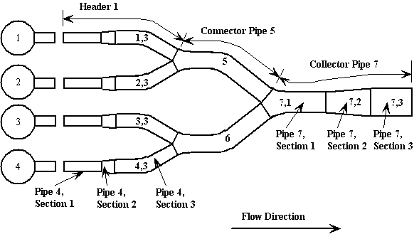

## Section Diameter Numbering Convention

A section has only one length but it has two diameters; the starting diameter and the finishing diameter. For a parallel pipe the two diameters are the same but for a taper pipe they are not. The first diameter of a pipe is numbered as 0. After that each diameter has the number of the section leading up to it. This means that the starting diameter of a section, other than the first section, will have the number of the previous section. This is shown in the next example.

## **Example 5 : Pipe section diameter numbering**

The same pipe as in Example 3 is used but with the diameter numbers added.

---

# Collector Modeling

The pipe boundary where 3 or more pipes join is known as a collector. Normally an exhaust collector has a number of incoming pipes and one outgoing pipe. The outgoing pipe, depending on its position in the exhaust system is known as the connector pipe or the collector pipe. When modeling a collector there are two values of importance:

1.  Relative pipe angles
2.  Collector area (diameter)

### Pipe angles

The angles between the pipes are used to determine the loss factors in the simulation. If two pipes enter the collector parallel (zero included angle) and at some stage the gas flows from the one into the other one (making a u-turn) larger flow losses will occur compared to the case where they are at a much larger angle to each other.

During the creation of a pipe system the software will query the user for the included angles between the pipes. It is up to the user to ensure that he understands the pipe numbering convention to be able to supply the correct angles.

If the pipes going into the collector are arranged to make the same angle with the center line of the out going pipe (a symmetrical collector junction) it is possible to generate the angles by just supplying the engle between the incoming pipes and the center line of the outgoing pipe:

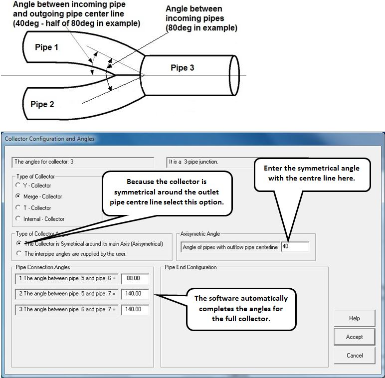{border="0"}

### Collector Areas

When modelling the collector pipe it is usual practice to model the first area as the sum total of the areas of the incoming pipes. (As the software uses diameters this area must be converted to an effective diameter.) This is the position marked on the Figures as **Collector**. From this point further, the next area (diameter) will depend on the type of collector. In the merge collector this area is the same as the collector area.

## Standard Collector Types

There are typically three standard types of collectors and one special type. They are described here with guidelines to model them.

**It is important to note that it is up to the user to decide what type of collector is being modelled and where in the pipe junction the collector boundary is.**

{border="0"}

### **1. Y Collector**

#### Steep Angle Y-collector

This is a more economic collector and is formed by deforming a piece of tube or by fabricating it from a piece of plate. The incoming pipes are usually parallel (zero included angle) but they might be at a slight angle to each other. This fabricated piece usually tapers down to section 2 of the collector pipe, from there they are the same. Refer to Figure.

{border="0"}

{border="0"}

{border="0"}

#### Zero Angle Y-Collector

This is the cheapest collector and is formed by slightly deforming the inlet of the collector pipe to follow the outside contour of the incoming pipes. The incoming pipes are usually parallel (zero included angle) but they might be at a slight angle to each other. Refer to Figure.

{border="0"}

{border="0"}

{border="0"}

### **2. Merge Collector**

This collector is the most expensive and is usually only seen on high performance racing engines. The incoming pipes curve where they enter the collector and has an included angle between the incoming pipes in the region of 15 to 70 degrees and an included angle between each incoming pipe and the outgoing pipe of 165 to 120 degrees. Other angles are of course possible, depending on the fabricator of the collector.

#### Steep Angle Merge Collector

For a collector with a steep angle between the incoming pipes the incoming pipes go directly into the collector pipe and is modelled as shown:

{border="0"}

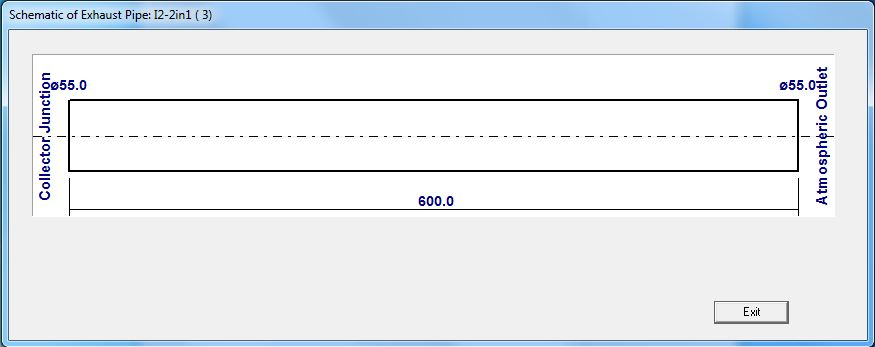{border="0"}

{border="0"}

#### Shallow Angle Merge Collector {#shallow-angle-merge-collector align="left"}

If the angle is shallower the transition from the header pipe to the collector pipe requires a tapered transition piece to be modelled as shown here:

{border="0"}

The following is an example of a 4 into 1 merge collector:

{border="0"}

{border="0"}

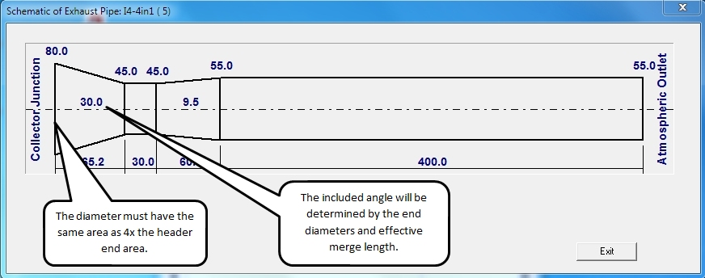{border="0"}

{border="0"}

On this type of collector it is often difficult to determine the exact position of the collector (where the incoming pipes end). The user will have to use his judgement. From current experience it appears that the effective collector point is at the intersection of the incoming pipe centre lines. The effective length for the incoming pipe will thus be up to this reflection point. The collector pipe length will start at this reflection point.

### **3. T-collectors**

T-collectors are just a special case of a straight collector but with one pipe at a steep angle, requiring the addition of a Cd-value to the pipe end. This is used to model a typical log manifold junction and an example is shown in the next figure.

This collector is basically a pipe with a side branch \"T-ed\" into it. Thus the angle between pipe 1 and pipe 3 is 180deg (it is a straight pipe). The angle between pipe 1 and pipe 2 is usually somewhere between 60 and 90 degrees. Typical angle sizes are as follows and the pipe ends that are forming the collector junction all blend into each other so the **\"Blend\"** pipe end configuration is selected:

{border="0"}

Please note that these angles are an approximation of the physical case and should be tested by the user to simulate reality as close as possible.

### **4. Internal-collectors**

An internal collector is not strictly speaking a collector but a way to model a junction where one pipe starts inside another pipe. Typical cases are the following examples. The first shows an absorption silencer:

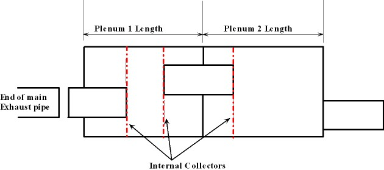{border="0"}

Another example shows the anti-reversion unit fitted to header pipes or in the collector:

{border="0"}

Note that for this configuration the end of the header pipe (pipe 1) is selected as **\"Sharp\"** and the software will apply the Cd-value of a sharp pipe entry to it when the flow is reversed. If the pipe has a radiused edge, selecting **\"Round\"** will let the software apply the Cd-value for a radiused edge if the flow is reversed.

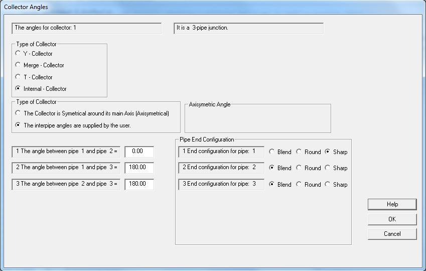{border="0"}

### **5. X-collectors**

X-collectors as used in this software is an attempt to model the collectors as used in Nascar racing. They are typically formed by curving two pipes and then welding them together with a hole in the joining area. This is shown in the next figure.

This collector is modeled as an X-collector. Most of the angles are the same as the physical angles of the collector. However, the angles between pipe 1 and 4 and between pipe 2 and 3 is specified smaller than the actual angle in an attempt to simulate the restriction of the connecting hole. A smaller hole will require a smaller angle. Typical angle sizes are as follows:

- 1-2   0 to 45 degrees
- 1-3   135 to 180 degrees
- 1-4   0 to 135 degrees, 0 for a small hole and 135 degrees for a hole size similar to the pipe diameter
- 2-3   same angle as for pipe angle 1-4
- 2-4   same angle as for pipe angle 1-3
- 3-4   same angle as for pipe angle 1-2

{border="0"}

Please note that these angles are an approximation of the physical case and should be tested by the user to simulate reality as close as possible.

---

# [Modeling of Stepped Pipes]{lang="EN-US"}

[A stepped pipe is a pipe that has an abrupt change of cross sectional area, either larger or smaller. A step is considered as a pipe boundary. This means that if for instance a header pipe has a step in it, the header will be modeled as two pipes connected by a step boundary. Two steps will result in three pipes and three steps in four pipes. The program can accommodate four steps per pipe.]{lang="EN-US"}

[The following two figures show a step-up and a step-down:]{lang="EN-US" style="font-size:12.0pt;mso-bidi-font-size:10.0pt"}

[  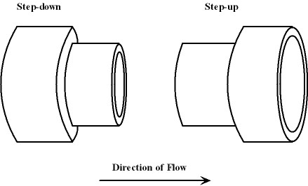{border="0" width="439" height="266"} ]{lang="EN-US" style="font-size:12.0pt;mso-bidi-font-size:10.0pt"}

[On the exhaust system boundary dialog the user can select the number of header pipe and collector pipe steps:]{lang="en-us"}

{border="0" width="330" height="250"}

[In the case where a step is specified and the two cross sectional areas are within 1 percent of each other the simulation software will default to a gradual area change calculation.]{lang="EN-US"}

[Depending on the flow direction, pressure ratio across the step and the area ratio between the two pipes the simulation software will determine the value of the coefficient of discharge.]{lang="EN-US" style="font-size:12.0pt;mso-bidi-font-size:10.0pt"}

[The current version of Dat4T allows steps in header (cylinder) pipes and collector pipes. No steps are allowed in connector pipes or box (plenum) outlet pipes. If steps are allowed in a pipe the user will be prompted for the number of steps in the pipe. ]{lang="EN-US" style="font-size:12.0pt;mso-bidi-font-size:10.0pt"}

[If steps are specified for the header pipes, all the header pipes will have that number of steps. If the user wants headers with different number of steps the recommended practice is to specify the maximum number of steps in the headers and then use equal diameter pipes on either side of the redundant or unwanted steps. The same principle applies to the collector pipes.]{lang="EN-US" style="font-size:12.0pt;mso-bidi-font-size:10.0pt"}

---

## [Modeling of Boxes and Plenums]{lang="EN-US"}

[ The terminology of a " box" and a "plenum" is both used to describe a container of a fixed volume that is connected to one or more pipes in the exhaust system. The user has to specify the box volume in cm^3^ and the pipe end configuration at the entry or exit from the box. The user has a choice between a sharp edge or a rounded edge for the pipe end. ]{lang="EN-US" style="font-size:12.0pt;mso-bidi-font-size:10.0pt"}

[ ]{lang="EN-US" style="font-size:12.0pt;mso-bidi-font-size:10.0pt"}

[ ]{lang="EN-US" style="font-size:12.0pt;mso-bidi-font-size:10.0pt"}

{width="492" height="266"}

[ On the exhaust pipe boundary dialog, if a \"Box Pipe\" is chosen the dialog is updated allowing the following choices:]{lang="en-us"}

{border="0" width="513" height="318"}

[ ]{lang="EN-US" style="font-size:12.0pt;mso-bidi-font-size:10.0pt"}

[ ]{lang="EN-US" style="font-size:12.0pt;mso-bidi-font-size:10.0pt"}

---

# Types of Exhaust Systems

There are three main general types of exhaust systems available:

- Individual pipes per cylinder.
- Ninto1 branch manifolds where N = number of cylinders
- Log manifolds -- all cylinders connect to a single pipe.

On top of these "normal" pipes there is a range of special pipes available depending on the engine types.

All the pipes can have one of three types of "collector outlets":

- Plain pipe. A normal plain opening to the atmosphere.
- Box pipe. The system flows into a box or plenum and from there via box outlet pipes into the atmosphere.
- Silencer pipe. Some of the silencer types are already active but in general the silencers are still under development. It is not recommended for use in this release.

## [Description of Main Exhaust types]{.underline}

These are the more common types of exhaust systems. They are general to any engine configuration and number of cylinders except for the single cylinder that for obvious reasons cannot have any sort of branch pipe.

### Individual Pipes

This system has a pipe for each cylinder. These pipes can each have a box or plenum or a silencer attached or can be directly open to the atmosphere. The pipes can be stepped and be of the megaphone type. Figure 1 shows a two-cylinder engine with a stepped pipe with megaphones and box outlets.

{border="0"}

Each pipe can also have a resonator tube added.

{border="0"}

On a single cylinder engine the pipe can also split into two outlets.

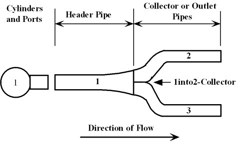{border="0"}

### Ninto1 Branch Manifolds

These are the so called "banana branch" type of exhaust manifolds. They are used where maximum power is the aim. The header pipes and the collector pipe can be stepped. The collector can be connected to a box/plenum, a silencer or directly open to the atmosphere.

Figure 2 shows a typical 4into1 manifold.

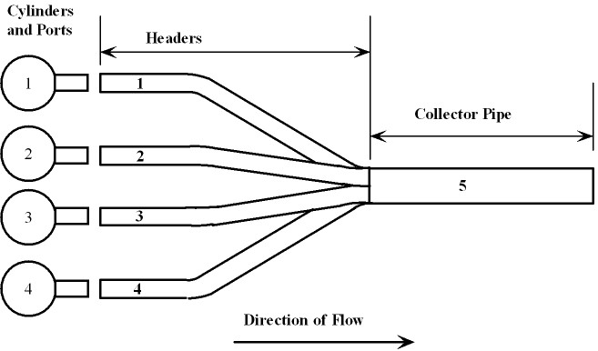{border="0"}

The 4into1 manifold can also have resonator tubes added to the headers.

{border="0"}

### Log Manifolds

### Log Manifolds for Inline engines

With a log manifold each cylinder is connected to a common pipe. This is usually not found on a high performance engine except on turbo-charged engines. This type is still under development and will be described in detail once development is completed. Figure 3 shows a four-cylinder engine with a log manifold.

{border="0"}

### Log Manifold for Inline engines with central outlet

On some engines with log manifolds the exit is not at the end but in the center, almost as if it is two log manifolds joined in the middle of the engine. The next figure shows an example on an inline 6 cylinder engine:

{border="0"}

### Log Manifolds for Vee and Flat engines

Vee or Flat engines have log manifolds on each bank. The outlet of these manifolds can be separate or connected:

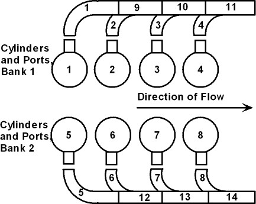{border="0"}

{border="0"}

{border="0"}

## Special Manifolds

### **[V-12 and Flat-12 Engines]{.underline}**

There are a number of special configurations:

### 1. 12into4into2

Each bank of cylinders is connected to two three into one collectors. After each collector there is another collector joining the two systems per side. The layout and numbering convention is shown in the next figure:

{border="0"}

### **[V-6, V-8, Flat-6 and Flat-8 Engines]{.underline}**

There are a number of special configurations:

### 1. Ninto2 (6into2 or 8into2) with an interconnecting pipe.

Each bank of cylinders is connected to a collector. After each collector there is another collector with an interconnecting pipe joining the two system. The layout and numbering convention is shown in the next figure:

{border="0"}

### 2. Ninto2 (6into2 or 8into2)

This is the same layout as the previous pipe but without the interconnecting pipe. The manifolds of the left and right bank operate as if they were from two separate inline engines. The system is shown in the next figure:

{border="0"}

### 3. Ninto2into1 (6into2into1 or 8into2into1) with an interconnecting pipe.

Each bank of cylinders is connected to a collector. After each collector there is another collector with an interconnecting pipe joining the two system after which the two main pipes join into a common collector pipe. The layout and numbering convention is shown in the next figure:

{border="0"}

### 4. Ninto2into1 (6into2into1 or 8into2into1)

This is the same layout as pipe no 2 with the exception that the two pipes after the main collectors join into a common collector pipe. The system is shown in the next figure:

{border="0"}

### 5. Ninto2intoX (6into2intoX or 8into2intoX) with an interconnecting pipe.

Each bank of cylinders is connected to a collector. After each collector there is another collector with an interconnecting pipe joining the two system after which the two main pipes join into a common X-collector into two outlet pipes. The layout and numbering convention is shown in the next figure.

{border="0"}

### 6. Ninto2intoX (6into2intoX or 8into2intoX)

This is the same layout as pipe no 2 with the exception that the two pipes after the main collectors join into a common X-collector into two outlet pipes. The system is shown in the next figure.

{border="0"}

### 7. Ninto2intoResonator (6into2intoResonator or 8into2intoResonator)

This is the same layout as pipe no 2 with the exception that the two pipes after the main collectors join into a resonator-collector into one outlet pipe. The system is shown in the next figure.

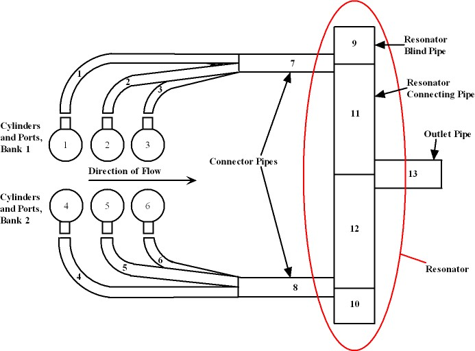{border="0"}

### [American V8\'s only pipes]{.underline}

In an effort to equalize the power produced by each cylinder in an engine that uses the uneven firing order of an American V8 a special 8into4into2 pipe was produced. The following four pipes are variations of this pipe:

### 1. 8into4into2

{border="0"}

### 2. 8into4into2into1

{border="0"}

### 3. 8into4into2Interconnected

{border="0"}

### 4. 8into4into2into1Interconnected

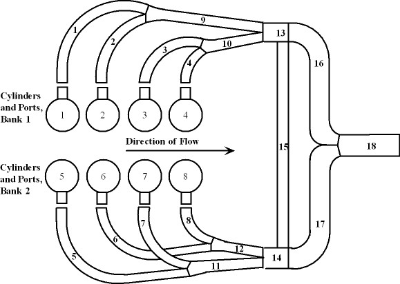{border="0"}

### [Inline 6-cylinder Engines]{.underline}

{border="0"}

### [Inline 4-cylinder Engines]{.underline}

There are seven special configurations and they are all a variation of a 4into2into1 system:

**1.** Cylinders 1 and 2 into one connector pipe, 3 and 4 into another connector and the two connector pipes into a common collector pipe.

{border="0"}

**2.** Cylinders 1 and 3 into one connector pipe, 2 and 4 into another connector and the two connector pipes into a common collector pipe.

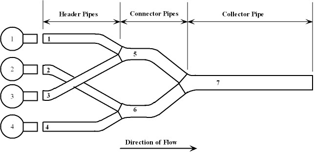{border="0"}

**3.** Cylinders 1 and 4 into one connector pipe, 2 and 3 into another connector and the two connector pipes into a common collector pipe.

{border="0"}

**4.** Pipes 4, 5 and 6 are the same as the previous three except the last collector is a cross connector that exits into 2 outlet collector pipes.

{border="0"}

{border="0"}

{border="0"}

**5.** Pipe 7 is the same as pipe 1 with the addition of cross connecting pipes, connecting header 1 with 4 and header 2 with 3.

{border="0"}

**6.** Pipe 8 is the same as pipe 1 with the addition of cross connecting pipes, connecting header 1 with 2 and header 3 with 4.

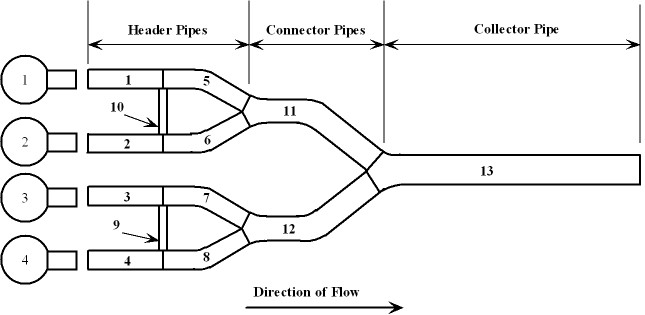{border="0"}

**7.** Pipe 9 is the same as pipe 3 with the addition of cross connecting pipes, connecting header 1 with 4 and header 2 with 3.

{border="0"}

**8.** Pipe 10 is the same as pipe 3 with the addition of cross connecting pipes, connecting header 1 with 2 and header 3 with 4.

{border="0"}

**9.** Pipe 11 is the same as pipe 7 with the addition of cross connecting pipes, connecting connector 1 with connector 2.

{border="0"}

**10.** Pipe 12 is the same as pipe 8 with the addition of cross connecting pipes, connecting connector 1 with connector 2.

{border="0"}

**11.** Pipe 13 is the same as pipe 9 with the addition of cross connecting pipes, connecting connector 1 with connector 2.

{border="0"}

**12.** Pipe 14 is the same as pipe 1 with the addition of connecting connector 1 with connector 2 and splitting the collector pipe into two tailpipes.

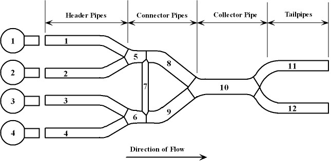{border="0"}

**13.** Pipe 15 is a Double Y-Manifold with two atmospheric outlet pipes.

{border="0"}

### [Three-cylinder Engines]{.underline}

There is one special pipe configuration:

### 1. 3into1 with headers interconnected

The three header pipes are joined by interconnector pipe3, after which they then join a common collector outlet.

{border="0"}

### [Two-cylinder Engines]{.underline}

There are three special pipe configurations:

### 1. 2into1into2

The two header pipes are joined by a connector pipe, which then splits into two pipes again.

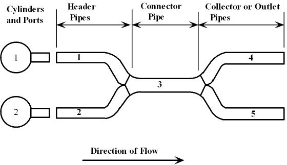{border="0"}

### 2. 2into2 with an interconnecting pipe

The two header pipes are separate but joined by an interconnecting pipe. This is a typical layout for a Ducati V2 engine.

{border="0"}

### 3. 2into2 with an interconnecting X-collector

The two header pipes are separate but joined by an interconnecting [X-collector](../Contents/ExCollector.htm). This is a typical layout for a Ducati V2 engine.

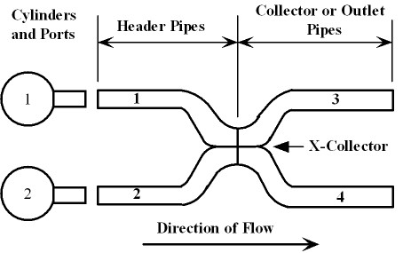{border="0"}

### [Special Box or Plenum Pipes]{.underline}

There are two special Box pipes depending on the engine layout:

### 1. One common box on an Inline multi-cylinder.

All the headers go directly into a common box.

{border="0"}

### 2. Two common boxes, one per bank on a Vee or Flat engine

All the headers per cylinder bank go directly into one of the boxes.

{border="0"}

---

# Types of Exhaust Systems for Turbocharged Engines

There are three main general types of exhaust systems available:

- Individual pipes per cylinder with a turbo on each cylinder.
- Ninto1 branch manifolds where N = number of cylinders.
- Log manifolds -- all cylinders connect to a single pipe.

On top of these "normal" pipes there is a range of special pipes available depending on the engine types.

All the pipes can have one of three types of "collector outlets":

- Plain pipe. A normal plain opening to the atmosphere.
- Box pipe. The system flows into a box or plenum and from there via box outlet pipes into the atmosphere.
- Silencer pipe. Some of the silencer types are already active but in general the silencers are still under development. It is not recommended for use in this release.

The turbocharger system can be with or without a wastegate.

## [Modeling the Turbine Inlet Pipe]{.underline}

The inlet pipe to the turbine must be extended to simulate the effect of the volute. On the turbocharger page there are information displayed that should be used to model the extra piece to be added to the turbine inlet pipe:

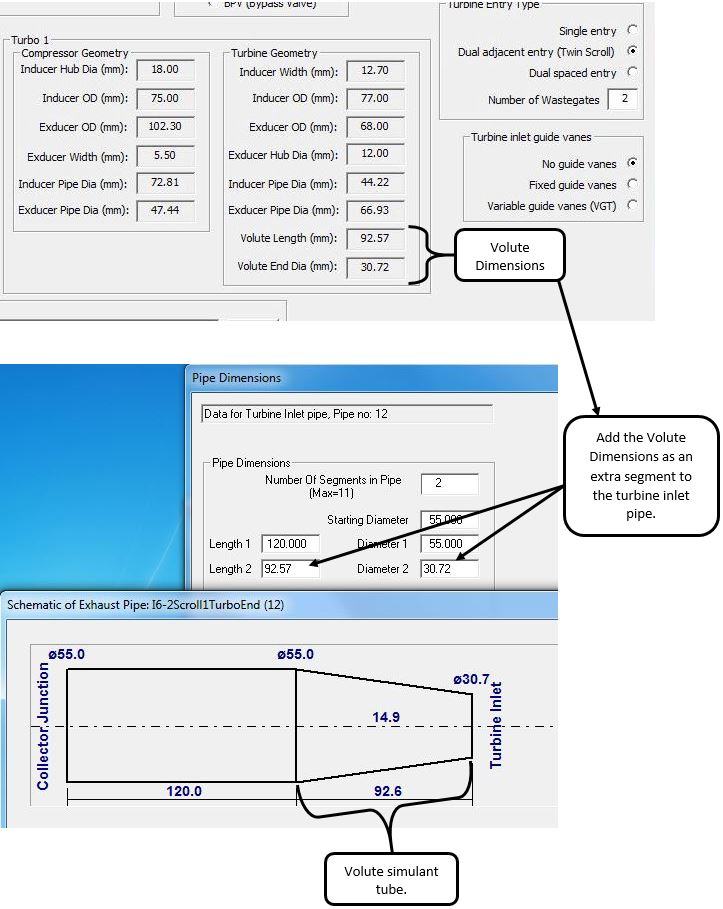{border="0"}

## [Description of Main Exhaust types for Single Scroll Turbines]{.underline}

These are the more common types of exhaust systems. They are general to any engine configuration and number of cylinders except for the single cylinder that for obvious reasons cannot have any sort of branch pipe.

### Individual Pipes

This system has a pipe for each cylinder. The figures show a two-cylinder engine with a turbo on each cylinder, with and without a wastegate.

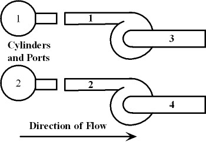{border="0"}

{border="0"}

### Ninto1 Branch Manifolds

These are the so called "banana branch" type of exhaust manifolds. They are used where maximum power is the aim. The header pipes and the collector pipe can be stepped. The turbine outlet can be connected to a box/plenum, a silencer or directly open to the atmosphere.

The next figure shows a 4into1 system without wastegate:

{border="0"}

And with a wastegate:

{border="0"}

### Log Manifolds

### Log Manifolds for Inline engines with end outlet

With a log manifold each cylinder is connected to a common pipe. The figure shows a four-cylinder engine with a log manifold, with and without a wastegate:

{border="0"}

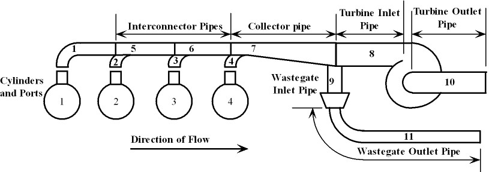{border="0"}

### Log Manifold for Inline engines with central outlet

On some engines with log manifolds the exit is not at the end but in the center, almost as if it is two log manifolds joined in the middle of the engine. The next figures show examples on an inline 6 cylinder engine, with and without wastegate:

{border="0"}

{border="0"}

### Log Manifolds for Vee and Flat engines

Vee or Flat engines have log manifolds on each bank. The outlet of these manifolds can be separate or connected:

{border="0"}

{border="0"}

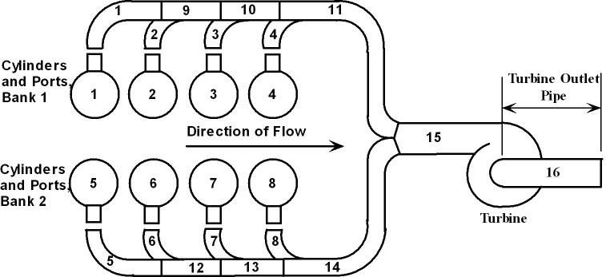{border="0"}

{border="0"}

## Special Manifolds

### [V-6, V-8, Flat-6 and Flat-8 Engines]{.underline}

There are a number of special configurations:

### 1. Ninto2 (6into2 or 8into2)

This is the same layout as the previous pipe but without the interconnecting pipe. The manifolds of the left and right bank operate as if they were from two separate inline engines. The system is shown in Figure 5.

{border="0"}

{border="0"}

### 2. Ninto2into1 (6into2into1 or 8into2into1)

This is the same layout as pipe no 2 with the exception that the two pipes after the main collectors join into a common collector pipe. The system is shown in Figure 7.

{border="0"}

{border="0"}

### [American V8\'s only pipes]{.underline}

In an effort to equalize the power produced by each cylinder in an engine that uses the uneven firing order of an American V8 a special 8into4into2 pipe was produced. The following four pipes are variations of this pipe.

### 1. 8into4into2

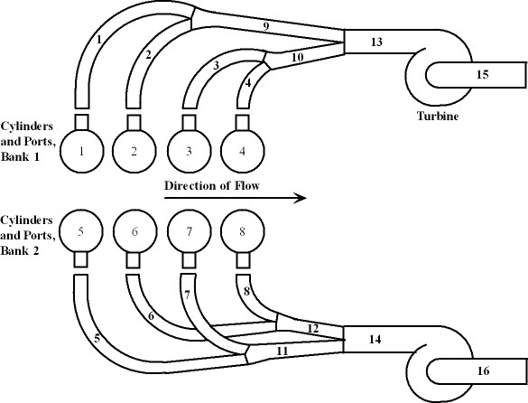{border="0"}

{border="0"}

### 2. 8into4into2into1

{border="0"}

{border="0"}

### [Inline 4-cylinder Engines]{.underline}

There are three special configurations and they are all a variation of a 4into2into1 system:

1\. Cylinders 1 and 2 into one connector pipe, 3 and 4 into another connector and the two connector pipes into a common collector pipe.

{border="0"}

{border="0"}

2\. Cylinders 1 and 3 into one connector pipe, 2 and 4 into another connector and the two connector pipes into a common collector pipe.

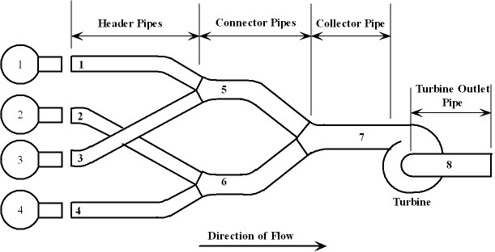{border="0"}

{border="0"}

3\. Cylinders 1 and 4 into one connector pipe, 2 and 3 into another connector and the two connector pipes into a common collector pipe.

{border="0"}

{border="0"}

## [Description of Main Exhaust types for Twin Scroll Turbines]{.underline}

All pipe configurations meant for two turbos with a single scroll volute can also be used for a single turbo with a twin scroll volute.

### [Ninto2 Branch Manifolds]{.underline}

{border="0"}

### [Inline 4-cylinder Engines]{.underline}

There are three special configurations and they are all a variation of a 4into2intoTurbine system:

1\. Cylinders 1 and 2 into one connector pipe, 3 and 4 into another connector and the two connector pipes into the turbine.

{border="0"}

2\. Cylinders 1 and 3 into one connector pipe, 2 and 4 into another connector and the two connector pipes into the turbine.

{border="0"}

3\. Cylinders 1 and 4 into one connector pipe, 2 and 3 into another connector and the two connector pipes into the turbine.

{border="0"}

### [Inline 6-cylinder Engines]{.underline}

There are two special configurations and they are both a variation of the double log collector system. One has the turbine in the center of the log manifold and the other the turbine is at the one end:

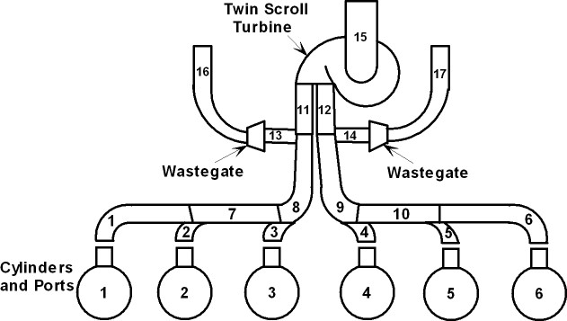{border="0"}

{border="0"}

---

# Creating a New Exhaust System

When a new exhaust system is created the user choose firstly the type of manifold and then the type of collector or outlet system. The manifold choices displayed depend on the number of cylinders and the type of engine (inline, vee or flat). Once this choice is made the user chooses the type of outlet. Three types of outlets are possible:

- Open ended pipe a plain pipe open to the atmosphere
- Box pipe the pipe(s) connects to a box(es) and from there to the atmosphere
- Silencer type the outlet pipe(s) is fitted with a silencer.

The example shown in the following figures is a four-cylinder engine fitted with a box in the collector pipe. It has one step per header and one step per collector pipe. The box has two outlet pipes.

The first screen looks as follows where we choose the \"N into 1\" manifold:

On the following screen the user is asked for the type of pipe end to the atmosphere and by choosing a **\"Box on each atmospheric outlet pipe\"** the entrance to and exit from the exhaust box and the atmospheric outlet edge conditions has to be selected as well as the number of box outlet pipes and box volume. The number of steps in the header pipes and collector pipe can also be selected.

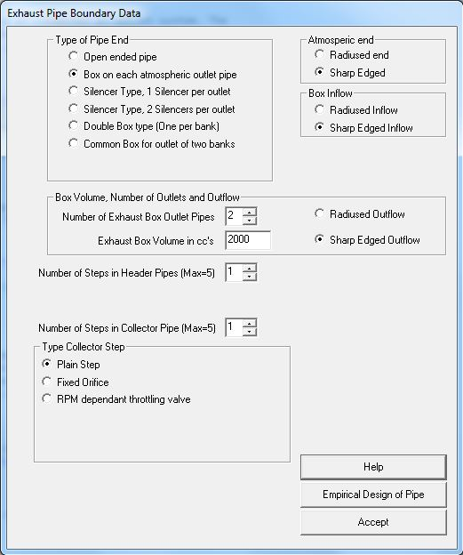

The next screen asks the number of sections in header pipe 1 and then the start and end diameters and length of each section must be filled in.

Click on \"Save and Display\" and the pipe is shown graphically:

This is followed by the question whether the primary headers (the headers connected to the cylinder head) are identical or not. If the headers are the same length and diameter this shortcut saves the time to input the data for each header individually. In this case they are identical.

Because there is one step per header the number of sections their lengths and diameters in the secondary headers, (the headers following the first step) are required. Following the same procedure the same shortcut for identical secondary headers are available.

The collector pipe has one step in it resulting in two pipes. The user is asked for the number of sections and their lengths and diameters in each pipe. The first pipe has an extra button available: **\"Recommended Starting Diameter for Collector Pipe\"**. This button uses the angle between the header pipes and the collector center line to calculate the effective area of the four angled pipes and assign this to the start of the collector as an option the user can select or discard to use his own dimension.

Clicking on this button opens the following dialog box:

We enter a value for the angle of 10, click **\"Calculate\"** and then click on **\"Accept\"** and then enter the rest of the collector data before the first step:

After entering the data we click on **\"Save and Display\"** and the first stage of the collector is displayed:

Next we enter and display the data for the part of the collector pipe after the step:

Following this the user is asked for the number of sections and their lengths and diameters in each box outlet pipe.

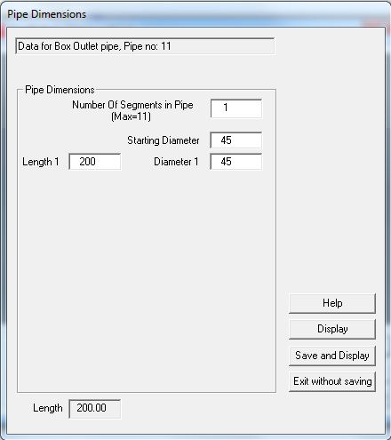

Once all the geometric data is supplied the user is prompted for the angles between the pipes entering the collector. The software automatically indexes the pipes but it is up to the user to identify which pipe is which.

The user can supply the angle for each pipe pair as requested or if the collector is symmetrical only the angle between the outflow pipe centreline and the centreline of one of the inflow pipes need to be supplied and the software will calculate the rest as shown in the next dialog box:

The pipe is now completely modeled. If further changes needs to be made the pipe data can be accessed through the edit button on the main subsystem edit dialog by clicking on the **\"Edit Exhaust Type and Data\"** button which opens the following dialog box:

---

# [Designing a New Exhaust System]{lang="EN-AU"}

[When the manifold selection dialog box is displayed there is also a button **\"Empirical Design of Exhaust Pipe\"** at the bottom of the dialog. This gives the choice to the user to use empiricism to design an exhaust system to use as starting point:]{lang="EN-AU"}

{width="660" height="654"}

[After clicking this button the design dialog opens. There are three (two for single cylinders) manifold choices displayed: ]{lang="EN-AU"}

- Open ended pipe - a plain pipe open to the atmosphere with or without steps
- Megaphone pipe - a straight pipe connected to a megaphone and from there to the atmosphere
- Collector type - straight header pipes connected to a collector pipe and from there to atmosphere.

## [Tuned Length]{lang="EN-AU"}

[Before designing a pipe it is necessary to explain the concept of **Tuned length**. The tuned length of an exhaust pipe is that length of pipe that causes a negative exhaust pressure at the cylinder during the valve overlap period at maximum power. The following image shows this tuned length for the three types of pipes: ]{lang="EN-AU" style="font-family:\"Times New Roman\""}

- Open Ended Pipe - Tuned length is from the exhaust valve to the atmospheric end of the pipe
- Megaphone Pipe - The tuned length is from the exhaust valve to 1/3rd down the megaphone
- Collector Type - The tuned length is from the exhaust valve to the collector junction.

It is important to note that this is just an approximation and the final lengths must be fine tuned through simulation.

{border="0" width="598" height="451"}

## [Example 1: Open ended pipe]{lang="EN-AU"}

The **\"Separate Straight Pipes\"** radio button is selected and the estimated bulk temperature is entered. Note how the tuned length updates as the value is filled in. Next, two steps are selected by entering the value \"2\". Finally we want a step at the export/pipe junction with an area ratio of 1.1 so we enter the value:

{border="0" width="581" height="602"}

To see what the pipe will look like we click the **\"Display\"** button:

{border="0" width="1004" height="330"}

As can be seen the pipe has two steps. Also note the export length has been subtracted from the first part. The overall pipe length is now displayed in the dialog box:

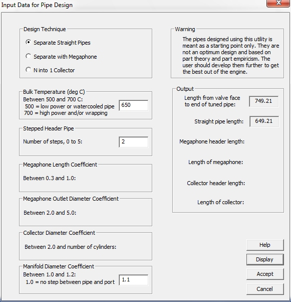{border="0" width="581" height="602"}

If we are satisfied with this pipe we click the \"Accept\" button and this pipe is saved for all the cylinders. Alternatively we could modify some parameters and display the pipe again, until we are satisfied.

## [Example 2: Megaphone pipe]{lang="EN-AU"}

The **\"Separate with Megaphone\"** radio button is selected and the estimated bulk temperature is entered. Note how the tuned length updates as the value is filled in. Next, the megaphone length coefficient is selected by entering the value \"0.75\", followed by the megaphone diameter coefficient by entering \"3\". Finally we want a step at the export/pipe junction with an area ratio of 1.1 so we enter the value:

{border="0" width="581" height="602"}

To see what the pipe will look like we click the **\"Display\"** button:

{border="0" width="1004" height="330"}

As can be seen this is a straight pipe with a megaphone. On the dialog the megaphone header length and megaphone length is displayed:

{border="0" width="581" height="602"}

If we are satisfied with this pipe we click the \"Accept\" button and this pipe is saved for all the cylinders. Alternatively we could modify some parameters and display the pipe again, until we are satisfied.

## [Example 3: Collector Type]{lang="EN-AU"}

The **\"N into 1\"** radio button is selected (N is the number of cylinders) and the estimated bulk temperature is entered. Note how the tuned length updates as the value is filled in. Next, the collector diameter coefficient is selected by entering the value \"2.6\". Finally we want a step at the export/pipe junction with an area ratio of 1.1 so we enter the value:

{border="0" width="581" height="602"}

To see what the pipe will look like we click the **\"Display\"** button (Please note that the the two short stubs at the collector boundary is shown only to indicate where the other pipes join, and can number from 2 to 16):

{border="0" width="1004" height="330"}

On the dialog the  header length and collector pipe length is displayed:

{border="0" width="581" height="602"}

If we are satisfied with this pipe we click the \"Accept\" button and this pipe is saved for all the cylinders. Alternatively we could modify some parameters and display the pipe again, until we are satisfied. When this pipe is saved the dialog opens where the collector junction inter pipe angles have to be entered.

---

# Modeling Siamesed Exhaust Ports

Currently this capability exists only for 4 and 6 cylinder engines where the exhaust ports of cylinder 2 is siamesed with that of cylinder 3 and the inlet port of cylinder 1 and that of cylinder 4 is conventional. The siamesed port is modeled by firstly modeling the exhaust ports in the cylinder heads very short - half the distance from the centre of the valve head to the effective split between the two ports. The other half of this length is modeled as part of the exhaust manifold as shown in the next figure:

{border="0"}

## Basic inline 4 manifold layouts

There are three basic I4 manifold layouts available:

1.  Long Center Branch - This is a 4into2into1 manifold

2.  A 3 into 1 manifold

3.  A split Center Branch

### Modeling the Long Center Branch (4into2into1 manifold)

In this layout the siamesed exhaust ports are joined into a single exhaust pipe through a collector as shown in the next figure:

{border="0"}

To select this version the \"4in2in1 manifold for siamesed inlet ports\" radio button is selected as shown on the next figure:

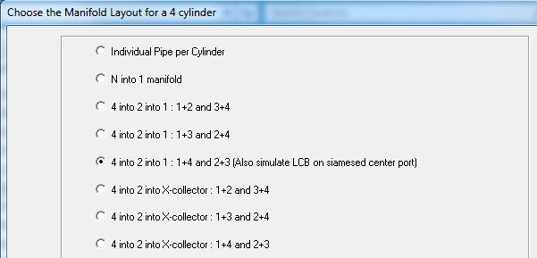{border="0"}

It is also possible to model the connector pipes with blind pipe resonators:

{border="0"}

To achieve this the following option is selected on the type of pipe dialog:

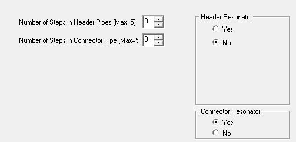{border="0"}

### Modeling the 3into1 layout

In this layout the siamesed port center branch connects to the collector with the header pipes of cylinder 1 and 4:

{border="0"}

And with resonators:

{border="0"}

To select this version the \"4 into 3 into 1 : 2+3 into 1 then all into 1 - simulates 3 into 1 siamesed center port\" radio button is selected as shown on the next figure:

{border="0"}

### Modeling the Split Center Branch (4into3into4into2into1 manifold)

In this manifold the center branch is split into two pipes which joins headers 1 and 4 which then joins into the collector pipe.

{border="0"}

To select this version the \"Split Center Branch on Siamesed Exhaust port on cylinder 2 and 3\" radio button is selected as shown on the next figure:

{border="0"}

## Basic inline 6 manifold layouts

There is currently one basic I6 manifold layout available:

1.  A 4 into 1 manifold

### Modeling the 4into1 layout

In this layout the two siamesed port sets connects to the collector with the header pipes of cylinder 1 and 6:

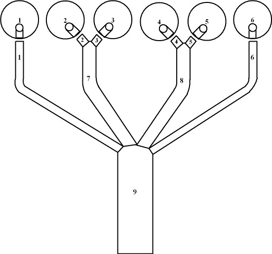{border="0"}

To select this version the \"6 into 4 into 1 to model two center siamesed exhaust ports\" radio button is selected as shown on the next figure:

{border="0"}

---

# [Editing an Existing Exhaust System]{lang="EN-AU"}

[ ]{lang="EN-AU"}

[The pipe length file and pipe diameter contains the pipe lengths and also the type of pipe system, the collector angles and the box volumes, the pipe end characteristics and all the diameters. Selecting to edit an existing exhaust system opens the following dialog:]{lang="EN-AU" style="font-family:\"Times New Roman\""}

[ ]{lang="EN-AU" style="font-family:\"Times New Roman\""}

{border="0" width="842" height="659"}

[The type of exhaust system is displayed in the top left hand and the number of pipes and how they connect in the bottom left hand. When an exhaust system is edited the user can choose to create a new system by clicking the \"Select a new Exhaust Manifold\" button. ]{lang="EN-AU"}[To edit a pipe the number is entered in the bottom edit box labelled: \"Give pipe number to edit:\' As an example pipe number 9 is entered and that opens the following dialog box:]{lang="en-au"}

{border="0" width="429" height="458"}

[After making the required changes and selecting the \"Save and Display\" button the following appears:]{lang="en-au"}

[]{lang="EN-AU" style="font-family:\"Times New Roman\""}

{border="0" width="864" height="341"}

[Clicking the \"Exit\" button we return to the main exhaust system dialog:]{style="font-family: Times New Roman" lang="en-au"}

[]{lang="EN-AU" style="font-family:\"Times New Roman\""}

{border="0" width="842" height="659"}

[The collector angles can be changed by entering the collector number in the edit box in the collector group and clicking the \"Edit\" button. The collector edit dialog then appears:]{lang="EN-AU" style="font-family:\"Times New Roman\""}

[]{lang="EN-AU" style="font-family:\"Times New Roman\""}

{border="0" width="677" height="659"}

[On this dialog we can individually edit each angle as required or if the collector is symmetrical about the centre line we select the relevant radio button and enter the axisymetric angle in the edit box. selecting the \"OK\" button returns us to the main exhaust system editing dialog.]{style="font-family: Times New Roman" lang="en-au"}

[After all the changes has been made the \"Accept\" button is clicked to save all the changes. Clicking the \"Exit without saving\" button rejects all the changes and the exhaust system stays as it was. ]{lang="EN-AU" style="font-family:\"Times New Roman\""}

---

# [Exhaust System Error]{style="font-weight: 400"}

Sometimes there is an error in the way the software connects pipes to each other and to other boundaries like cylinder heads, turbochargers, wastegates etc. When this happens the boundary conditions displayed on the pipe graphics will either be two or more over each other or missing altogether.

The next figure shows an example of two boundaries connected to the right hand end and correctly to the left hand end:

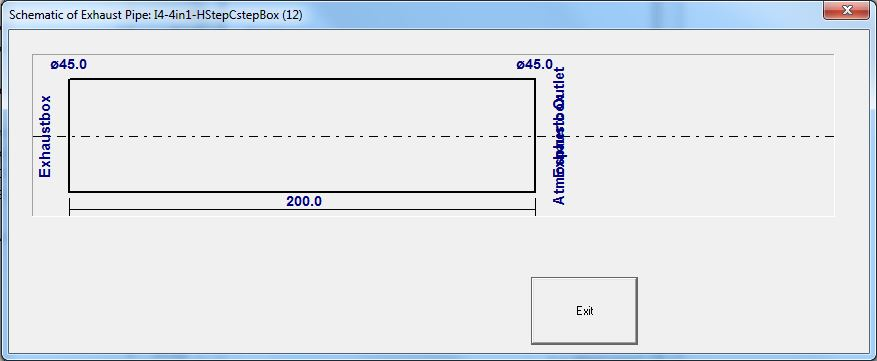

The next pixture shows an example of a missing boundary condition on the left hand end:

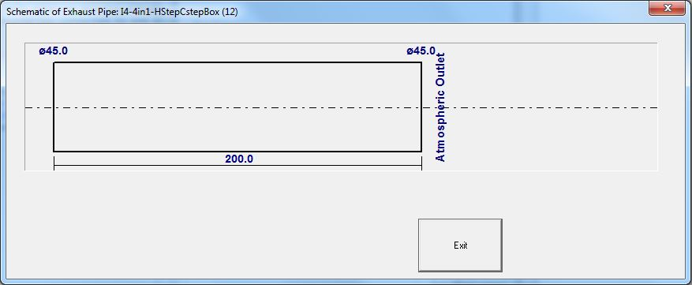

## When an error occurs:

Completes the modeling and the send a description of the pipe system to Vannik Developments at: <vannik@mweb.co.za>

Also send the exhaust files **\"YourExhaustName.exl\"** and **\"YourExhaustName.exd\"** or **Pack** the project and email ithe pack file.

 

---

# Catalytic Converters

It is possible to select an exhaust system that includes a catalytic converter. Currently this option is only available for a catalytic converter fitted to the outlet pipe of the exhaust system.

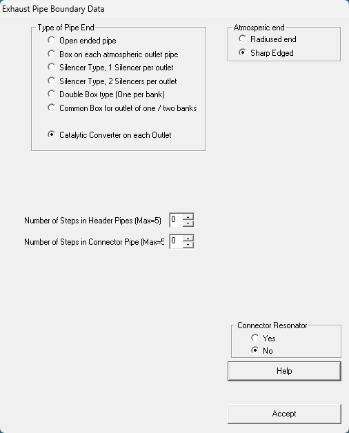{border="0"}

After selecting to use a catalytic converter option the following dialog opens to collect the required catalytic converter data:

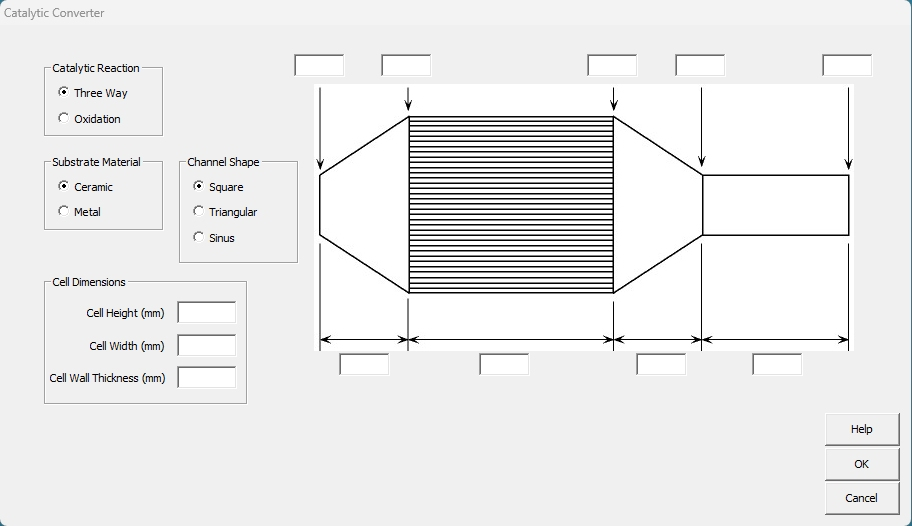{border="0"}

There are two types of exhaust system Catalytic Converters available:

- **Three-Way** The normal type used on gasoline engines.
- **Oxidation** Normally used on diesel engines.

There are two types of substrate materials available:

- **Ceramic**
- **Metal**

There are three cell shapes available:

- **Square**
- **Triangular**
- **Sinusoidal**

---

## [**Introduction to Silencers**]{.underline}

The silencer models included in the software are there purely to allow the correct gasdynamics to be predicted in the pipes. At a much later stage the noise emissions will be predicted. The silencer models are not yet fully debugged and will mostly only work on single cylinder engines or pipes with a single outlet but not on all. It is recommended that [chapter 7 of reference 1](References.htm) be read first.

[**The silencers in the current version is used at the users own risk.**]{.underline}

Before the silencer models can be described it is first necessary to briefly describe two sub-models.

[**1. Butted Joints**]{.underline}

Butted joints or flush entry or exit of a pipe is the case where a pipe enters or exits a silencer and stops or starts flush with the wall. If the main silencer is modeled as a pipe the butted joint is nothing more than a stepped pipe as described in Stepped pipes. The basics are repeated in the next figure. If the main silencer is modeled as a plenum the entry or exit type has no influence.

{border="0" width="395" height="199"}

[**2. Re-entry Pipes**]{.underline}

Re-entry pipes are a common occurrence in industrial type silencers. Basically the pipe entering or exiting the silencer protrudes past the silencer wall as shown in the next figure. If the main silencer is modeled as a plenum this has no effect but if the main silencer is modeled as a tube (to correctly account for the wave action) the end of the pipe is modeled as a three way branch as shown in the figure. The software will automatically calculate the pipe lengths and diameters and branch angles from the user input data.

{border="0" width="429" height="510"}

Including a silencer in the simulation dramatically slows down the simulation so must be avoided if possible. The following screen shows the possible options currently available.

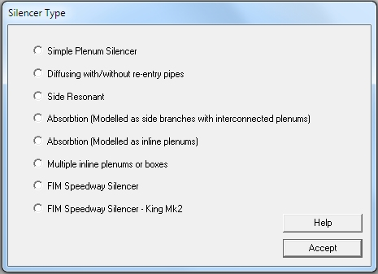{border="0" width="465" height="337"}

 

---

## [**Simple Plenum Silencer**]{.underline}

The simplest form of a silencer is a simple plenum. There is no real difference between a pipe with a plenum silencer and a box pipe. If the silencer is relatively short in that the wave action in the silencer tube is negligible using the simple plenum silencer is acceptable but if the wave action is of importance it is better to model the silencer as a diffusing silencer. Note where the main exhaust pipe ends and the silencer starts.

{border="0" width="600" height="179"}

Even though the user has to supply the diameter and length of the outer tube it is used purely to calculate the plenum volume. The following figure shows a typical input screen.

{border="0" width="671" height="576"}

---

## [**Diffusing Silencer**]{.underline}

The following two figures shows the layout of typical diffusing silencers. The first figure shows a single plenum silencer with a re-entry inlet and a re-entry outlet. Its internals will be modeled as two three-way branches. The second figure shows a two-plenum silencer with the first plenum having the same layout as in the first picture but with a plenum added. The second plenum has a re-entry inlet but a flush outlet pipe. Its internals will be modeled as three three-way branches and one stepped pipe. At the moment the program does not cater for re-entry pipes that overlaps each other. The plenums does not have to be against each other but the user has to take care in not entering physical impossible data as the internal error checking of the software has not been developed yet.

{border="0" width="443" height="211"}

 

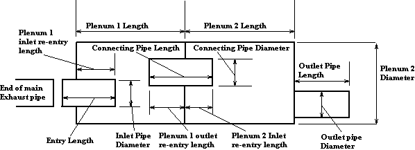{border="0" width="598" height="217"}

The following figure shows a typical input screen for the second silencer.

{border="0" width="855" height="574"}

Note that in this case sum of the inlet and outlet re-entry lengths of the interconnecting tube 1 is equal to the length of the interconnecting tube. If the sum was smaller it would mean that plenum 1 and plenum 2 were not against each other. If the sum was greater the model would have no physical meaning.

---

## [**Side Resonant Silencer**]{.underline}

The side resonant silencer has a inner tube that has a few holes in roughly the center of the tube as shown in the following figure. If the length of the perforation exceeds about one third of the silencer length the silencer should rather be modeled as an absorption silencer will low density packing. Note where the main exhaust stops and the silencer begins. The silencer is modeled as a tube with a three-way branch with the side branch connected to a plenum as shown in the second figure. The main exhaust and the outlet pipe are connected to the silencer using steps.

{border="0" width="600" height="469"}

 The length and diameter of the side branch and the volume of the plenum is calculated by the software. The steps, which can be step-up or step-down steps are also calculated by the software. The following picture shows the typical input data.

{border="0" width="647" height="546"}

 

---

## [**Absorption Silencer**]{.underline}

The absorption silencer is the most common high performance engine silencer. Correctly sized it has almost no negative effect on the engine performance. It is commonly known as a \"free flow\" silencer. It consists of a straight through inner tube that is perforated and with the space between the inner and outer tube packed with some absorption material like glass wool. The number and size of the holes define the \"opacity\" of the silencer and the density of the packing the \"density\" of the silencer. The following figure shows the main dimensions of an absorption silencer.

{border="0" width="647" height="209"}

Depending on the opacity of the silencer one of two ways can be used to model the silencer.

**1: Absorption Silencer modeled as branches with interconnected plenums**

For an opacity of less than 0.45 the silencer can be modeled as a series of branches with side plenums, almost like a row of side-resonant silencers. The plenums are connected with interconnecting pipes of which the diameter depends on the density. The side branch diameter depends on the opacity and the plenum volume on the total silencer volume. The following figure shows the internal modeling as performed by the software.

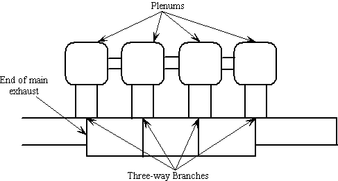{border="0" width="487" height="261"}

The software as a default determines all the relevant dimensions from the main dimensions as supplied by the user. The next screen shows a typical example of the input data.

{border="0" width="876" height="711"}

The user can also prescribe the number of sections and their dimensions of the perforated tube and the software determines all the rest of the relevant dimensions from the main dimensions as supplied by the user. The next screen shows a typical example of the input data.

{border="0" width="876" height="711"}

**2: Absorption Silencer modeled as a series of inline plenums and pipes**

For an opacity of more than 0.25 the silencer can be modeled as a series of inline plenums connected by short pipes. The following figure shows the internal modeling as performed by the software.

{border="0" width="516" height="305"}

The software determines all the relevant dimensions from the main dimensions as supplied by the user. The next screen shows a typical example of the input data.

{border="0" width="612" height="698"}

 

---

## [**Multiple Plenum Silencer**]{.underline}

This type of silencer is fairly common among chainsaw and lawnmower engines and typically consists of two chambers or plenums as shown in the next figure. They differ from the diffusing silencer in that the re-entrant pipes overlap and that the plenum is short with a large diameter with little discernable wave action.

{border="0" width="403" height="219"}

The following screen shows the typical input data for a small two-chamber silencer.

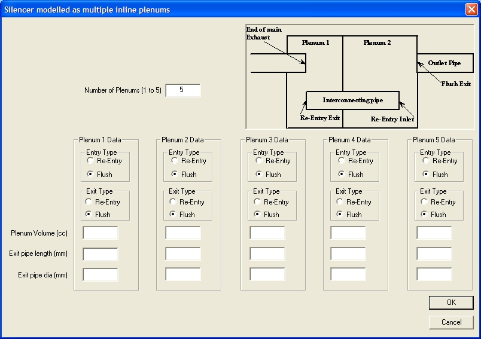{border="0" width="804" height="567"}

The entry type (re-entry or flush) does not currently have an effect but at a later stage will influence the Cd-map used at the pipe entrance.

---

## [**Speedway Silencer**]{.underline}

This is a silencer prescribed by the FIM for use on world championship speedway bikes. It is a combination of a side resonant and a diffusing silencer. The number and size of the holes define the \"opacity\" of the silencer. The following figure shows the main dimensions of a speedway silencer.

{border="0" width="638" height="226"}

**Speedway Silencer modeled as branches with interconnected plenums**

 The following figure shows the internal modeling as performed by the software.

{border="0" width="487" height="261"}

The software as a default determines all the relevant dimensions from the main dimensions as supplied by the user. The next screen shows a typical example of the input data.

{border="0" width="668" height="736"}

## [Updated Silencer]{.underline} {#updated-silencer align="left"}

Since the introduction of the prescribed silencer a further silencer was prescribed with even more restriction to flow and more noise attenuation/absorption.

{border="0" width="624" height="227"}

This configuration requires a more complex series of plenums and branches to model:

The next screen shows a typical example of the input data.

{border="0" width="687" height="772"}

 

 

 
