# Inlet Pipe Numbering Convention

Before the numbering convention is discussed it is necessary to first define what is meant by a pipe:

A Pipe is a piece of tube that runs from one boundary to the next with no discontinuities in between.

## Boundaries:

- End of a pipe at the cylinder manifold face.
- Start of a pipe open to the atmosphere.
- A collector (multi-pipe joint).
- The entry to or exit from a box or plenum.
- The entry to or exit from a throttle.
- The entry to or exit from a compressor.
- The entry to or exit from an intercooler.

Note: A straight pipe connected to a gradual area change (diffuser) is not a boundary but just one pipe with 2 sections.

## Pipe Numbering

Pipes are numbered in the **opposite** direction of major flow starting at the cylinders and in cylinder sequence. Using this sequence the pipes connecting to the cylinder pipes are numbered next and this process is continued until the last pipe open to the atmosphere is numbered. This is demonstrated in the following example:

### Example 1: Demonstration of Pipe numbering process

This example shows the layout and pipe numbering for a four-cylinder engine fitted with a 4into1 pipe system fitted with a box. Each cylinder pipe has one throttle in it and the box has 3 inlet pipes. The numbering is shown in the following figure (also take note of what each pipe is called):

The pipes connecting directly to the cylinder head (called cylinder pipes) are numbered first, followed by the throttle body pipes (the pipes leading up to the throttles), then the collector pipe followed by the box inlet pipes.

The exception to this rule is when a boost bottle is employed. The pipes on an engine with boost bottles are numbered from the cylinder head until a collector, an open end or a box/plenum is encountered and then the boost bottle pipes are numbered before the collector or box inlet pipes. This is illustrated in the next example:

### Example 2: Numbering with a boost bottle in the system

Note how the pipes are numbered from the cylinder up to the atmospheric inlet and only then the boost bottle pipe is numbered.

## Pipe Section Numbering

Pipes with gradual area changes are subdivided into sections. These sections are also numbered in the major direction of flow. A pipe can have no less than 1 section and a maximum of 12 sections. To identify which pipe a section belongs to a section is numbered using a double index system, the first index identifies the pipe it belongs to and the second index is the section number. For example, **section(2,3)** means section 3 in pipe 2. This is demonstrated in the following two examples:

### Example 3: Pipe section numbering on a single cylinder engine

A single cylinder engine fitted with a bell mouth and throttle system is shown. The throttle body is fitted with a small cone, the bell mouth or velocity stack. To model this engine one uses two inlet pipes with the throttle body pipe, pipe 2, divided into three sections, a tapered pipe, a parallel pipe and another tapered pipe.

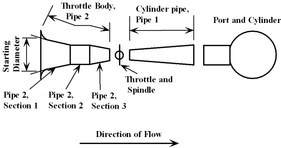

The first tapered pipe, pipe2 section 1, simulates the bell mouth. The second tapered pipe, pipe2 section 3, simulates the venturi. The pipe connecting the venturi to the cylinder head, pipe 1, is modelled here as a gradually tapering pipe.

Note how the pipes are numbered starting from the cylinder head interface to the atmospheric entry while the sections in each pipe are numbered in the direction of the flow.

The user is free to model each pipe with as many sections as required (with a maximum of 12 per pipe); this layout is just one possibility for an intake with a throttle and a venturi. It is the responsibility of the user to model the real situation as close as possible to ensure accurate results.

### Example 4: Pipe section numbering on a multi-cylinder engine

This example shows the same basic pipe configuration as used in Example 1 but with the throttles replaced with short tapered sections. This results in a reduction in the number of pipes. Notice how the pipes are numbered against the flow direction but the sections in the direction of flow.

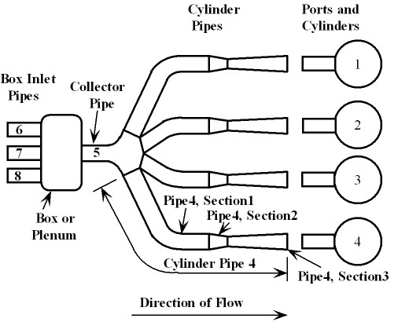

## Section Diameter Numbering Convention

A section has only one length but it has two diameters; the starting diameter and the finishing diameter. For a parallel pipe the two diameters are the same but for a taper pipe they are not. The first diameter of a pipe is numbered as 0. After that each diameter has the number of the section leading up to it. This means that the starting diameter of a section, other than the first section, will have the number of the previous section. This is shown in the next example.

### Example 5: Pipe section diameter numbering

A similar pipe as in Example 3 is used but with the diameter numbers added.

---

# [Inlet End Correction]{lang="EN-AU"}

[ ]{lang="EN-AU" style="font-family:\"Times New Roman\""}

[The reflection from the open end of a pipe is not really from the end of the pipe but from a point a short distance outside the pipe because of 3-dimensional effects. This effect is usually ignored on longish pipes but can cause large errors in the phasing of the pulses in short pipes. The main concern here is the tuning of the primary inlet pipe(s), the one(s) connected to a cylinder(s) and only if they end in an air box or are open to the atmosphere. It is standard practice [(refer to reference \[2\])](references.htm) to use a point a distance of half the inlet diameter outside the entry as the reflection point. It is left to the modeler to add this extra length to the primary intake length.]{lang="EN-AU" style="font-family:\"Times New Roman\""}

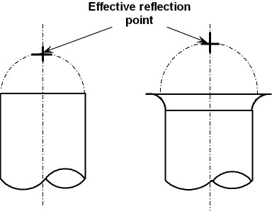{border="0" width="384" height="298"}

The exact reflection point can vary with inlet edge configuration and might require some experimentation to get right but will seldom be less than 0.3 times the inlet diameter or more than 0.7 times the inlet diameter. The following shows typical length corrections added for inlet edge configurations:

## [Parallel walled ram tube]{lang="EN-AU"}

[The correction added to a parallel walled ram tube (velocity stack) is relatively simple and is shown in the next figures. The first figure shows the basic geometry and the second figure shows the way to add the correction length. As the pipe has a constant cross sectional diameter the correction length is half this diameter.]{lang="EN-AU" style="font-family:\"Times New Roman\""}

[ ]{lang="EN-AU" style="font-family:\"Times New Roman\""}

[ ]{lang="EN-AU" style="font-family:\"Times New Roman\""}

{width="470" height="416"}

[ ]{lang="EN-AU" style="font-family:\"Times New Roman\""}

[ The boundary condition for this type of intake is]{lang="EN-AU" style="font-family:\"Times New Roman\""}[ either "**sharp edged**", "**radiused**" or \"**bell mouth**\", depending on the physical end of the ram tube.]{lang="EN-AU" style="font-family:\"Times New Roman\""}

[.]{lang="EN-AU" style="font-family:\"Times New Roman\""}

## [Taper walled ram tube]{lang="EN-AU"}

[The correction added to a taper walled ram tube (velocity stack) is slightly more complex and is shown in the next figures. The first figure shows the basic geometry and the second figure shows the way to add the correction length. The straight walls are extended to the end of the ram tube and half of this diameter is used for the correction length.]{lang="EN-AU"}

[ ]{lang="EN-AU"}

[ ]{lang="EN-AU"}

{width="471" height="416"}

[ ]{lang="EN-AU"}

[The boundary condition for this type of intake is either "**sharp edged**", "**radiused**" or \"**bell mouth**\", depending on the physical end of the ram tube.]{lang="EN-AU" style="font-family:\"Times New Roman\""}

## [Curved wall ram tube (fully developed bell mouth)]{lang="EN-AU"}

[The correction added to a curved wall ram tube (velocity stack) is more complex and is shown in the next figures. The first figure shows the basic geometry and the second figure shows the way to add the correction length. The modeler has to use his best judgement to fit a straight line through the curved side and the diameter where these lines exit the bell mouth is then used in the calculation of the end correction.]{lang="EN-AU"}

[ ]{lang="EN-AU"}

[ ]{lang="EN-AU"}

{width="463" height="416"}

[ ]{lang="EN-AU"}

[The boundary condition for this type of intake is ]{lang="EN-AU"}[ either "**radiused**" or \"**bell mouth**\", depending on the physical end of the ram tube.]{lang="EN-AU" style="font-family:\"Times New Roman\""}

---

# \>Throttle Boundary Condition

The intake systems of most internal combustion engines have a throttle somewhere in the system. Dat4T allows the modelling of three types of throttles in three possible positions in the intake system. The throttle types are:

- **Butterfly type:** This is the conventional throttle that uses a throttle plate on a spindle. At full throttle the spindle forms a restriction. The user has to supply the spindle diameter from which the program calculates the effective flow area.
- **Plate Throttle:** The plate throttle is a plate that slides completely out the way with only the slot in which it slides having a slight effect on the flow. It is usually used with fuel injection systems on very high performance competition engines.
- **Slide Throttle:** This is the typical motorcycle carburettor layout. It usually has a metering needle running through the centre of the bore. The needle, the slots the slide move in and the shape of the exposed throttle slide are the only factors influencing the flow.

Once the user has specified the throttle type the software will automatically choose the correct Cd-map.

The throttles can be used in the following three positions (note the pipe and section numbering sequence):

- **In the cylinder pipes:** This is the most conventional layout for high performance competition engines with either a carburettor or a fuel injection system per cylinder.

  {width="638" height="272"}

- **In the collector pipe:** Some engines use a collector type inlet manifold connected to a single carburettor.

  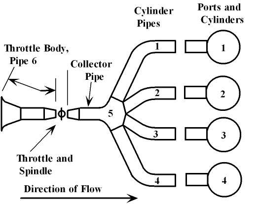{width="525" height="414"}

- **In the plenum intake pipe(s):** Certain engines have an intake system where all the cylinder pipes are connected to a small plenum with a multi-barrel carburettor feeding the plenum.

  {width="481" height="427"}

---

# Collector Modeling

The pipe boundary where 3 or more pipes join is known as a collector. Normally an inlet collector has one incoming pipe and a number of outgoing pipes. The incoming pipe, depending on its position in the inlet system is known as the connector pipe or the collector pipe. When modeling a collector junction there are two values of importance:

1.  Relative pipe angles
2.  Collector area (diameter)

### Pipe angles

The angles between the pipes are used to determine the loss factors in the simulation. If two pipes enter the collector parallel (zero included angle) and at some stage the gas flows from the one into the other one (making a u-turn) larger flow losses will occur compared to the case where they are at a much larger angle to each other. The smallest angle that can be used is 0° and the largest angle is 180°.

During the creation of a pipe system the software will query the user for the included angles between the pipes. It is up to the user to ensure that he understands the pipe numbering convention to be able to supply the correct angles.

If the pipes exiting the collector are arranged to make the same angle with the center line of the incoming pipe (a symmetrical collector junction) it is possible to generate the angles by just supplying the angle between the center line of the incoming pipe and the outgoing pipes:

{border="0"}

### Collector Areas

When modelling the collector pipe it is usual practice to model the first area as the sum total of the areas of the outgoing pipes. (As the software uses diameters this area must be converted to an effective diameter.) This is the position marked on the Figures as **Collector**. From this point upstream, the next area (diameter) will depend on the type of collector. In the merge collector this area is the same as the collector area.

## Standard Collector Types

There are typically three standard types of collectors and one special type. They are described here with guidelines to model them.

**It is important to note that it is up to the user to decide what type of collector is being modelled and where in the pipe junction the collector boundary is.**

{border="0"}

### **1. Y Collector**

This is a more economic collector and is formed by deforming a piece of tube or by fabricating it from a piece of plate. The incoming pipes are usually parallel (zero included angle) but they might be at a slight angle to each other. This fabricated piece usually tapers down to section 2 of the collector pipe, from there they are the same. Refer to Figure.

{border="0"}

{border="0"}

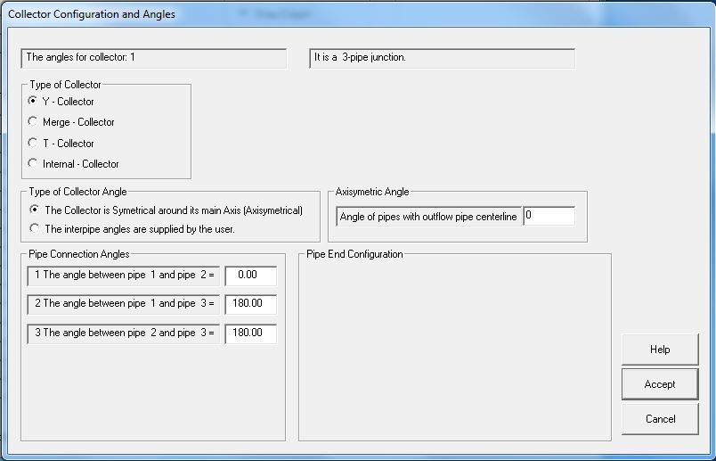{border="0"}

### **2. Merge Collector**

This collector is the most expensive and is usually only seen on high performance racing engines. The incoming pipes curve where they enter the collector and has an included angle between the incoming pipes in the region of 15° to 70° and an included angle between each incoming pipe and the outgoing pipe of 165° to 120°. Other angles are of course possible, depending on the fabricator of the collector.

For a collector with a steep angle between the incoming pipes the incoming pipes go directly into the collector pipe and is modelled as shown:

{border="0"}

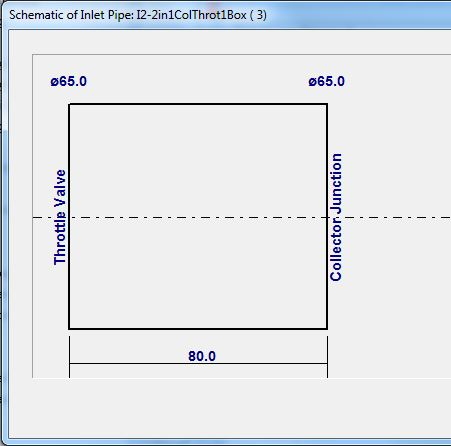{border="0"}

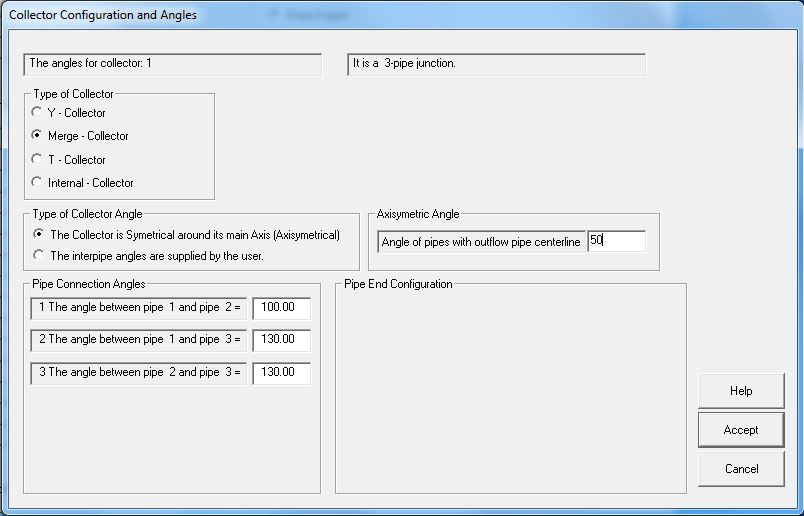{border="0"}

### **3. T-collectors**

#### Merge Type - big angles but similar sized pipes

T-collectors are just a special case of a straight collector but with one or more pipes at a steep angle and / or with a much smaller pipe diameter, requiring the addition of a Cd-value to the pipe end. This is used to model a typical log manifold junction and an example is shown in the next figure.

This collector is basically a pipe with a side branch \"T-ed\" into it. Thus the angle between pipe 1 and pipe 3 is 180° (it is a straight pipe). The angle between pipe 1 and pipe 2 is usually somewhere between 60° and 90°. Typical angle sizes are as follows and the pipe ends that are forming the collector junction all blend into each other so the **\"Blend\"** pipe end configuration is selected:

{border="0"}

Please note that these angles are an approximation of the physical case and should be tested by the user to simulate reality as close as possible.

#### Sharp Type - big angles and with big differences in pipe diameters

This type of junction usually have the T-pipe or T-pipes at or close to 90° to the major pipes in the junction. It is usually used for boost bottle junctions or for the pipes joining a plenum-collector manifold:

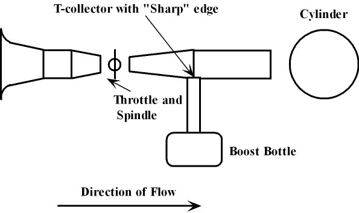{border="0"}

---

# [Modeling of Boxes and Plenums]{lang="EN-US"}

[ ]{lang="EN-US" style="font-size:12.0pt;mso-bidi-font-size:10.0pt"}

[The terminology of a " box" and a "plenum" is both used to describe a container of a fixed volume that is connected to one or more pipes in the intake system. The user has to specify the box volume in cm^3^ and the pipe end configuration at the entry or exit from the box. The user has a choice between a sharp edge and a rounded edge for the pipe end. ]{lang="EN-US" style="font-size:12.0pt;mso-bidi-font-size:10.0pt"}

[ An inlet box can be used to simulate an air cleaner box, a resonating chamber (called a boost bottle) or a collector with a large volume (typically the cavity under the carburetor of a V-engine intake manifold to which the cylinder pipes connect).]{lang="EN-US" style="font-size:12.0pt;mso-bidi-font-size:10.0pt"}

{border="0" width="483" height="357"}

---

# Variable Inlet Length

The inlet length can be modeled as varying in length with RPM. This can be defined on the inlet creation dialog box:

{border="0" width="912" height="657"}

It can also later be defined on the inlet edit dialog box:

{border="0" width="1003" height="677"}

The variable length is subject to the following:

- Only cylinder pipes (pipes directly connected to the cylinder head) or throttle body pipes (connected to cylinder pipes) can vary in length.
- If there are throttle body pipes, these pipes will vary while if there are no throttle bodies the cylinder pipes will vary.
- The last segment of the pipe (the one against the head for cylinder pipes or the one against the throttle for throttle body pipes) will vary in length.

The next figure shows an example of where the length in a throttle body will be varied:

{border="0" width="848" height="429"}

The length will be varied as follows:

- At rpm values below the minimum rpm value the length will be fixed at the lowest rpm length value.
- At rpm values above the maximum rpm value the length will be fixed at the highest rpm length value.
- For rpm values between prescribed rpm length values the length will be determined by linear interpolation.
- The specified length for the last segment will not be used but be replaced with the interpolated length.

---

# Types of Intake Systems

There are three main general types of inlet systems available:

- Individual pipes per cylinder.
- 1intoN branch manifolds where N = number of cylinders
- Log manifolds -- all cylinders connect to a single pipe.

On top of these \"normal\" pipes there is a range of special pipes available depending on the engine types.

All the pipes can have one of two types of \"atmospheric inlets\":

- Plain pipe. A normal plain opening to the atmosphere.

- Box pipe. The air flows from the atmosphere into a box or plenum and from there via box outlet pipes into the intake system.

## The main inlet system selection dialog box

When creating an inlet system for the first time or when redefining it the main inlet selection dialog box opens. Depending on the engine layout only some options will be displayed. The next picture shows all the possible options for all the possible engine layouts:

{border="0"}

## Description of Main Intake types

These are the more common types of intake systems. They are general to any engine configuration and number of cylinders except for the single cylinder that for obvious reasons cannot have any sort of branch pipe.

## Individual Pipes

This system has a pipe for each cylinder. These pipes can each have a box or plenum attached or can be directly open to the atmosphere. The pipes can have throttles and boost bottles. Figure 1 shows a two-cylinder engine with throttles, with ram tubes and box inlets.

{border="0"}

To select this inlet layout the following selections were made (The engine is an inline twin, \"I2\", and only the options for an I2 were available):

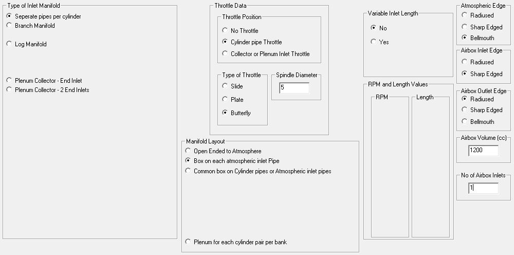{border="0"}

## 1intoN Branch Manifolds

These are usually a cheaper type of intake manifold with a single carburetor. They are used where economy of production is the aim. The cylinder pipes or the collector pipe can have a throttle. The collector can be connected to a box/plenum or directly open to the atmosphere.

Figure 2 shows a typical 4into1 manifold.

{border="0"}

The next picture shows the options selected to create this inlet system:

## Double Collector Manifolds

On some older inline 4 cylinder engines the inlet was often made up from two Y-collectors that connected two adjacent cylinders to a carburator. Some times these manifolds were interconnected. Both types are shown in the next figures:

The next picture shows the options selected to create this inlet system:

## Log Manifolds

With a log manifold each cylinder is connected to a common pipe. This is usually not found on a high performance engine except on turbo-charged engines. This type is still under development and will be described in detail once development is completed. Figure 3 shows a four-cylinder engine with a side inlet log manifold. Note the direction of flow.

{border="0"}

The next picture shows the options selected to create this inlet system:

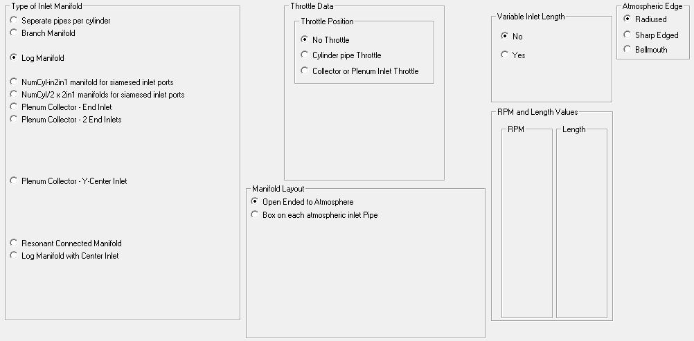{border="0"}

The next figure shows a log pipe layout on and inline engine with a central inlet. This example shows a collector throttle.

{border="0"}

The next picture shows the options selected to create this inlet system:

{border="0"}

The next figure shows a log pipe layout on a V or F engine with one manifold per cylinder bank and side inlets. This example is shown with two air boxes.

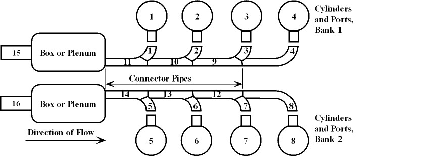{border="0"}

The next picture shows the options selected to create this inlet system:

{border="0"}

## [Special Manifolds]{.underline}

### Discussion of Plenums

A plenum or a box is modeled as a 0D element and should only be used if the transmission of the waves through it is not important as it only simulates emptying and filling with no pressure gradients through the plenum. If the phasing of the pressure pulses through the plenum is important the plenum should rather be modeled as a combination of large diameter pipes and connector points. One way to do this is to use the so called \"Plenum-Collectors\" described next:

## [Plenum-Collector]{.underline}

### Plenum-Collector, End Inlet, I-engine

This manifold is currently active for inline, Vee and Flat engines and models the typical plenum-collector as found on most fuel injected engines with a single throttle body at the entrance to the plenum. It is modelled as a series of short pipes simulating the plenum, joined to the cylinder pipes by collector junctions. The following picture is of such a manifold but the throttle body is not shown:

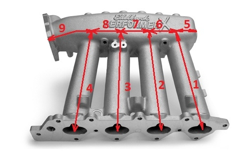{border="0"}

The plenum is usually too long and narrow to be modelled as a box so it is modelled as a log manifold with a blind pipe on the closed end and 4 3into1 junctions as shown in the next figure:

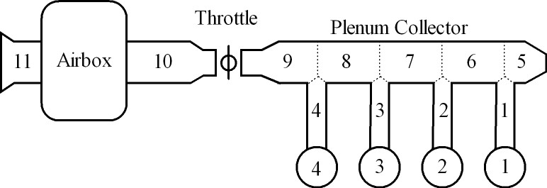{border="0"}

The next picture shows the options selected to create this inlet system:

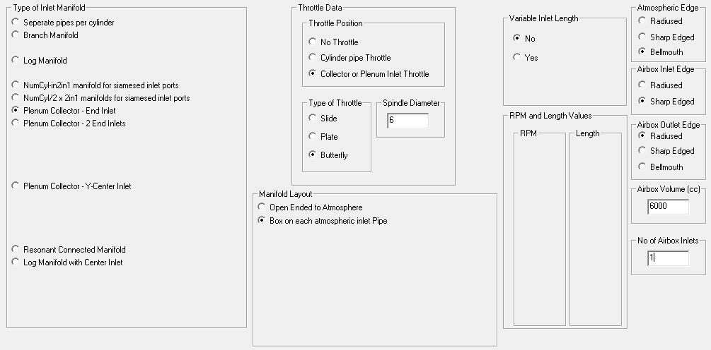{border="0"}

### Plenum-Collector, Y-Inlet

This figure shows a special plenum collector on an I4 engine (7 3into1 junctions) with Y-shaped central inlet:

{border="0"}

The next picture shows the options selected to create this inlet system:

{border="0"}

### Plenum-Collector, End Inlet, V or F engine

The next figure shows the common plenum collector on a V8 engine (4 4into1 junctions) with side inlet:

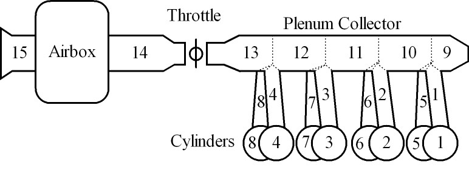{border="0"}

The next picture shows the options selected to create this inlet system:

{border="0"}

### Plenum-Collector, Center Inlet

The next figure shows the common plenum collector on a V8 engine (4 4into1 plus 1 3into1 junctions) with center inlet:

{border="0"}

The next picture shows the options selected to create this inlet system:

{border="0"}

### Double Plenum-Collectors, 2 End Inlets, 2 Air Boxes

In the examples shown there is also an airbox. The following figure shows the use of double plenum-collectors on a V8 or F8 engine, with individual plenum throttles and air boxes.

{border="0"}

The next picture shows the options selected to create this inlet system:

{border="0"}

### Double Plenum-Collectors, Single End Inlet

{border="0"}

### Double Plenum-Collectors, Single End Inlet, Interconnected Plenums

{border="0"}

### Double Plenum-Collectors, Two End Inlets

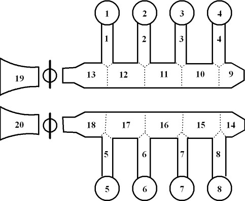{border="0"}

### Double Plenum-Collectors, Two End Inlets, Interconnected Plenums

{border="0"}

### Porsche 964 Inlet System

The next picture shows the Porsche 964 inlet system modeled as a plenum-collector (This is only available for an F6 engine):

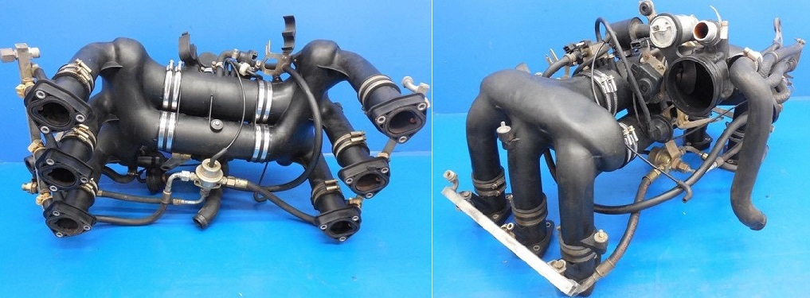{border="0"}

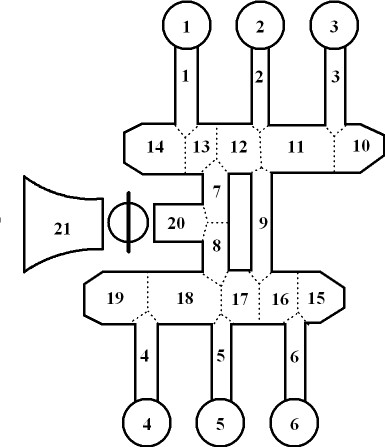{border="0"}

The next picture shows the options selected to create this inlet system:

{border="0"}

## [Plain Plenums]{.underline}

### Paired Plenum Inlets

This manifold is currently only active for I2, I4, I6, I8, I10, I12 and I16 engines.

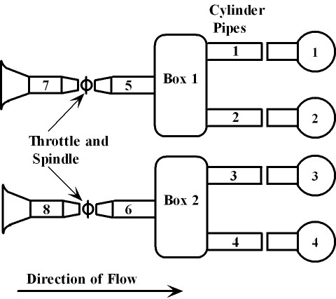{border="0"}

The next picture shows the options selected to create this inlet system:

{border="0"}

### Resonant Collector Box

This manifold is currently only active for 4 cylinder engines and models the system as described in US Patent 5,379,735 Jan. 10,1995. The idea behind the layout is to lengthen the inlet pipes by using its opposite pipe as part of the tuned length as shown in the next figure:

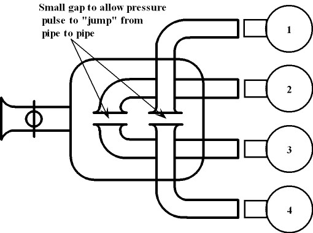{border="0"}

To model the two \"connecting\" pipes a collector is used with a very short collector pipe as shown in the next figure:

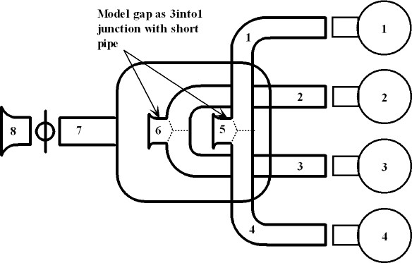{border="0"}

The next picture shows the options selected to create this inlet system:

{border="0"}

## [Special Box or Plenum Pipes]{.underline}

There are two special Box pipes depending on the engine layout:

- Single Box. A single common box on all the inlet pipes to the cylinders.
- Double Box. Two boxes, usually on a V or flat engine, with one box per bank.

It is important to keep in mind that these boxes or plenums should only be used where the wave action in the plenum does not play a major role and missing it will not influence the characteristics being investigated with the simulation. If this is not the case a Plenum-Collector should rather be used.

### One common box on a multi-cylinder engine with individual cylinder pipes (Single Plane Manifold), also used to model a V8 Tunnel Ram or Single Plane manifold

All the cylinder pipes go directly into a common box. The box can have multiple inlet pipes. A typical collector type inlet manifold on a V-8 with a four barrel down draught carburetor can be modeled using this manifold with a small plenum volume.

{border="0"}

The next picture shows the options selected to create this inlet system:

{border="0"}

### Two common boxes, one per bank on a Vee or Flat engine, with a separate intakes

All the cylinder pipes per bank go directly into one of the boxes. The intake to the two boxes are separate and has separate intakes that can be fitted with a throttles.

{border="0"}

The next picture shows the options selected to create this inlet system:

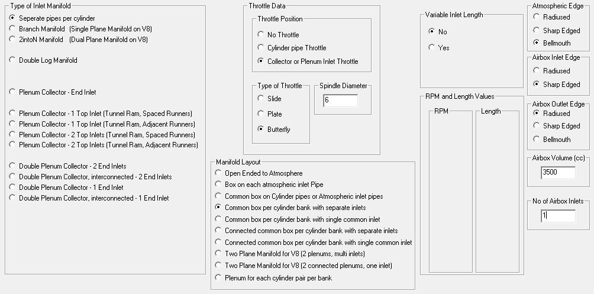{border="0"}

### Two common boxes, one per bank on a Vee or Flat engine, with a common intake

All the cylinder pipes per bank go directly into one of the boxes. The intake to the two boxes are joined and has a common intake that can be fitted with a throttle.

{border="0"}

### Two common boxes, one per bank on a Vee or Flat engine, with separate intakes and an inter connector pipe between the two plenums

All the cylinder pipes per bank go directly into one of the boxes. The intake to the two boxes are joined and has a separate intakes that can be fitted with a throttles. The two plenums are connected through a connecting pipe.

{border="0"}

### Two common boxes, one per bank on a Vee or Flat engine, with a common intake and an inter connector pipe between the two plenums

All the cylinder pipes per bank go directly into one of the boxes. The intake to the two boxes are joined and has a common intake that can be fitted with a throttle. The two plenums are connected through a connecting pipe.

{border="0"}

### Twin Plane Manifold - Two common plenum, cross connected on a Vee or Flat engine, with an intake(s) on each of the two plenums

Cylinders 1, 4, 6 and 7 go directly into one of the plenums and cylinders 2, 3, 5 and 8 go directly into the other plenum. The intake is a typical two-plane manifold used as standard on many older V8 engines.

{border="0"}

### Twin Plane Manifold - Two common plenum, cross connected on a Vee or Flat engine, with a siamesed intake and the two plenums interconnected

Cylinders 1, 4, 6 and 7 go directly into one of the plenums and cylinders 2, 3, 5 and 8 go directly into the other plenum. This intake is a typical two-plane manifold used as standard on the Porsche 928 V8 engines.

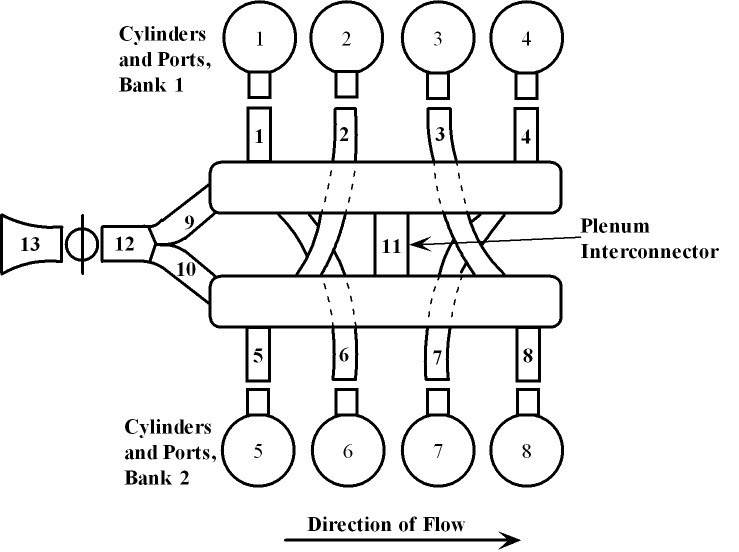{border="0"}

---

# Types of V8 Intake Systems

There is a large number of inlet systems available for V8 engines. With some pipes like independent runners connected to the atmosphere there is no ambiguity in the modeling process. However, when a plenum is involved the model is not so clearcut or obvious. A plenum as modeled in 1-dimensional gasdynamics is a 0-dimensional item and does not transmit waves over a distance with time delay but transmits it instantaneously. If the plenum is in a part of the manifold where this will have a significant influence on the wave action it should rather be modeled as a series of large diameter pipes.

The following shows some examples of inlet systems and how they are modeled in Dat4T:

## Independent Runners

There is no ambiguity in modeling this inlet.

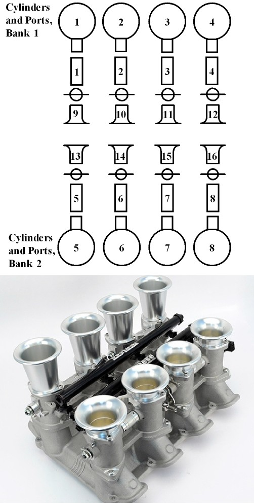

To model this inlet the following manifold type and manifold layout is selected:

## Independent Runners connected to a Plenum per bank - Cross Ram

In this case it is clearly required to model the two plenums as a combination of pipes. If the plenum was much larger the choice is no longer so obvious and might require modeling it using either method and comparing the results.

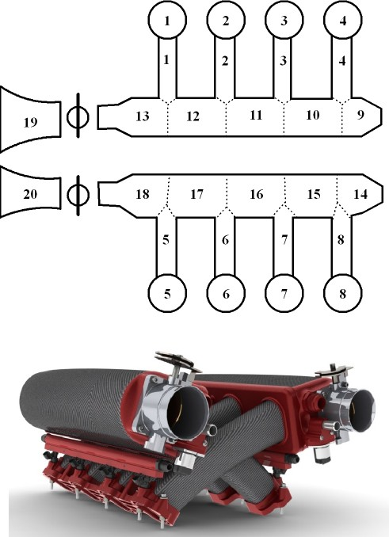

To model this inlet the following manifold type and inlet configurations are selected:

In the case where the plenums are much larger in diameter to the extent where the wave action in the plenum is so small as to be negligable it can be modeled as two plenums:

To model this inlet the following manifold type and inlet configurations are selected:

## Single Plane Manifold

A single plane manifold typically has a very small \"plenum\" where all the runners collect to the inlet pipe (Which is the effective diameter of all the carburettor pipes combined).

To model this inlet the following manifold type and inlet configurations are selected:

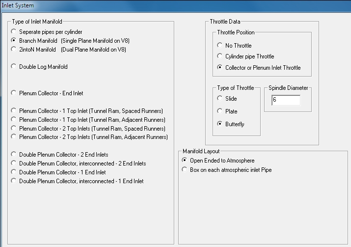

If the plenum is very large or the inlet wave action not important the single plane manifold can be modeled as a plenum into which the inlets and runners connect:

To model this inlet the following manifold type and inlet configurations are selected:

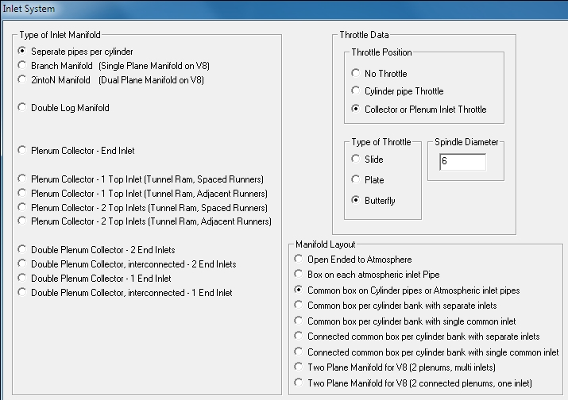

## Dual Plane Manifold

A dual plane manifold typically has two very small \"plenums\" where the runners collect to the inlet pipes (Which is the effective diameters of the connected carburettor pipes).

To model this inlet the following manifold type and inlet configurations are selected:

If the plenums are very large or the inlet wave action not important the dual plane manifold can be modeled as two plenums into which the inlet pipes and runners connect:

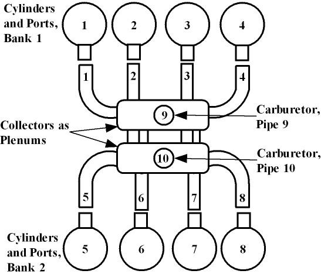

To model this inlet the following manifold type and inlet configurations are selected:

## Tunnel Ram Manifold with One Inlet - Spaced Runners

There is a single effective inlet into the tunnel. This inlet can be the sum of a single barrel, two barrel or four barrel carburetor or throttle body. The runners join the tunnel with a space between them requiring extra \"collector joints\" to model.

To model this inlet the following manifold type and inlet configurations are selected:

## Tunnel Ram Manifold with One Inlet - Adjacent Runners

There is a single effective inlet into the tunnel. This inlet can be the sum of a single barrel, two barrel or four barrel carburetor or throttle body. The runners join the tunnel in adjacent pairs requiring two 6 pipe collector joints.

To model this inlet the following manifold type and inlet configurations are selected:

## Tunnel Ram Manifold with Two Inlets - Spaced Runners

There are two effective inlets into the tunnel. These inlet can be the sum of a single barrel, two barrel or four barrel carburetor or throttle body. The runners join the tunnel with a space between them requiring extra \"collector joints\" to model.

To model this inlet the following manifold type and inlet configurations are selected:

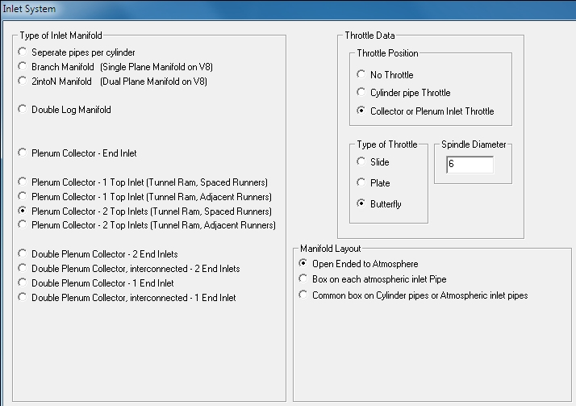

## Tunnel Ram Manifold with Two Inlets - Adjacent Runners

There are two effective inlets into the tunnel. These inlet can be the sum of a single barrel, two barrel or four barrel carburetor or throttle body. The runners join the tunnel in adjacent pairs requiring two 7 pipe collector joints.

To model this inlet the following manifold type and inlet configurations are selected:

---

# Types of Intake Systems for Turbocharged and Supercharged Engines

Turbocharged engines and Supercharged engines with Centrifugal compressors (blowers) can use the same types of inlet systems although it is rare to find a dual compressor supercharger system. Superchargers that are of the Twin Screw (twin lobe, Roots) type cannot realistically use all these configurations.

There are four main general types of inlet systems available:

- Individual pipes per cylinder.
- 1intoN branch manifolds where N = number of cylinders.
- Log manifolds -- all cylinders connect to a single pipe.
- Log-Plenum manifolds - where a plenum is too long and slender to be approximated with a simple plenum.

On top of these normal pipes there is a range of special pipes available depending on the engine types.

All the pipes can have one of two types of atmospheric inlets:

- Plain pipe. A normal plain opening to the atmosphere.
- Box pipe. The air flows from the atmosphere into a box or plenum and from there via box outlet pipes into the intake system.

The next picture shows the dialog box with all the options. The actual options shown for the engine being simulated will depend firstly on the engine layout and secondly on the \"Type of Inlet Manifold\" and \"Manifold Layout\" options selected by the user.

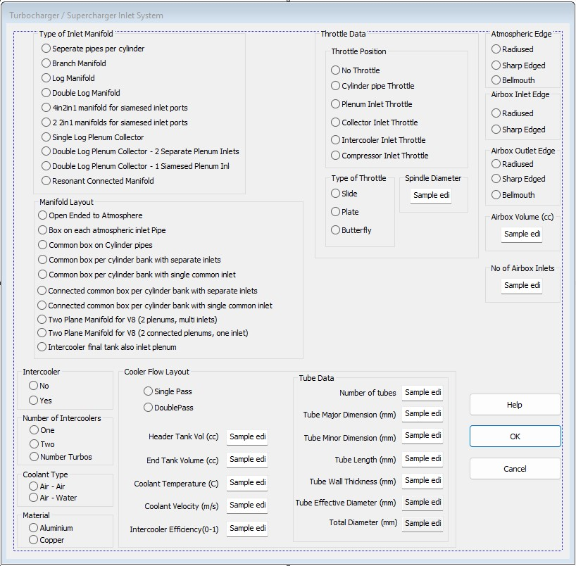{border="0"}

## Description of Main Intake types

These are the more common types of intake systems. They are general to any engine configuration and number of cylinders except for the single cylinder that for obvious reasons cannot have any sort of branch pipe.

## Individual Pipes

This system has completely separate pipes and turbo for each cylinder and is primarily used on a single cylinder engine.

{border="0"}

{border="0"}

## Individual Pipes - With a Common Plenum

This system has a pipe for each cylinder. These pipes end in a plenum which can be attached directly to the compressor or first to a charge air cooler (intercooler) and from the compressor open to the atmosphere. The next figures show this layout, with and without a charge air cooler.

{border="0"}

{border="0"}

There is also a special version that combines the intercooler outlet tank with the inlet plenum:

{border="0"}

## 1intoN Branch Manifolds

All the inlet ports are connected to a single collector pipe. This collector pipe is connected to the turbocharger or to an intercooler first.

The figures show typical 4into1 manifolds with and without an intercooler.

{border="0"}

{border="0"}

## Log Manifolds

With a log manifold each cylinder is connected to a common pipe. This is usually not found on a high performance engine except on turbo-charged engines. The next figures show a four-cylinder engine with a log manifold with and without charge air cooler. Note the direction of flow.

{border="0"}

{border="0"}

The next figure shows a log pipe layout on a V or F engine with one manifold per cylinder bank. This example is shown with two air boxes.

{border="0"}

{border="0"}

## [Special Manifolds]{.underline}

### Plenum-Collector {#plenum-collector style="text-align:justify"}

This manifold is currently active for inline, Vee and Flat engines and models the typical plenum-collector as found on most fuel injected engines with a single throttle body at the entrance to the plenum. It is modelled as a series of short pipes simulating the plenum, joined to the cylinder pipes by collector junctions. The following picture is of such a manifold but the throttle body is not shown:

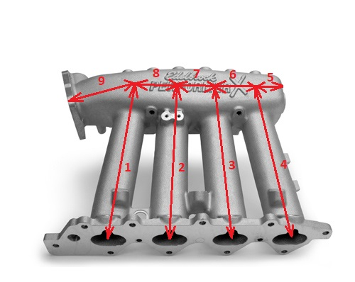{border="0"}

The plenum is usually too long and narrow to be modelled as a box so it is modelled as a log manifold with a blind pipe on the closed end and 4 3into1 junctions as shown in the next figure:

{border="0"}

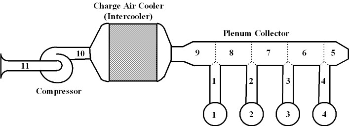{border="0"}

The next figure shows the common plenum collector on a V8 engine (4 4into1 junctions):

{border="0"}

{border="0"}

In the example shown there is also an airbox. The following figure shows the use of double plenum-collectors on a V8 or F8 engine, with individual turbochargers.

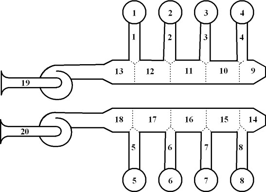{border="0"}

 

{border="0"}

 

## [Special Box or Plenum Pipes]{.underline}

There are three special Box pipes depending on the engine layout:

### One common box on an inline 4 cylinder engine with the paired cylinder pipes facing each other (Resonant Manifold)

This manifold is currently only active for 4 cylinder engines and models the system as described in US Patent 5,379,735 Jan. 10,1995. The idea behind the layout is to lengthen the inlet pipes by using its opposite pipe as part of the tuned length as shown in the next figure:

{border="0"}

To model the two \"connecting\" pipes a collector is used with a very short collector pipe as shown in the next figure:

{border="0"}

The next picture shows the options selected to create this inlet system:

{border="0"}

### One common box on a multi-cylinder engine with individual cylinder pipes (Single Plane Manifold)

All the cylinder pipes go directly into a common box.

{border="0"}

{border="0"}

{border="0"}

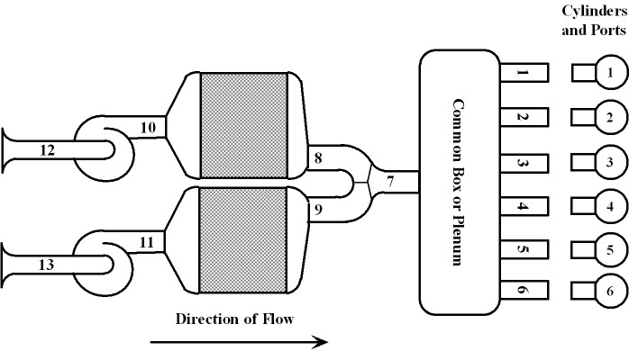{border="0"}

{border="0"}

### Two common boxes, one per bank on a Vee or Flat engine, with a separate turbochargers

All the cylinder pipes per bank go directly into one of the boxes. The intake to the two boxes are separate and has separate intakes that can be fitted with a throttles.

{border="0"}

{border="0"}

### Two common boxes, one per bank on a Vee or Flat engine, with a single turbocharger

All the cylinder pipes per bank go directly into one of the boxes. The intake to the two boxes are joined and has a common intake that can be fitted with a charge air cooler.

{border="0"}

{border="0"}

### Two common boxes, one per bank on a Vee or Flat engine, with two separate turbochargers and an inter connector pipe between the two plenums

All the cylinder pipes per bank go directly into one of the boxes. The intake to the two boxes are joined and has a separate intakes that can be fitted with a throttles. The two plenums are connected through a connecting pipe.

{border="0"}

{border="0"}

### Two common boxes, one per bank on a Vee or Flat engine, with a common turbocharger and an inter connector pipe between the two plenums

All the cylinder pipes per bank go directly into one of the boxes. The intake to the two boxes are joined and has a common intake that can be fitted with a throttle. The two plenums are connected through a connecting pipe.

{border="0"}

{border="0"}

---

# [Creating or Editing an Intercooler]{.underline}

When modeling a turbo or supercharged inlet system there is an option to use an intercooler or more correctly, a charge air cooler. If selecting the \"Yes\" radio button for intercooler a new field opens that requires the cooler data:

{border="0"}

The input data required is the following:

## Number of Intercoolers

On some systems it is possible to fit more than one intercooler in parallel and for such a system the choice has to be made at this point.

## Coolant Type

The cooler can be of the air-air type or the water-air type. For short distance races like drag racing water is often used as the cooling medium where the cooler is in a tank that is filled with ice water before each race. For a short duration this can extract a large amount of heat.\
For longer duration usage the air-air cooler is more common and the normal atmospheric air is used as the cooling medium. It cannot absorb as much heat as water but it is continually refreshed. It requires a much larger cooler.

## Material

Coolers can be made from either aluminium or copper. Aluminium has a higher heat transfer rate and is lighter but less robust and more expensive. It is rare to see a cooler for competition use to be manufactured from anything other than aluminium.

## Single or Double Pass

A single pass cooler is more efficient as the whole cooler is exposed to cold cooling medium (air or water) but sometimes it is not possible because of packaging constraints to fit the required size cooler so one is made that doubles back on itself. That means that the cooling air passes through the one core and is heated up before it passes through the second core.

## Header Tank Volume (cc)

This is the volume of each of the two tanks that is on the inlet and outlet side of the cooler.

{border="0"}

## Center Tank Volume (cc)

If a double pass intercooler is used there is an extra tank that joins the two cores.

## Coolant Temperature (°C)

This is the temperature of the air or water that is used as the cooling medium. In the case of air it is usually the ambient air temperature. In the case of water it can be a dedicated water tank with ice water or part of the engine cooling system.

## Coolant Velocity (m/s)

This is the speed that the cooling medium flows through the core. For a vehicle using the free stream airflow is is normal to use about 75% of the maximum vehicle speed. For water this can be zero for a static tank or the speed that the water is pumped through the core.

## Intercooler Efficiency

This is the ratio between the actual temperature drop of the inlet air and the theoretically possible temperature drop. This is usually in the 0.65 to 0.75 range (65% to 75%).

## Number of Tubes (From Header Tank to Header Tank)

This is the total number of tubes in the core that the inlet air flows through. There can be one or more rows of tubes. The next picture shows an example of the number of rows in a single row cooler (If this was a double row intercooler there would be 48 tubes):

{border="0"}

## Tube Major Dimension (Of Tubes flowing from Header Tank to Header Tank)

This is the inside width of each tube, as shown in the next picture (Note that the intercooler shown in the picture has a single row of tubes):

{border="0"}

## Tube Minor Dimension (Of Tubes flowing from Header Tank to Header Tank)

This is the inside breedth of each inner tube that flows from tank to tank, as shown in the next picture:

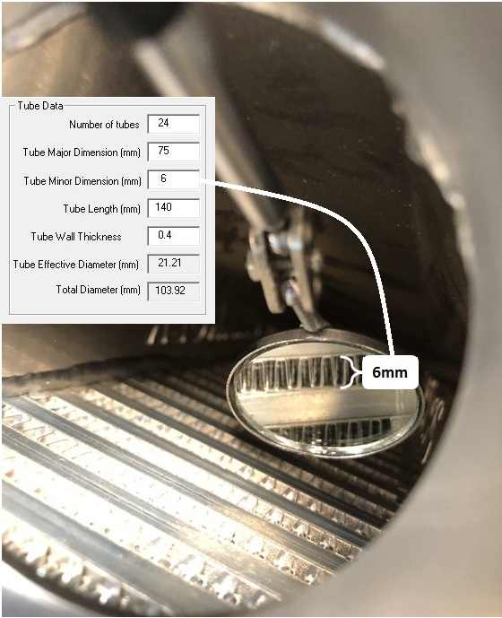{border="0"}

## Tube Length (Of Tubes flowing from Header Tank to Header Tank)

This is the cooling length of each tube, as shown in the next picture:

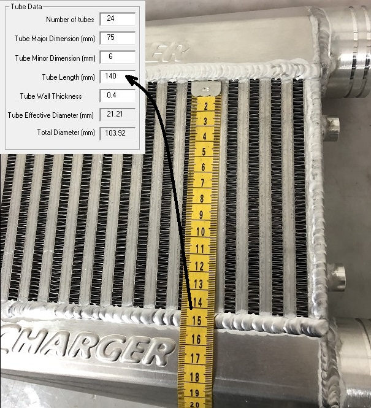{border="0"}

## Tube Wall Thickness (Of Tubes flowing from Header Tank to Header Tank)

This is the thickness of the material the tubes are made from and is typically between 0.3 and 0.4mm thick. This is a very important criteria as it plays a large role in the rate of heat transfer.

## General Discussion

The software calculates the internal flow area of each tube and from that it calculates and displays the effective tube diameter if the tube was round. It also calculates and displays the effective diameter of the sum of all the the tube flow areas added together. As the tubes has a fairly high flow resistance because of internal fins and turbulators to aid heat transfer, this diameter should be about 50% bigger than the tube flowing into the intercooler.

---

# Creating a New Inlet System

When a new inlet system is created the user choose firstly the type of manifold and then the type of collector or inlet system. The manifold choices displayed depend on the number of cylinders and the type of engine (inline, vee or flat). Once this choice is made the user chooses the type of inlet. Two types of inlets are possible:

- Open ended pipe, a plain pipe open to the atmosphere
- Box pipe, the pipe(s) connects to a box(es) from the atmosphere

The example shown in the following figure is a four-cylinder engine fitted with an air box and a throttle in the collector pipe.

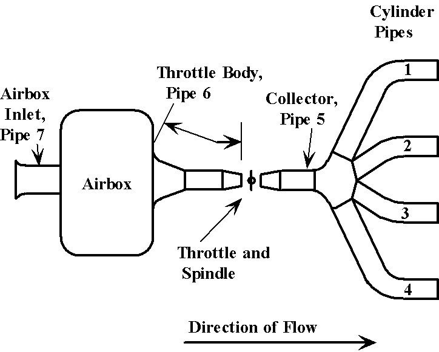{\"=""}

The first screen looks as follows:

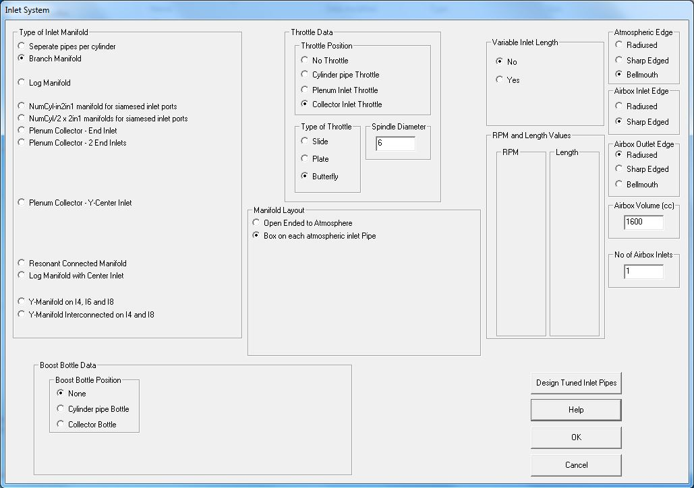

The choices were a collector type pipe, a box type collector, a throttle in the collector pipe, a butterfly throttle with a 6mm spindle and no boost bottles. The atmospheric and air box pipe ends are selected as well as the number of air box entry pipes and box volume.

On the following dialog the user is starts inputting the data for each pipe:.

Entering the data and selecting \"Save and Display\" displays the pipe:

Clicking the \"Exit\" button displays the following dialog if the pipe is the first of the cylinder pipes:

If the cylinder pipes are identical the user clicks \"Yes\" and continue inputting the data for the rest of the pipes. If \"No\" each cylinder pipe\'s data must also be entered. After the data for all the pipes have been entered the dialog for the collector appears:

The user can now enter the angle for each pipe pair for a non-symmetrical collector or select the axisymetric radio button and only enters the outflow pipe angle with the collector centre line after which the program calculates all the angles:

At this point the system is fully specified but can be further modified or updated in the Edit dialog.

---

# Modeling Siamesed Inlet Ports

Currently this capability exists only for 4 and 6 cylinder engines where the inlet ports of cylinder 1 is siamesed with that of cylinder 2 and the inlet port of cylinder 3 is siamesed with that of cylinder 4 (and 5 with 6 in an I6 engine). The siamesed port is modeled by firstly modeling the inlet ports on the cylinders very short - half the distance from the centre of the valve head to the effective split between the two ports. The other half of this length is modeled as part of the intake manifold as shown in the next figure:

{border="0"}

## Basic manifold layouts

There are two basic manifold layouts available:

1.  A 4into2into1 manifold

2.  Two or Three separate 2into1 manifolds

### Modeling the 4into2into1 manifold

In this layout the two siamesed inlet ports are joined into a single inlet pipe through a collector as shown in the next figure:

{border="0"}

To select this version the \"4in2in1 manifold for siamesed inlet ports\" radio button is selected as shown on the next figure:

{border="0"}

This layout can be used with:

1.  \"no throttles\" which is the layout shown above

2.  \"cylinder throttles\" which add throttles to pipe 5 and 6

3.  \"collector throttle\" which add a throttle to pipe 7

4.  \"collector box\" which adds an air box to the collector for all three the above versions which is the \"Box on each atmospheric end\" radio button selected.

### Modeling the two or three 2into1 layout

In this layout the two siamesed port pairs stay as separate inlet manifolds although they can be joined to a common box:

{border="0"}

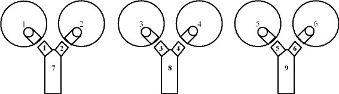{border="0"}

To select this version the \"NumCyl/2 2in1 manifolds for siamesed inlet ports\" radio button is selected as shown on the next figure:

{border="0"}

#### Typical layouts:

1.  \"no throttles\" which is the layout shown above

2.  \"cylinder throttles\" which add throttles to pipe 5 and 6

3.  \"plenum throttles\" which add throttles to the plenum intakes but requires a \"common box on cylinder pipes\" to be selected first

4.  common box or plenum can also be added to options 1 and 2

#### Using option 3 to model a typical 36DCD carburetor layout.

A typical configuration this system is used to model is where a single twin barrel carburetor is used. The two manifolds are joined by a common plenum as shown in the next figure:

{border="0"}

To model the layout as shown the following selection was made on the inlet dialog and 2 air box inlets were chosen:

{border="0"}

#### Using option 2 to model a typical 40DCOE carburetor layout

A typical configuration this layout is used for is for a manifold that connects each port pair to a barrel of a twin choke carburetor. The basic layout is shown in the next figure:

{border="0"}

To model this layout the following selection was made on the inlet dialog:

{border="0"}

If an air box need to be added the \"Common box on Cylinder pipes\" radio button is selected.

---

# [Editing an Existing Inlet System]{lang="EN-AU"}

[ ]{lang="EN-AU"}

[The pipe length file and pipe diameter contains the pipe lengths and also the type of pipe system, the collector angles and the box volumes, the pipe end characteristics and all the diameters. Selecting to edit an existing inlet system opens the following dialog:]{lang="EN-AU" style="font-family:\"Times New Roman\""}

{border="0" width="1020" height="689"}

[The type of inlet system is displayed in the top left hand and the number of pipes and how they connect in the bottom left hand. When an inlet system is edited the user can choose to create a new system by clicking the \"Create a new Inlet Manifold\" button. To edit a pipe the number is entered in the bottom edit box labelled: \"Give pipe number to edit:\' As an example pipe number 7 is entered and that opens the following dialog box:]{lang="EN-AU"}

[ {border="0" width="429" height="454"}]{lang="EN-AU" style="font-family:\"Times New Roman\""}

[After making the required changes and selecting the \"Save and Display\" button the following appears:]{lang="en-au"}

[ {border="0" width="864" height="436"}]{lang="EN-AU" style="font-family:\"Times New Roman\""}

[Clicking the \"Exit\" button we return to the main inlet system dialog:]{style="font-family: Times New Roman" lang="en-au"}

[ {border="0" width="1020" height="689"}]{lang="EN-AU" style="font-family:\"Times New Roman\""}

[ The collector angles can be changed by entering the collector number in the edit box in the collector group and clicking the \"Edit\" button. The collector edit dialog then appears:]{lang="EN-AU" style="font-family:\"Times New Roman\""}

{border="0" width="677" height="655"}

[On this dialog we can individually edit each angle as required or if the collector is symmetrical about the centre line we select the relevant radio button and enter the axisymetric angle in the edit box. selecting the \"OK\" button returns us to the main exhaust system editing dialog.]{style="font-family: Times New Roman" lang="en-au"}

[After all the changes has been made the \"Accept\" button is clicked to save all the changes. Clicking the \"Exit without saving\" button rejects all the changes and the inlet system stays as it was. ]{lang="EN-AU" style="font-family:\"Times New Roman\""}

---

# [Inlet System Error]{style="font-weight: 400"}

Sometimes there is an error in the way the software connects pipes to each other and to other boundaries like cylinder heads, turbochargers, intercoolers etc. When this happens the boundary conditions displayed on the pipe graphics will either be two or more over each other or missing altogether. The next figure shows an example of two boundaries connected to one side and nothing to the other side:

{border="0" width="864" height="440"}

## When an error occurs:

Completes the modeling and the send a description of the pipe system to Vannik Developments at: <vannik@mweb.co.za>

Also send the exhaust files \"YourName.inl\" and \"YourName.ind\".

 

 
