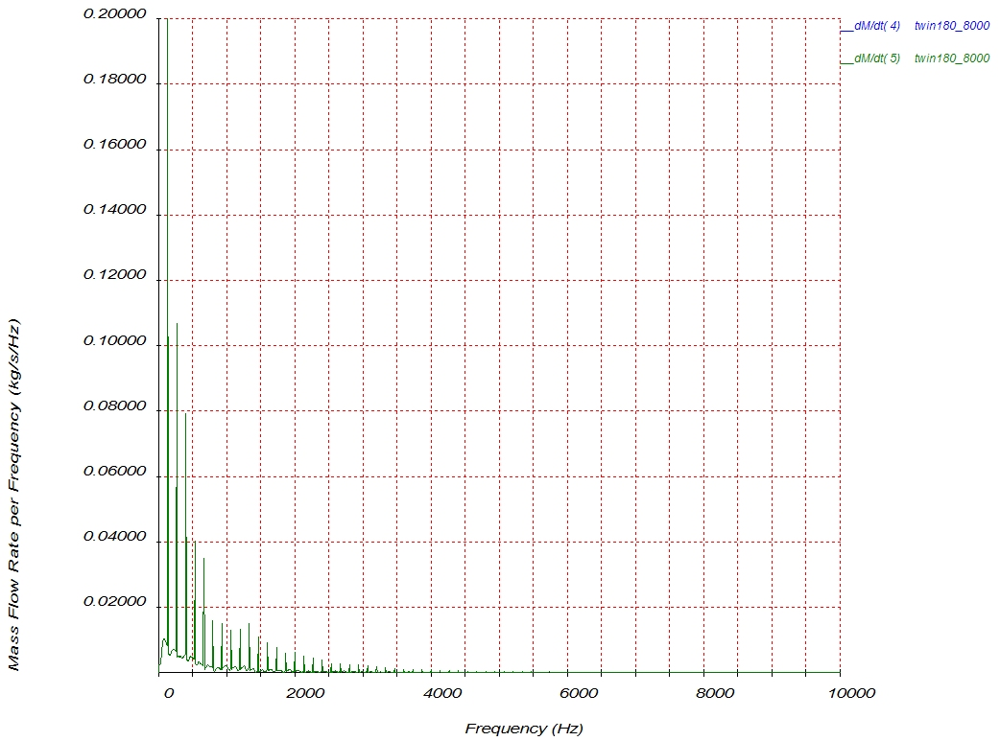
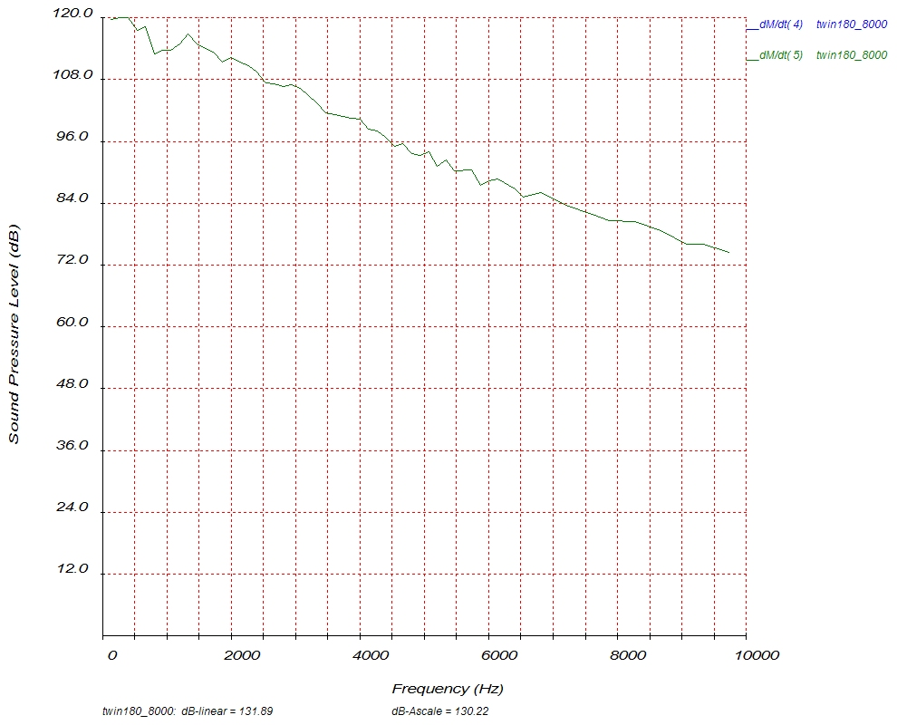

# [Noise Level Processing]{.underline}

Post2T can determine the Sound Power Levels (SPL) of the exhaust system
outlet pipes. The theory is based on \"Sound radiated from a circular
piston in an infinite baffle\" theory found in most acoustic textbooks.
It uses the instantaneous mass flow rate at the exhaust outlet to
calculate the SPL at each dominant frequency and its harmonics up to
10kHz at a user specified distance and angle from the outlet(s). It
determines the SPL of the exhaust outlets only as a function of the
pulsation and ignores the noise generated by the shear flow, the ringing
of the pipe walls, the engine intake noise and the engine mechanical
noise. It also ignores the effect of a reflection plane like the ground
close to the outlet.

The noise part is not fully debugged and used at own risk.

Selecting \"**Noise Spectrum Processing**\" opens the following dialog
box:

{border="0" width="429" height="562"}

The first step is to add an input file using the **\"Add File\"**
button. This opens the standard file open dialog box with the noise
files listed. They have the extension: **.nse**. Once the required files
are selected the output pipes in each must be selected. A typical
listing of a noise file headers are shown:

{border="0" width="465" height="450"}

This listing means that there are two outlet pipes, pipe 4 and pipe 5.
The mass flow rate for each are shown. What is also listed is the time.
One of the major differences in the noise output file compared to the
normal thermodynamic output files is that it is plotted against time and
not crank angle. Selecting only one will display noise data for that one
only as well as calculating the SPL for only that pipe. Selecting the
two pipe outlets in the above dialog and accepting it returns one to the
main dialog. Selecting the \"**Plot FFT**\" button calculates and
displays the FFT output as shown:

{border="0" width="1042" height="773"}

This graph shows that for the selected pipes that above 6000Hz the
amplitudes are very small. Selecting \"**Noise Spectrum Processing**\"
again opens the noise dialog box again. If one now selects the \"**Plot
Sound Pressure Levels (SPL)**\" button the next output is displayed:

{border="0" width="990" height="800"}

This displays the SPL at each frequency determined using FFT. At the
bottom of the graph the total SPL for all the outlet pipes are displayed
as both a linearly added SPL and as an A-weighted SPL (dB-Linear and
dB-Ascale).
