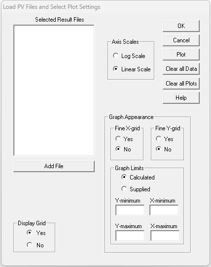
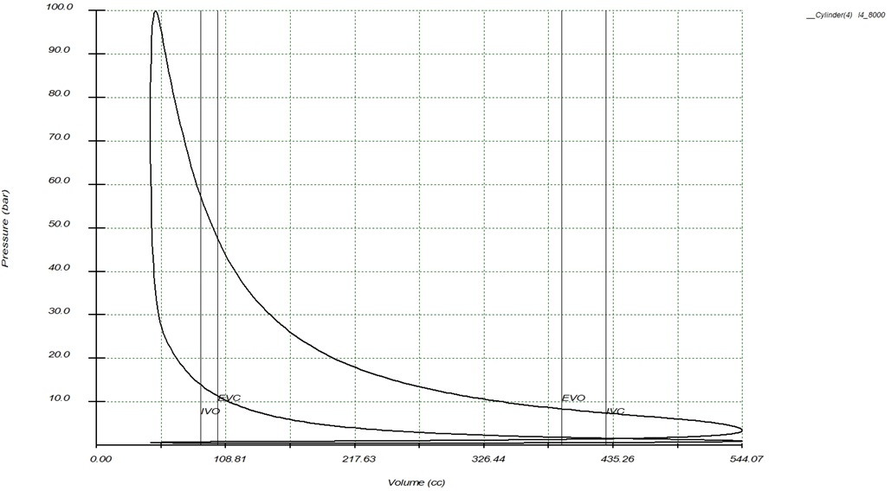
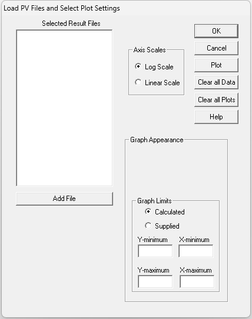
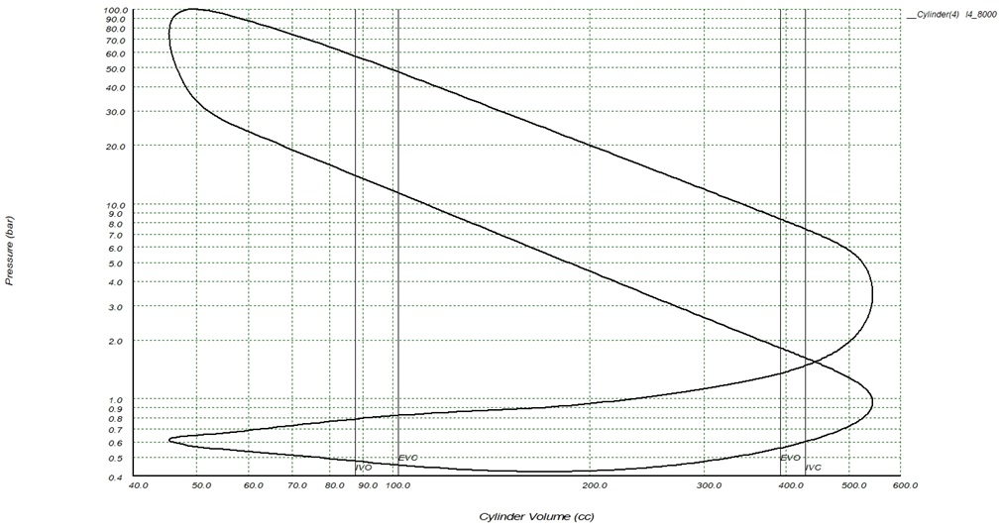

# [PV-Diagram]{.underline}

The PV-diagram selection plots the cylinder pressure against the
cylinder volume. Selecting the \"**PV-Diagram**\" option opens the
following dialog:

{border="0"}

By selecting the \"**Add File**\" button the file open dialog appears.
The PV file has the extension: **.pvd**. After selecting the file it
appears in the selected files list box. Clicking on the file name opens
the following dialog:

{border="0"}

Select the required crankcases and cylinders by clicking on the names
and accept. This returns control to the main PV dialog. In this example
the x-axis value radio button was set to displacement volume and the
\"**OK**\" button clicked:

{border="0"}

Next the same graph was plotted using the \"log P - log V\" option:

{border="0"}

{border="0"}

------------------------------------------------------------------------

© Neels van Niekerk 2024
