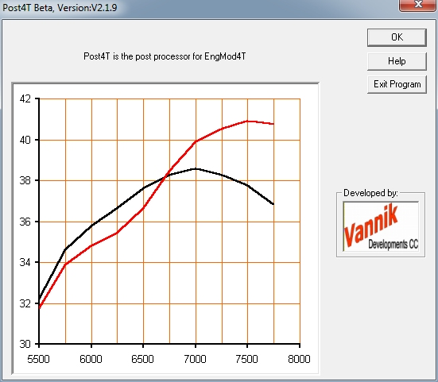
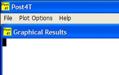
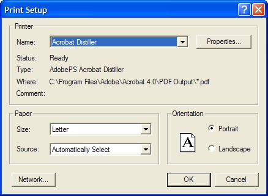
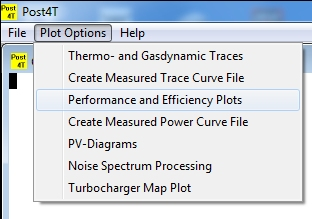
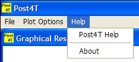

### [**Starting Post4T**]{.underline}

Start Post4T by double clicking on the Post4T icon.

{width="34" height="33"}

This will open the program on the following page:

{border="0" width="551" height="481"}

Clicking the **Exit Program**-button will exit the program. Clicking the
**Help Program**-button will will open these help files. Clicking the
**OK**-button will continue to the following screen:

{border="0" width="241" height="152"}

Selecting \"**File**\" will drop down the following menu:

{border="0" width="167" height="135"}

- Selecting \"**Print**\" will open a print dialog box displaying the
  installed printers available. Print will send the graphics displayed
  in the workspace to the printer.

{border="0" width="438" height="321"}

- Selecting \"**Save**\" option will open the dialog box to save the
  graphics in the work space as a bit map.

{border="0" width="563" height="416"}

- Selecting \"**Exit**\" option will quit the program.

Selecting \"**Plot Options**\" will drop down the following menu:

{border="0" width="308" height="209"}

- \"**Thermo- and Gasdynamic Traces**\" option will allow the user to
  plot the thermo and gasdynamic traces at the various engine speeds and
  positions.
- \"**Create Measured Trace Curve File**\" option allows the user to
  import an existing trace file into a file format suitable for use in
  Post4T.
- \"**Performance and Efficiency Plots**\" option allows the user to
  look at the power and torque curves as well as delivery ratio,
  scavenging efficiency etc.
- \"**Create Measured Power Curve File**\" option allows the user to
  either manually input measured power and rpm points or to import an
  existing file into a file format suitable for use in Post4T.
- \"**PV-Diagrams**\" option allows the user to import an existing file
  that contains the pressure and volume data for each cylinder to
  display the PV-Diagram in Post4T.
- \"**Noise Spectrum Processing**\" option allows the user to perform a
  FFT (Fast Fourier Transform) analysis on the exhaust outlet or to
  determine the SPL (Sound Pressure Level) for each exhaust outlet as a
  function of the frequencies determined by the FFT analysis and to
  determine the overall SPL both linear and A-weighted (dB-Linear or
  dB(A)).
- \"**Turbocharger Map Plot**\" allows the user to plot just the
  compressor map or the turbine map, or the compressor or turbine map
  with the pressure trace superimposed on the map.

Selecting \"**Help**\" will drop the following menu:

{border="0" width="234" height="105"}
