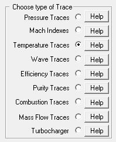

## [Temperature Trace Output (\*.tpt)]{.underline}

The temperature trace files are part of the new or over written files.
They have the project name appended with the rpm value and the extension
**.tpt**. The temperature traces for project Honda at 8000 rpm will be
in the file: **Honda8000.tpt**. This file will be in the project
directory and over written each time a simulation at its specific rpm is
conducted.

It has the following traces as output:

- **Deg      **      Engine degrees using the last cylinder as
  reference.
- **TinTrace**    Temperature trace at the trace position in each inlet
  pipe.
- **InTemp**      Temperature trace at the inlet valve per cylinder.
- **Tab     **       Temperature in each air box.
- **CylTemp**    Temperature trace in the cylinder per cylinder.
- **TUnburnt**   Temperature trace for the unburnt mixture in the
  cylinder.
- **TBurnt**       Temperature trace for the burnt mixture in the
  cylinder.
- **ExTemp**     Temperature trace at each exhaust valve per cylinder.
- **TexTrace**   Temperature trace at the trace position in each exhaust
  pipe.
- **Teb       **      Temperature in each exhaust box.

The temperature traces are in degrees Celsius.

To load temperature traces the following radio button is selected:

{border="0"}
