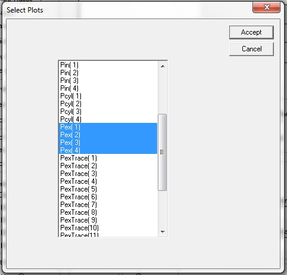
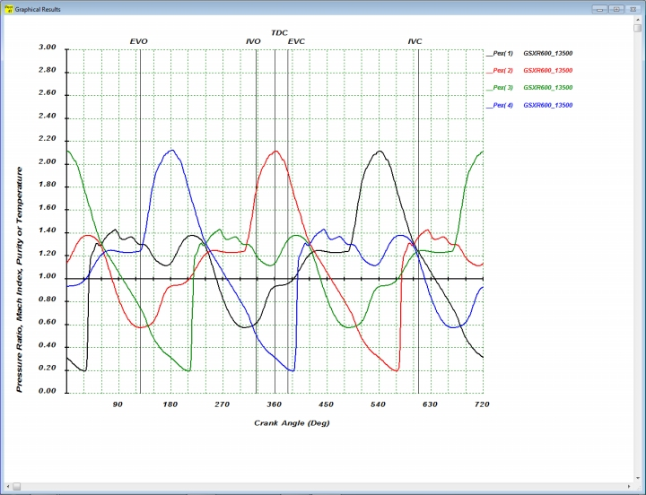
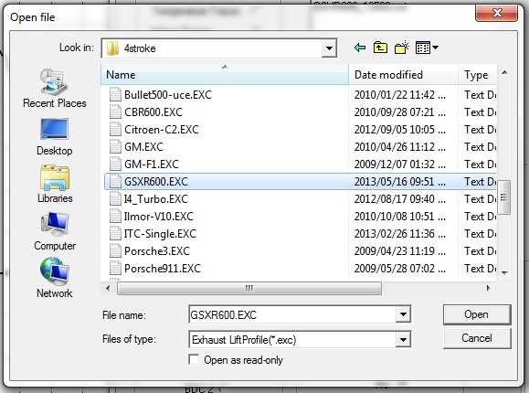

### [**Thermodynamic and Gasdynamic Traces**]{.underline}

Selecting the **Thermo- and Gasdynamic trace** option on the **Plot
Options** menu will open the following dialog box:

{border="0"}

To use this box the first step is to select the type of trace by
clicking the required radio button in the **Choose type of Trace** group
box. Following this a results file is added by clicking on the **Add
File** button. This will open the following file selection dialog box
which will display a list of files of the the selected type after
navigating to the correct folder:

{border="0"}

After selecting the required file you are returned to the main dialog
box which now displays the selected file in the **Selected Result
Files** list box:

{border="0"}

More result files can be added. To select the traces to be plotted click
on the file name in the **Selected Result Files** list box. This opens
the **Select Plots** dialog box. Clicking on the required traces will
highlight them.

{border="0"}

After making the choices click the **Accept** button to return to the
main dialog box. To see the traces plotted click the **OK** button which
will display the following plot:

{border="0"}

This plot shows the traces in firing order starting at the last
cylinder. The valve event lines are also referenced to the last
cylinder. To overlay the traces and reference each to its own TDC
position select the **Thermo- and Gasdynamic trace** option on the
**Plot Options** menu again and click the **TDC1** radio button in the
**Plot Reference** group box and the press **OK** to display the
following plot:

{border="0"}

As can be seen the traces are now all referenced to TDC1 and the valve
event lines are valid for each trace. The appearance of the plot can be
further modified by switching the grid on or off in the **Display Grid**
group box and by switching the valve event line on or of in the
**Display Valve Events** group box.

To zoom in on specific areas of the plot traces select the **Supplied**
radio button in the **X and Y  axis limit** group box and specify the
required values in the edit boxes either by editing the value displayed
or by using the spin buttons next to each edit box.

It is also possible to show the inlet and exhaust valve lift curves on
the plot. To select the lift profile **click** the **Display Exhaust
Valve Lift Profile - Yes** radio button and the following dialog box
will open:

{border="0"}

After selecting the required file the main dialog box is updated to the
following:

{border="0"}

As can be seen the file name is now listed. We next click on the **OK**
button:

{border="0"}

The selected pressure trace and the valve lift profile is now displayed.
The valve lift profile is scaled down with a factor 10. It is also
possible to plot it true size or to scale it to the maximum value of the
graph.

The **Plot** button does the same as the **OK** button except that the
main dialog box is not closed.

The **Clear all Data** button clears all the selected thermo- and
gasdynamic traces and closes all the selected files.

The **Clear all Plots** button just clears the selected thermo- and
gasdynamic traces but keeps the selected files open.
