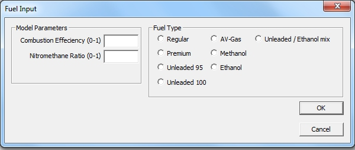

# Extracting Wiebe (Vibe) values from a Turbulent Entrainment Simulation File

## [Introduction]{lang="EN-US"}

The normal prescribed combustion model runs a lot faster than the
turbulent entrainment model but requires a number of user supplied
values. By conducting a run using the turbulent entrainment model these
inputs can be generated by the software. The following describes how to
extract it. It is assumed that the batch run using the turbulent
entrainment model is complete.

## Parameter Extraction and the Creation of a new Combustion file

The Performance part of Post4T contains a button that will perform this
function. First open, select and load the performance file:

{border="0"}

Next, click on the result name, in this case: GSXR600 Turbulent:

{border="0"}

[Now we click on the button **Write Combustion File** and the file
creation dialog will open in the Project Folder. First use the up button
or the folder tree field to navigate to the working folder (C:\\4Stroke)
and type the name of the combustion file to be created into the file
name field:]{lang="EN-US"}

{border="0"}

[After creating the file the fuel and efficiency input dialog will
appear:]{lang="EN-US"}

{border="0"}

[As the post processing files contain no information of the type and/or
mix with nitro or ethanol the user must specify the values. The
following dialog shows an example of this completed:]{lang="EN-US"}

{border="0"}

[After clicking the **OK** button and exiting Post4T the user now has to
still include the new file into the project file using
Dat4T.]{lang="EN-US"}

## Note:

The combustion model uses a maximum of 15 points. If the simulation
results contain more than 15 points only the first 15 will be used. This
might result in ignition details at high rpm values to be excluded. It
is therefor recommended that you decide before the start of the
simulation which 15 points you want included and run the simulation for
these points only. It will give you the following warning:

{border="0"}

## Possible causes of problems

The turbulent entrainment model is not very robust and can sometimes
predict combustion durations that extent past the point where the
exhaust valve opens. This can result in erroneous performance
predictions. This is because the open cycle subroutine (from EVO to IVC)
does not contain any combustion calculations so if the duration extends
into the exhaust open phase the combustion calculation is terminated
without completing.

To prevent this from happening Dat4T has a built in check that will
correct the duration to terminate at least 1 degree before the opening
of the exhaust valve. If this happens a few places in the curve it is
acceptable but if it happens over a long stretch of the curve it
probably indicates that the turbulent entrainment model was not
successful and should not be used.
